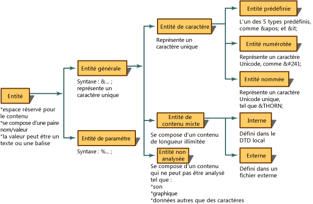
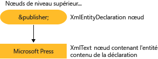

# Lecture de d&#233;clarations d&#39;entit&#233; et de r&#233;f&#233;rences d&#39;entit&#233; vers le DOM
Une entité est une déclaration établissant qu'un certain nom doit être utilisé dans les données XML en lieu et place d'un contenu ou d'un balisage donné.  Une entité présente deux aspects.  D'une part, vous devez associer un nom au contenu de remplacement, au moyen d'une déclaration d'entité.  Une déclaration d'entité est créée au moyen de la syntaxe `<!ENTITY name "value">` dans une DTD ou un schéma XML.  D'autre part, le nom défini dans la déclaration d'entité est utilisé par la suite dans les données XML.  Ce nom, une fois employé dans le code XML, est appelé référence d'entité.  Par exemple, la déclaration d'entité suivante déclare une entité portant le nom `publisher` associé au contenu de « Microsoft Press ».  
  
```  
<!ENTITY publisher "Microsoft Press">  
```  
  
 L'exemple suivant illustre l'utilisation de cette déclaration d'entité dans le code XML en tant que référence d'entité.  
  
```  
<author>Fred</author>  
<pubinfo>Published by &publisher;</pubinfo>  
```  
  
 Certains analyseurs développent automatiquement des entités lors du chargement d'un document en mémoire.  Dès lors, lorsque le code XML est lu et chargé en mémoire, les déclarations d'entité sont mémorisées et enregistrées.  Ensuite, quand l'analyseur rencontre des caractères `&;` qui identifient une référence d'entité générale, il recherche ce nom dans une table de déclaration d'entité.  La référence, `&publisher;`, est remplacée par le contenu qu'elle représente.  À l'aide du code XML suivant,  
  
```  
<author>Fred</author>  
<pubinfo>Published by &publisher;</pubinfo>  
```  
  
 le développement de la référence d'entité et le remplacement de `&publisher;` par le contenu Microsoft Press produit les données XML développées suivantes :  
  
 **Sortie**  
  
```  
<author>Fred</author>  
<pubinfo>Published by Microsoft Press</pubinfo>  
```  
  
 Il existe diverses sortes d'entités.  Le diagramme suivant montre la répartition des types d'entité et leur terminologie.  
  
   
  
 Par défaut, l'implémentation par Microsoft .NET Framework de DOM \(Document Object Model\) XML préserve les références d'entités et ne développe pas les entités lors du chargement du XML.  Cela a pour effet de créer, lorsqu'un document est chargé dans le DOM, un nœud **XmlEntityReference** contenant la variable de référence `&publisher;`, avec des nœuds enfants représentant le contenu de l'entité déclarée dans la DTD.  
  
 En se basant sur la déclaration d'entité `<!ENTITY publisher "Microsoft Press">`, le diagramme suivant montre les nœuds **XmlEntity** et **XmlText** créés à partir de cette déclaration.  
  
   
  
 Les différences qu'il existe entre les références d'entité développées et non développées concernent les nœuds qui sont générés dans l'arborescence DOM en mémoire.  La différence dans les nœuds générés est expliquée dans les rubriques [Conservation des références d'entité](../../../../docs/standard/data/xml/entity-references-are-preserved.md) et [Développement sans conservation des références d'entité](../../../../docs/standard/data/xml/entity-references-are-expanded-and-not-preserved.md).  
  
## Voir aussi  
 [DOM \(Document Object Model\) XML](../../../../docs/standard/data/xml/xml-document-object-model-dom.md)