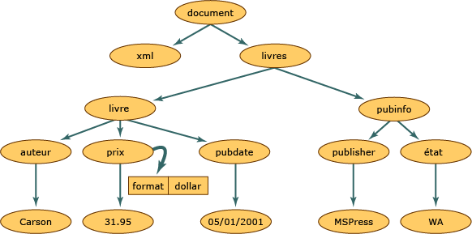

# DOM (Document Object Model) XML
La classe DOM \(Document Object Model\) XML fournit une représentation en mémoire d'un document XML.  Le DOM vous permet de lire, de manipuler et de modifier un document XML par programme.  La classe **XmlReader** lit également le code XML, mais elle garantit seulement un accès en lecture seule, en avant uniquement et non mis en cache.  Cela signifie que **XmlReader** n'offre pas la possibilité de modifier les valeurs d'un attribut ou le contenu d'un élément, ni d'insérer ou de supprimer des nœuds.  La modification est la fonction principale du DOM.  Ce dernier régit la représentation en mémoire commune et structurée des données XML, bien que les données XML véritables soient stockées de façon linéaire lorsqu'elles se trouvent dans un fichier ou qu'elles proviennent d'un autre objet.  Voici des données XML :  
  
## Entrée  
  
```  
<?xml version="1.0"?>  
  <books>  
    <book>  
        <author>Carson</author>  
        <price format="dollar">31.95</price>  
        <pubdate>05/01/2001</pubdate>  
    </book>  
    <pubinfo>  
        <publisher>MSPress</publisher>  
        <state>WA</state>  
    </pubinfo>  
  </books>   
```  
  
 L'illustration suivante montre comment la mémoire est structurée lorsque ces données XML sont lues dans la structure DOM.  
  
   
Structure d'un document XML  
  
 Au sein de la structure d'un document XML, chaque cercle de cette illustration représente un nœud, appelé objet **XmlNode**.  L'objet **XmlNode** est l'objet de base de l'arborescence DOM.  La classe **XmlDocument**, extension de **XmlNode**, prend en charge des méthodes destinées à exécuter des opérations sur le document dans son ensemble, par exemple pour charger ce dernier en mémoire ou l'enregistrer sous la forme d'un fichier.  La classe **XmlDocument** offre en outre une solution pour afficher et manipuler les nœuds du document XML entier.  Les classes **XmlNode** et **XmlDocument** bénéficient toutes deux d'améliorations sur le plan des performances et des possibilités d'utilisation. Elles comprennent des méthodes et des propriétés qui permettent :  
  
-   d'accéder et de modifier des nœuds spécifiques au DOM, tels que les nœuds d'élément, de référence d'entité, et bien d'autres ;  
  
-   d'extraire des nœuds entiers, en plus des informations qu'ils contiennent, telles que le texte des nœuds d'élément.  
  
    > [!NOTE]
    >  Si une application n'a pas besoin des fonctionnalités de structure ou de modifications proposées par le DOM, les classes **XmlReader** et **XmlWriter** assurent un accès en flux continu non mis en cache et en avant uniquement au code XML.  Pour plus d’informations, consultez <xref:System.Xml.XmlReader> et <xref:System.Xml.XmlWriter>.  
  
 Les objets **Node** comportent un ensemble de méthodes et de propriétés, ainsi que des caractéristiques de base et bien définies.  Voici certaines de ces caractéristiques :  
  
-   Un nœud ne possède qu'un seul nœud parent, qui est le nœud situé juste au\-dessus de lui.  Le seul nœud qui est dépourvu de parent est la racine du document, puisqu'il s'agit du nœud de premier niveau qui contient le document lui\-même et les fragments de document.  
  
-   La plupart des nœuds peuvent comporter plusieurs nœuds enfants, qui sont les nœuds situés directement sous eux.  La liste suivante répertorie des types de nœuds pouvant comporter des nœuds enfants :  
  
    -   **Document**  
  
    -   **DocumentFragment**  
  
    -   **EntityReference**  
  
    -   **Élément**  
  
    -   **Attribut**  
  
     Les nœuds **XmlDeclaration**, **Notation**, **Entity**, **CDATASection**, **Text**, **Comment**, **ProcessingInstruction** et **DocumentType** sont dépourvus de nœuds d'enfants.  
  
-   Les nœuds situés au même niveau, représentés dans le diagramme par les nœuds **book** et **pubinfo**, sont des nœuds frères.  
  
 L'une des caractéristiques du DOM est la manière dont il gère les attributs.  Les attributs ne sont pas des nœuds qui font partie des relations parent\-enfant et frère.  Ils sont considérés comme une propriété du nœud d'élément et sont constitués d'une paire composée d'un nom et d'une valeur.  Par exemple, si vous avez des données XML composées de `format="dollar` associées à l'élément `price`, le mot `format` correspond au nom et la valeur de l'attribut `format` est `dollar`.  Pour extraire l'attribut `format="dollar"` du nœud **price**, vous appelez la méthode **GetAttribute** lorsque le curseur se trouve au nœud d'élément `price`.  Pour plus d'informations, voir [Accès aux attributs dans le DOM](../../../../docs/standard/data/xml/accessing-attributes-in-the-dom.md).  
  
 Lorsque le code XML est lu en mémoire, des nœuds sont créés.  Toutefois, tous les nœuds ne sont pas du même type.  Un élément, dans XML, possède des règles et une syntaxe différentes de celles d'une instruction de traitement.  C'est pourquoi, à mesure que des données diverses sont lues, un type de nœud est assigné à chaque nœud.  Ce type de nœud détermine les caractéristiques et la fonctionnalité du nœud.  
  
 Pour plus d'informations sur les types de nœuds générés en mémoire, voir [Types de nœuds XML](../../../../docs/standard/data/xml/types-of-xml-nodes.md).  Pour plus d'informations sur les objets créés dans l'arborescence de nœuds, voir [Mappage de la hiérarchie d'objets à des données XML](../../../../docs/standard/data/xml/mapping-the-object-hierarchy-to-xml-data.md).  
  
 Microsoft a étendu les API disponibles dans les recommandations du World Wide Web Consortium \(W3C\) DOM Level 1 et Level 2 afin de faciliter la manipulation d'un document XML.  En plus d'assurer une prise en charge complète des normes W3C, les classes, méthodes et propriétés supplémentaires ajoutent une fonctionnalité qui dépasse ce que le DOM XML du W3C permet de faire.  De nouvelles classes vous permettent d'accéder aux données relationnelles, tout en proposant des méthodes qui permettent de les synchroniser avec des données ADO.NET et d'exposer simultanément des données comme des données XML.  Pour plus d'informations, voir [Synchronisation d'un DataSet avec un XmlDataDocument](../../../../docs/framework/data/adonet/dataset-datatable-dataview/dataset-and-xmldatadocument-synchronization.md).  
  
 Le DOM revêt un intérêt tout particulier pour la lecture de données XML et leur chargement en mémoire afin d'en modifier la structure, d'y ajouter ou d'en supprimer des nœuds, ou encore de modifier les données contenues dans un nœud tout comme dans le texte contenu dans un élément.  Cependant, d'autres classes sont disponibles et offrent de meilleures performances que le DOM dans d'autres scénarios.  Pour un accès rapide en flux continu non mis en cache et en avant uniquement au code XML, utilisez **XmlReader** et **XmlWriter**.  Si vous avez besoin d'un accès aléatoire avec un modèle de curseur et **XPath**, utilisez la classe **XPathNavigator**.  
  
## Voir aussi  
 [Types de nœuds XML](../../../../docs/standard/data/xml/types-of-xml-nodes.md)   
 [Mappage de la hiérarchie d'objets à des données XML](../../../../docs/standard/data/xml/mapping-the-object-hierarchy-to-xml-data.md)