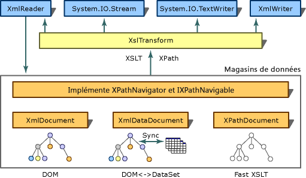

# <a name="xslt-transformations-with-the-xsltransform-class"></a><span data-ttu-id="cf94a-102">Transformations XSLT avec la classe XslTransform</span><span class="sxs-lookup"><span data-stu-id="cf94a-102">XSLT Transformations with the XslTransform Class</span></span>
> [!NOTE]
>  <span data-ttu-id="cf94a-103">La classe <xref:System.Xml.Xsl.XslTransform> est obsolète dans le [!INCLUDE[dnprdnext](../../../../includes/dnprdnext-md.md)].</span><span class="sxs-lookup"><span data-stu-id="cf94a-103">The <xref:System.Xml.Xsl.XslTransform> class is obsolete in the [!INCLUDE[dnprdnext](../../../../includes/dnprdnext-md.md)].</span></span> <span data-ttu-id="cf94a-104">Vous pouvez effectuer des transformations XSLT (Extensible Stylesheet Language Transformation) à l'aide de la classe <xref:System.Xml.Xsl.XslCompiledTransform>.</span><span class="sxs-lookup"><span data-stu-id="cf94a-104">You can perform Extensible Stylesheet Language for Transformations (XSLT) transformations using the <xref:System.Xml.Xsl.XslCompiledTransform> class.</span></span> <span data-ttu-id="cf94a-105">Consultez [à l’aide de la classe XslCompiledTransform](../../../../docs/standard/data/xml/using-the-xslcompiledtransform-class.md) et [migration depuis la classe XslTransform](../../../../docs/standard/data/xml/migrating-from-the-xsltransform-class.md) pour plus d’informations.</span><span class="sxs-lookup"><span data-stu-id="cf94a-105">See [Using the XslCompiledTransform Class](../../../../docs/standard/data/xml/using-the-xslcompiledtransform-class.md) and [Migrating From the XslTransform Class](../../../../docs/standard/data/xml/migrating-from-the-xsltransform-class.md) for more information.</span></span>  
  
 <span data-ttu-id="cf94a-106">Le but des transformations XSLT est de transformer le contenu d’un document XML source en un autre document différent par son format ou sa structure (par exemple, transformer du code XML en HTML afin de l’utiliser sur un site web ou le transformer en un document contenant uniquement les champs requis par une application).</span><span class="sxs-lookup"><span data-stu-id="cf94a-106">The goal of the XSLT is to transform the content of a source XML document into another document that is different in format or structure (for example, to transform XML into HTML for use on a Web site or to transform it into a document that contains only the fields required by an application).</span></span> <span data-ttu-id="cf94a-107">Ce processus de transformation est spécifié par la recommandation World Wide Web Consortium (W3C) sur XSLT version 1.0 à www.w3.org/TR/xslt.</span><span class="sxs-lookup"><span data-stu-id="cf94a-107">This transformation process is specified by the World Wide Web Consortium (W3C) XSLT version 1.0 recommendation located at www.w3.org/TR/xslt.</span></span> <span data-ttu-id="cf94a-108">Dans le [!INCLUDE[dnprdnshort](../../../../includes/dnprdnshort-md.md)], la classe <xref:System.Xml.Xsl.XslTransform>, située dans l'espace de noms <xref:System.Xml.Xsl>, est le processeur XSLT qui implémente les fonctionnalités de cette spécification.</span><span class="sxs-lookup"><span data-stu-id="cf94a-108">In the [!INCLUDE[dnprdnshort](../../../../includes/dnprdnshort-md.md)], the <xref:System.Xml.Xsl.XslTransform> class, found in the <xref:System.Xml.Xsl> namespace, is the XSLT processor that implements the functionality of this specification.</span></span> <span data-ttu-id="cf94a-109">Il existe un petit nombre de fonctionnalités qui n’ont pas été implémentées à partir de la recommandation du W3C sur XSLT 1.0, répertoriée dans [sorties à partir de XslTransform](../../../../docs/standard/data/xml/outputs-from-an-xsltransform.md).</span><span class="sxs-lookup"><span data-stu-id="cf94a-109">There are a small number of features that have not been implemented from the W3C XSLT 1.0 recommendation, listed in [Outputs from an XslTransform](../../../../docs/standard/data/xml/outputs-from-an-xsltransform.md).</span></span> <span data-ttu-id="cf94a-110">La figure suivante illustre l'architecture de transformation du [!INCLUDE[dnprdnshort](../../../../includes/dnprdnshort-md.md)].</span><span class="sxs-lookup"><span data-stu-id="cf94a-110">The following figure shows the transformation architecture of the [!INCLUDE[dnprdnshort](../../../../includes/dnprdnshort-md.md)].</span></span>  
  
## <a name="overview"></a><span data-ttu-id="cf94a-111">Vue d'ensemble</span><span class="sxs-lookup"><span data-stu-id="cf94a-111">Overview</span></span>  
 <span data-ttu-id="cf94a-112"></span><span class="sxs-lookup"><span data-stu-id="cf94a-112"></span></span>  
<span data-ttu-id="cf94a-113">Architecture de transformation</span><span class="sxs-lookup"><span data-stu-id="cf94a-113">Transformation Architecture</span></span>  
  
 <span data-ttu-id="cf94a-114">La recommandation XSLT utilise XML Path Language (XPath) pour sélectionner des parties d'un document XML, où XPath est un langage de requête utilisé pour accéder aux nœuds d'une arborescence de document.</span><span class="sxs-lookup"><span data-stu-id="cf94a-114">The XSLT recommendation uses XML Path Language (XPath) to select parts of an XML document, where XPath is a query language used to navigate nodes of a document tree.</span></span> <span data-ttu-id="cf94a-115">Comme illustré dans le diagramme, l'implémentation [!INCLUDE[dnprdnshort](../../../../includes/dnprdnshort-md.md)] de XPath est utilisée pour sélectionner des parties de XML dans plusieurs classes, telles que <xref:System.Xml.XmlDocument>, <xref:System.Xml.XmlDataDocument> et <xref:System.Xml.XPath.XPathDocument>.</span><span class="sxs-lookup"><span data-stu-id="cf94a-115">As shown in the diagram, the [!INCLUDE[dnprdnshort](../../../../includes/dnprdnshort-md.md)] implementation of XPath is used to select parts of XML stored in several classes, such as an <xref:System.Xml.XmlDocument>, an <xref:System.Xml.XmlDataDocument>, and an <xref:System.Xml.XPath.XPathDocument>.</span></span> <span data-ttu-id="cf94a-116">Un objet <xref:System.Xml.XPath.XPathDocument> est un magasin de données XSLT optimisé qui fournit des transformations XSLT performantes lorsqu'il est utilisé avec l'objet <xref:System.Xml.Xsl.XslTransform>.</span><span class="sxs-lookup"><span data-stu-id="cf94a-116">An <xref:System.Xml.XPath.XPathDocument> is an optimized XSLT data store, and when used with <xref:System.Xml.Xsl.XslTransform>, it provides XSLT transformations with good performance.</span></span>  
  
 <span data-ttu-id="cf94a-117">Le tableau suivant répertorie les classes généralement utilisées lors de l'utilisation de l'objet <xref:System.Xml.Xsl.XslTransform> et de XPath et leur fonction.</span><span class="sxs-lookup"><span data-stu-id="cf94a-117">The following table list commonly uses classes when working with <xref:System.Xml.Xsl.XslTransform> and XPath and their function.</span></span>  
  
|<span data-ttu-id="cf94a-118">Classe ou interface</span><span class="sxs-lookup"><span data-stu-id="cf94a-118">Class or Interface</span></span>|<span data-ttu-id="cf94a-119">Fonction</span><span class="sxs-lookup"><span data-stu-id="cf94a-119">Function</span></span>|  
|------------------------|--------------|  
|<xref:System.Xml.XPath.XPathNavigator>|<span data-ttu-id="cf94a-120">API qui fournit un modèle de style curseur pour naviguer dans un magasin ainsi qu'une prise en charge de requête XPath.</span><span class="sxs-lookup"><span data-stu-id="cf94a-120">It is an API that provides a cursor style model for navigating over a store, along with XPath query support.</span></span> <span data-ttu-id="cf94a-121">Elle ne permet pas de modifier le magasin sous-jacent.</span><span class="sxs-lookup"><span data-stu-id="cf94a-121">It does not provide editing of the underlying store.</span></span> <span data-ttu-id="cf94a-122">Pour le modifier, utilisez la classe <xref:System.Xml.XmlDocument>.</span><span class="sxs-lookup"><span data-stu-id="cf94a-122">For editing, use the <xref:System.Xml.XmlDocument> class.</span></span>|  
|<xref:System.Xml.XPath.IXPathNavigable>|<span data-ttu-id="cf94a-123">Interface qui fournit une méthode `CreateNavigator` à un objet <xref:System.Xml.XPath.XPathNavigator> pour le magasin.</span><span class="sxs-lookup"><span data-stu-id="cf94a-123">It is an interface that provides a `CreateNavigator` method to an <xref:System.Xml.XPath.XPathNavigator> for the store.</span></span>|  
|<xref:System.Xml.XmlDocument>|<span data-ttu-id="cf94a-124">Permet la modification de ce document.</span><span class="sxs-lookup"><span data-stu-id="cf94a-124">It enables editing of this document.</span></span> <span data-ttu-id="cf94a-125">Cette classe implémente l'objet <xref:System.Xml.XPath.IXPathNavigable>, autorisant des scénarios de modification de documents où des transformations XSLT sont ultérieurement requises.</span><span class="sxs-lookup"><span data-stu-id="cf94a-125">It implements <xref:System.Xml.XPath.IXPathNavigable>, allowing document-editing scenarios where XSLT transformations are subsequently required.</span></span> <span data-ttu-id="cf94a-126">Pour plus d’informations, consultez [entrée XmlDocument dans XslTransform](../../../../docs/standard/data/xml/xmldocument-input-to-xsltransform.md).</span><span class="sxs-lookup"><span data-stu-id="cf94a-126">For more information, see [XmlDocument Input to XslTransform](../../../../docs/standard/data/xml/xmldocument-input-to-xsltransform.md).</span></span>|  
|<xref:System.Xml.XmlDataDocument>|<span data-ttu-id="cf94a-127">Classe dérivée de l'objet <xref:System.Xml.XmlDocument>.</span><span class="sxs-lookup"><span data-stu-id="cf94a-127">It is derived from the <xref:System.Xml.XmlDocument>.</span></span> <span data-ttu-id="cf94a-128">Elle établit une passerelle entre les mondes relationnels et XML en utilisant un objet <xref:System.Data.DataSet> pour optimiser le stockage de données structurées dans le document XML selon les mappages spécifiés sur l'objet <xref:System.Data.DataSet>.</span><span class="sxs-lookup"><span data-stu-id="cf94a-128">It bridges the relational and XML worlds by using a <xref:System.Data.DataSet> to optimize storage of structured data within the XML document according to specified mappings on the <xref:System.Data.DataSet>.</span></span> <span data-ttu-id="cf94a-129">Elle implémente l'interface <xref:System.Xml.XPath.IXPathNavigable>, autorisant des scénarios où des transformations XSLT peuvent être effectuées sur des données relationnelles extraites d'une base de données.</span><span class="sxs-lookup"><span data-stu-id="cf94a-129">It implements <xref:System.Xml.XPath.IXPathNavigable>, allowing scenarios where XSLT transformations can be performed over relational data retrieved from a database.</span></span> <span data-ttu-id="cf94a-130">Pour plus d’informations, consultez [intégration de XML aux données relationnelles et à ADO.NET](../../../../docs/standard/data/xml/xml-integration-with-relational-data-and-adonet.md).</span><span class="sxs-lookup"><span data-stu-id="cf94a-130">For more information, see [XML Integration with Relational Data and ADO.NET](../../../../docs/standard/data/xml/xml-integration-with-relational-data-and-adonet.md).</span></span>|  
|<xref:System.Xml.XPath.XPathDocument>|<span data-ttu-id="cf94a-131">Classe optimisée pour le traitement de l'objet <xref:System.Xml.Xsl.XslTransform> et les requêtes XPath, elle fournit un cache très performant en lecture seule.</span><span class="sxs-lookup"><span data-stu-id="cf94a-131">This class is optimized for <xref:System.Xml.Xsl.XslTransform> processing and XPath queries, and it provides a read-only high performance cache.</span></span> <span data-ttu-id="cf94a-132">Elle implémente l'interface <xref:System.Xml.XPath.IXPathNavigable> et représente le magasin par défaut à utiliser pour les transformations XSLT.</span><span class="sxs-lookup"><span data-stu-id="cf94a-132">It implements <xref:System.Xml.XPath.IXPathNavigable> and is the preferred store to use for XSLT transformations.</span></span>|  
|<xref:System.Xml.XPath.XPathNodeIterator>|<span data-ttu-id="cf94a-133">Permet la navigation dans des collections de nœuds XPath.</span><span class="sxs-lookup"><span data-stu-id="cf94a-133">It provides navigation over XPath node sets.</span></span> <span data-ttu-id="cf94a-134">Toutes les méthodes de sélection XPath sur l'objet <xref:System.Xml.XPath.XPathNavigator> retournent une classe <xref:System.Xml.XPath.XPathNodeIterator>.</span><span class="sxs-lookup"><span data-stu-id="cf94a-134">All XPath selection methods on the <xref:System.Xml.XPath.XPathNavigator> return an <xref:System.Xml.XPath.XPathNodeIterator>.</span></span> <span data-ttu-id="cf94a-135">Plusieurs objets <xref:System.Xml.XPath.XPathNodeIterator> peuvent être créés sur le même magasin, chacune représentant une collection de nœuds sélectionnée.</span><span class="sxs-lookup"><span data-stu-id="cf94a-135">Multiple <xref:System.Xml.XPath.XPathNodeIterator> objects can be created over the same store, each representing a selected set of nodes.</span></span>|  
  
## <a name="msxml-xslt-extensions"></a><span data-ttu-id="cf94a-136">Extensions de MSXML XSLT</span><span class="sxs-lookup"><span data-stu-id="cf94a-136">MSXML XSLT Extensions</span></span>  
 <span data-ttu-id="cf94a-137">Les fonctions `msxsl:script` et `msxsl:node-set` sont les seules extensions de Microsoft XML Core Services (MSXML) XSLT prises en charge par la classe <xref:System.Xml.Xsl.XslTransform>.</span><span class="sxs-lookup"><span data-stu-id="cf94a-137">The `msxsl:script` and `msxsl:node-set` functions are the only Microsoft XML Core Services (MSXML) XSLT extensions supported by the <xref:System.Xml.Xsl.XslTransform> class.</span></span>  
  
## <a name="example"></a><span data-ttu-id="cf94a-138">Exemple</span><span class="sxs-lookup"><span data-stu-id="cf94a-138">Example</span></span>  
 <span data-ttu-id="cf94a-139">L'exemple de code suivant charge une feuille de style XSLT, lit un fichier nommé mydata.xml dans un objet <xref:System.Xml.XPath.XPathDocument> et effectue une transformation des données sur un fichier fictif nommé myStyleSheet.xsl, en envoyant le résultat mis en forme à la console.</span><span class="sxs-lookup"><span data-stu-id="cf94a-139">The following code example loads an XSLT style sheet, reads a file called mydata.xml into an <xref:System.Xml.XPath.XPathDocument>, and performs a transformation on the data on a fictitious file called myStyleSheet.xsl, sending the formatted output to the console.</span></span>  
  
```vb  
Imports System  
Imports System.IO  
Imports System.Xml  
Imports System.Xml.XPath  
Imports System.Xml.Xsl  
  
Public Class Sample  
    Private filename As [String] = "mydata.xml"  
    Private stylesheet As [String] = "myStyleSheet.xsl"  
  
    Public Shared Sub Main()  
        Dim xslt As New XslTransform()  
        xslt.Load(stylesheet)  
        Dim xpathdocument As New XPathDocument(filename)  
        Dim writer As New XmlTextWriter(Console.Out)  
        writer.Formatting = Formatting.Indented  
  
        xslt.Transform(xpathdocument, Nothing, writer, Nothing)  
    End Sub 'Main  
End Class 'Sample  
```  
  
```csharp  
using System;  
using System.IO;  
using System.Xml;  
using System.Xml.XPath;  
using System.Xml.Xsl;  
  
public class Sample   
{  
    private const String filename = "mydata.xml";  
    private const String stylesheet = "myStyleSheet.xsl";  
  
    public static void Main()   
    {  
    XslTransform xslt = new XslTransform();  
    xslt.Load(stylesheet);  
    XPathDocument xpathdocument = new  
    XPathDocument(filename);  
    XmlTextWriter writer = new XmlTextWriter(Console.Out);  
    writer.Formatting=Formatting.Indented;  
  
    xslt.Transform(xpathdocument, null, writer, null);      
    }  
}  
```  
  
## <a name="see-also"></a><span data-ttu-id="cf94a-140">Voir aussi</span><span class="sxs-lookup"><span data-stu-id="cf94a-140">See Also</span></span>  
 <xref:System.Xml.Xsl.XslTransform>  
 [<span data-ttu-id="cf94a-141">XslTransform Class Implements the XSLT Processor</span><span class="sxs-lookup"><span data-stu-id="cf94a-141">XslTransform Class Implements the XSLT Processor</span></span>](../../../../docs/standard/data/xml/xsltransform-class-implements-the-xslt-processor.md)  
 [<span data-ttu-id="cf94a-142">Implémentation de comportements discrétionnaires dans la classe XslTransform</span><span class="sxs-lookup"><span data-stu-id="cf94a-142">Implementation of Discretionary Behaviors in the XslTransform Class</span></span>](../../../../docs/standard/data/xml/implementation-of-discretionary-behaviors-in-the-xsltransform-class.md)  
 [<span data-ttu-id="cf94a-143">XPathNavigator dans les Transformations</span><span class="sxs-lookup"><span data-stu-id="cf94a-143">XPathNavigator in Transformations</span></span>](../../../../docs/standard/data/xml/xpathnavigator-in-transformations.md)  
 [<span data-ttu-id="cf94a-144">XPathNodeIterator dans les Transformations</span><span class="sxs-lookup"><span data-stu-id="cf94a-144">XPathNodeIterator in Transformations</span></span>](../../../../docs/standard/data/xml/xpathnodeiterator-in-transformations.md)  
 [<span data-ttu-id="cf94a-145">Entrée XPathDocument dans XslTransform</span><span class="sxs-lookup"><span data-stu-id="cf94a-145">XPathDocument Input to XslTransform</span></span>](../../../../docs/standard/data/xml/xpathdocument-input-to-xsltransform.md)  
 [<span data-ttu-id="cf94a-146">Entrée XmlDataDocument dans XslTransform</span><span class="sxs-lookup"><span data-stu-id="cf94a-146">XmlDataDocument Input to XslTransform</span></span>](../../../../docs/standard/data/xml/xmldatadocument-input-to-xsltransform.md)  
 [<span data-ttu-id="cf94a-147">Entrée XmlDocument dans XslTransform</span><span class="sxs-lookup"><span data-stu-id="cf94a-147">XmlDocument Input to XslTransform</span></span>](../../../../docs/standard/data/xml/xmldocument-input-to-xsltransform.md)
