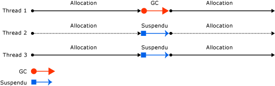
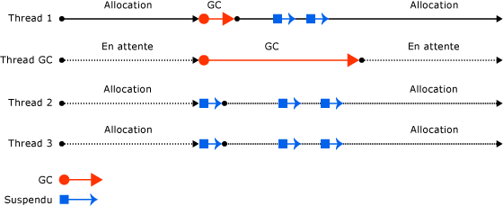
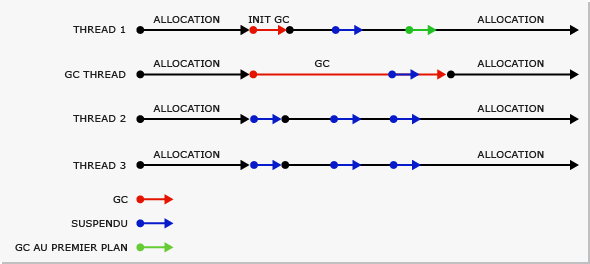
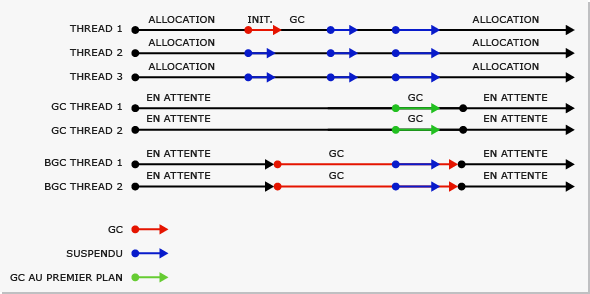

# Fundamentals of Garbage Collection
 Dans le Common Language Runtime \(CLR\), le garbage collector a un rôle de gestionnaire de mémoire automatique. Il fournit les avantages suivants :  
  
-   Il vous permet de développer votre application sans avoir à libérer de la mémoire.  
  
-   Il alloue efficacement les objets sur le tas managé.  
  
-   Il libère les objets qui ne sont plus utilisés, efface leur mémoire et garde la mémoire disponible pour les futures allocations. Les objets managés obtiennent automatiquement un contenu propre au démarrage, ce qui fait que leurs constructeurs n'ont pas à initialiser chaque champ de données.  
  
-   Il sécurise la mémoire en s'assurant qu'un objet ne peut pas utiliser le contenu d'un autre objet.  
  
 Cette rubrique décrit les concepts fondamentaux du garbage collection. Elle contient les sections suivantes :  
  
-   [Notions de base de la mémoire](#fundamentals_of_memory)  
  
-   [Conditions pour une opération garbage collection](#conditions_for_a_garbage_collection)  
  
-   [Tas managé](#the_managed_heap)  
  
-   [Générations](#generations)  
  
-   [Déroulement d'une opération garbage collection](#what_happens_during_a_garbage_collection)  
  
-   [Manipulation des ressources non managées](#manipulating_unmanaged_resources)  
  
-   [Garbage collection de station de travail et de serveur](#workstation_and_server_garbage_collection)  
  
-   [Garbage collection simultané](#concurrent_garbage_collection)  
  
-   [Nettoyage de la mémoire de la station de travail en arrière\-plan](#background_garbage_collection)  
  
-   [Nettoyage de la mémoire du serveur en arrière\-plan](#background_server_garbage_collection)  
  
   
## Notions de base de la mémoire  
 La liste suivante résume les concepts importants de la mémoire CLR.  
  
-   Chaque processus possède son propre espace d'adressage virtuel séparé. Tous les processus sur le même ordinateur partagent la même mémoire physique et le fichier d'échange s'il en existe un.  
  
-   Par défaut, sur les ordinateurs 32 bits, chaque processus a un espace d'adressage virtuel en mode utilisateur de 2 Go.  
  
-   En tant que développeur d'applications, vous travaillez uniquement avec l'espace d'adressage virtuel et ne gérez jamais directement la mémoire physique. Le garbage collector alloue et libère la mémoire virtuelle pour vous sur le tas managé.  
  
     Si vous écrivez du code natif, vous utilisez des fonctions Win32 pour utiliser l'espace d'adressage virtuel. Ces fonctions allouent et libèrent la mémoire virtuelle pour vous sur les tas natifs.  
  
-   La mémoire virtuelle peut être dans trois états :  
  
    -   Libre. Il n'existe aucune référence au bloc de mémoire et celui\-ci est disponible pour allocation.  
  
    -   Réservé. Le bloc de mémoire est disponible pour votre utilisation et ne peut pas être utilisé pour une autre demande d'allocation. Toutefois, vous ne pouvez pas stocker de données dans ce bloc de mémoire tant qu'il n'est pas validé.  
  
    -   Validé. Le bloc de mémoire est assigné au stockage physique.  
  
-   L'espace d'adressage virtuel peut être fragmenté. Cela signifie qu'il existe des blocs libres, également appelés trous, dans l'espace d'adressage. Lorsqu'une allocation de mémoire virtuelle est demandée, le gestionnaire de mémoire virtuelle doit rechercher un bloc unique libre suffisamment grand pour satisfaire la demande d'allocation. Même si vous disposez de 2 Go d'espace libre, l'allocation qui requiert 2 Go échoue, sauf si tout cet espace est contenu dans un bloc d'adresse unique.  
  
-   Vous pouvez manquer de mémoire si vous manquez d'espace d'adressage virtuel à réserver ou d'espace physique à valider.  
  
 Votre fichier d'échange est utilisé, même si la sollicitation de la mémoire physique \(c'est\-à\-dire, la demande de mémoire physique\) est faible. La première fois que la sollicitation de la mémoire physique est élevée, le système d'exploitation doit libérer de la place dans la mémoire physique pour stocker des données et sauvegarde une partie des données qui sont dans la mémoire physique dans le fichier d'échange. Ces données ne sont pas paginées tant qu'elles ne sont pas nécessaires, il est donc possible de rencontrer la pagination dans les situations dans lesquelles la sollicitation de la mémoire physique est très faible.  
  
 [Retour au début](#top)  
  
   
## Conditions pour une opération garbage collection  
 Le garbage collection se produit lorsque l'une des conditions suivantes est vraie :  
  
-   Le système possède peu de mémoire physique.  
  
-   La mémoire utilisée par les objets alloués sur le tas managé dépasse un seuil acceptable. Ce seuil est continuellement ajusté à mesure que le processus s'exécute.  
  
-   La méthode <xref:System.GC.Collect%2A?displayProperty=fullName> est appelée. Dans presque tous les cas, vous n'avez pas à appeler cette méthode, car le garbage collector s'exécute continuellement. Cette méthode est principalement utilisée pour les situations uniques et les tests.  
  
 [Retour au début](#top)  
  
   
## Tas managé  
 Une fois que le garbage collector est initialisé par le CLR, il alloue un segment de mémoire pour stocker et gérer des objets. Cette mémoire est appelée tas managé, par opposition à un tas natif dans le système d'exploitation.  
  
 Il existe un tas managé pour chaque processus managé. Tous les threads du processus allouent de la mémoire pour les objets sur le même tas.  
  
 Pour réserver de la mémoire, le récupérateur de mémoire appelle la fonction Win32 [VirtualAlloc](http://go.microsoft.com/fwlink/?LinkId=179047) et réserve un segment de mémoire à la fois pour les applications managées. Le récupérateur de mémoire réserve également des segments si nécessaire, et libère des segments dans le système d’exploitation \(après avoir effacé tous leurs objets\) en appelant la fonction Win32 [VirtualFree](http://go.microsoft.com/fwlink/?LinkId=179050).  
  
> [!IMPORTANT]
>  La taille des segments alloués par le garbage collector est spécifique à l'implémentation et susceptible de changer à tout moment, y compris les mises à jour périodiques. Votre application ne doit jamais faire d'hypothèses concernant une taille de segment particulière, ni dépendre de celle\-ci. Elle ne doit pas non plus tenter de configurer la quantité de mémoire disponible pour les allocations de segments.  
  
 Moins il y a d'objets alloués sur le tas, moins le garbage collector a à faire. Lorsque vous allouez des objets, n'utilisez pas de valeurs arrondies qui dépassent vos besoins, par exemple en allouant un tableau de 32 octets lorsque vous avez besoin de seulement 15 octets.  
  
 Lorsqu'un garbage collection est déclenché, le garbage collector libère la mémoire occupée par les objets morts. Le processus de libération compacte les objets vivants afin qu'ils soient déplacés ensemble, et l'espace inutilisé est supprimé, ce qui entraîne la diminution du tas. Les objets alloués ensemble restent ainsi ensemble sur le tas managé, pour conserver leur emplacement.  
  
 Le déroulement \(fréquence et durée\) des garbage collection est le résultat du volume des allocations et de la quantité de mémoire restante sur le tas managé.  
  
 Le tas peut être considéré comme l'accumulation de deux tas : le tas d'objets volumineux et le tas de petits objets.  
  
 Le tas d'objets volumineux contient de très grands objets de 85 000 octets ou plus. Ces objets du tas d'objets volumineux sont généralement des tableaux. Il est rare qu'un objet d'instance soit extrêmement grand.  
  
 [Retour au début](#top)  
  
   
## Générations  
 Le tas est organisé en générations. Il peut ainsi gérer des objets durables et éphémères. Le garbage collection consiste principalement en la récupération d'objets éphémères qui occupent généralement une petite partie du tas. Il existe trois générations d'objets sur le tas :  
  
-   **Génération 0**. Il s'agit de la génération la plus jeune, qui contient des objets éphémères. Un exemple d'objet éphémère est une variable temporaire. Le garbage collection a le plus souvent lieu dans cette génération.  
  
     Les objets alloués récemment forment une nouvelle génération d'objets et sont implicitement des collections de génération 0, à moins qu'ils ne s'agissent de grands objets, auquel cas ils entrent dans le tas d'objets volumineux dans une collection de génération 2.  
  
     La plupart des objets sont libérés pour l'opération garbage collection dans la génération 0 et ne survivent pas à la génération suivante.  
  
-   **Génération 1**. Cette génération contient des objets éphémères et sert de tampon entre objets éphémères et objets durables.  
  
-   **Génération 2**. Cette génération contient des objets durables. Un exemple d'objet durable est un objet dans une application serveur qui contient des données statiques qui sont vivantes pour la durée du processus.  
  
 Les opérations garbage collection se produisent sur des générations spécifiques, selon les conditions spécifiées. La collecte d'une génération signifie la collecte des objets de cette génération et de toutes ses générations plus jeunes. Les opérations garbage collection de génération 2 sont également appelées garbage collection complet, car elles libèrent tous les objets de toutes les générations \(autrement dit, tous les objets du tas managé\).  
  
### Survie et promotions  
 Les objets qui ne sont pas libérés dans un garbage collection sont appelé survivants et sont promus à la génération suivante. Les objets qui survivent à un garbage collection de génération 0 sont promus à la génération 1, les objets qui survivent à un garbage collection de génération 1 sont promus à la génération 2 et les objets qui survivent à un garbage collection de génération 2 restent dans la génération 2.  
  
 Lorsque le garbage collector détecte que le taux de survie est élevé dans une génération, il augmente le seuil des allocations de cette génération. La collecte suivante récupère donc une taille substantielle de mémoire libérée. Le CLR équilibre continuellement deux priorités : ne pas permettre au jeu de travail d'une application de devenir trop grand et ne pas permettre pas au garbage collection d'être trop long.  
  
### Segments et générations éphémères  
 Étant donné que les objets des générations 0 et 1 sont éphémères, ces générations sont appelées générations éphémères.  
  
 Les générations éphémères doivent être allouées dans le segment de mémoire appelé segment éphémère. Chaque nouveau segment acquis par le garbage collector devient le nouveau segment éphémère et contient les objets qui ont survécu à un garbage collection de génération 0. L'ancien segment éphémère devient le nouveau segment de génération 2.  
  
 La taille du segment éphémère peut varier selon que le système est 32 ou 64 bits. Elle peut également varier en fonction du type de garbage collector exécuté. Le tableau ci\-dessous répertorie les valeurs par défaut.  
  
||32 bits|64 bits|  
|-|-------------|-------------|  
|Garbage collector pour station de travail|16 Mo|256 Mo|  
|Garbage collector pour serveur|64 Mo|4 Go|  
|Garbage collector pour serveur \> 4 processeurs logiques|32 Mo|2 Go|  
|Garbage collector pour serveur \> 8 processeurs logiques|16 Mo|1 Go|  
  
 Le segment éphémère peut inclure des objets de la génération 2. Les objets de génération 2 peuvent utiliser plusieurs segments \(autant que votre processus en requiert et que la mémoire en autorise\).  
  
 La quantité de mémoire libérée à partir d'un garbage collection éphémère est limitée à la taille du segment éphémère. La quantité de mémoire libérée est proportionnelle à l'espace occupé par les objets morts.  
  
 [Retour au début](#top)  
  
   
## Déroulement d'une opération garbage collection  
 Une opération garbage collection présente les phases suivantes :  
  
-   Une phase de marquage qui recherche et crée une liste de tous les objets actifs.  
  
-   Une phase de déplacement qui met à jour les références aux objets qui seront compactés.  
  
-   Une phase de compactage qui libère l'espace occupé par les objets morts et compacte les objets survivants. La phase de compactage déplace les objets qui ont survécu à un garbage collection vers l'extrémité la plus ancienne du segment.  
  
     Étant donné que les collections de génération 2 peuvent occuper plusieurs segments, les objets promus dans la génération 2 peuvent être déplacés dans un segment plus ancien. Les survivants des générations 1 et 2 peuvent être déplacés vers un autre segment, car ils sont promus à la génération 2.  
  
     Normalement, le tas d'objets volumineux n'est pas compacté, car la copie d'objets volumineux implique une diminution des performances. Toutefois, à partir de [!INCLUDE[net_v451](../../../includes/net-v451-md.md)], vous pouvez utiliser la propriété <xref:System.Runtime.GCSettings.LargeObjectHeapCompactionMode%2A?displayProperty=fullName> pour compacter le tas d'objets volumineux à la demande.  
  
 Le garbage collector utilise les informations suivantes pour déterminer si les objets sont vivants :  
  
-   **Racines de pile**. Variables de pile fournies par le compilateur juste\-à\-temps \(JIT\) et l'explorateur de pile.  
  
-   **Handles de garbage collection**. Handles qui pointent vers les objets managés qui peuvent être alloués par le code utilisateur ou par le Common Language Runtime.  
  
-   **Données statiques**. Objets statiques des domaines d'application qui pourraient référencer d'autres objets. Chaque domaine d'application effectue le suivi de ses objets statiques.  
  
 Avant qu'une opération garbage collection ne démarre, tous les threads managés sont suspendus à l'exception du thread qui a déclenché l'opération.  
  
 L'illustration suivante montre un thread qui déclenche un garbage collection et entraîne l'interruption des autres threads.  
  
   
Thread qui déclenche un garbage collection  
  
 [Retour au début](#top)  
  
   
## Manipulation des ressources non managées  
 Si vos objets managés référencent des objets non managés à l'aide de leurs handles de fichiers natifs, vous devez libérer explicitement les objets non managés, car le garbage collector effectue le suivi de la mémoire uniquement sur le tas managé.  
  
 Les utilisateurs de votre objet managé ne peuvent pas supprimer les ressources natives utilisées par l'objet. Pour effectuer le nettoyage, vous pouvez rendre votre objet managé finalisable. La finalisation est constituée des actions de nettoyage que vous exécutez lorsque l'objet n'est plus utilisé. Lorsque votre objet managé meurt, il effectue les actions de nettoyage spécifiées dans sa méthode de finaliseur.  
  
 Lorsqu'un objet finalisable est détecté comme étant mort, son finaliseur est placé dans une file d'attente afin que ses actions de nettoyage soient exécutées, mais l'objet lui\-même est promu à la génération suivante. Par conséquent, vous devez attendre jusqu'au garbage collection suivant sur cette génération \(qui n'est pas nécessairement le garbage collection suivant\) pour déterminer si l'objet a été récupéré.  
  
 [Retour au début](#top)  
  
   
## Garbage collection de station de travail et de serveur  
 Le garbage collector s'ajuste automatiquement et peut travailler dans une large gamme de scénarios. Vous pouvez utiliser un paramètre du fichier de configuration pour définir le type de garbage collection en fonction des caractéristiques de la charge de travail. Le CLR fournit les types de garbage collection suivants :  
  
-   Garbage collection de station de travail, pour toutes les stations de travail clientes et les PC autonomes. Il s'agit du paramètre par défaut de l'[élément \<gcServer\>](../../../docs/framework/configure-apps/file-schema/runtime/gcserver-element.md) dans le schéma de configuration d'exécution.  
  
     Le garbage collection de station de travail peut être simultané ou non simultané. Le garbage collection simultané permet aux threads managés de continuer à fonctionner pendant un garbage collection.  
  
     En commençant par le [!INCLUDE[net_v40_long](../../../includes/net-v40-long-md.md)], le garbage collection d'arrière\-plan remplace le garbage collection simultané.  
  
-   Garbage collection de serveur, prévu pour les applications serveur qui ont besoin d'un débit et d'une extensibilité. Le garbage collection de serveur peut être non simultané ou en arrière\-plan.  
  
 Les illustrations suivantes montrent les threads dédiés qui exécutent un garbage collection sur un serveur.  
  
   
Garbage collection de serveur  
  
### Configuration du garbage collection  
 Vous pouvez utiliser l'[élément \<gcServer\>](../../../docs/framework/configure-apps/file-schema/runtime/gcserver-element.md) du schéma de configuration d'exécution pour spécifier le type de garbage collection que vous souhaitez que le CLR exécute. Lorsque l'attribut `enabled` de cet élément a la valeur `false` \(valeur par défaut\), le CLR exécute le garbage collection de station de travail. Lorsque vous affectez à l'attribut `enabled` la valeur `true`, le CLR exécute le garbage collection de serveur.  
  
 Le garbage collection simultané est spécifié avec l'[élément \<gcConcurrent\>](../../../docs/framework/configure-apps/file-schema/runtime/gcconcurrent-element.md) du schéma de configuration d'exécution. Le paramètre par défaut est `enabled`. Ce paramètre contrôle à la fois le garbage collection en cours et celui d'arrière\-plan.  
  
 Vous pouvez également spécifier le garbage collection de serveur avec des interfaces d'hébergement non managées. Notez que ASP.NET et SQL Server activent automatiquement le garbage collection de serveur si votre application est hébergée dans un de ces environnements.  
  
### Comparaison des opérations garbage collection de station de travail et de serveur  
 Voici les considérations liées aux threads et aux performances pour le garbage collection de station de travail :  
  
-   La collecte se produit sur le thread utilisateur qui a déclenché le garbage collection et reste à la même priorité. Étant donné que les threads utilisateur sont généralement exécutés à la priorité normale, le garbage collector \(qui s'exécute sur un thread de priorité normale\) doit rivaliser avec d'autres threads pour le temps processeur.  
  
     Les threads qui exécutent du code natif ne sont pas interrompus.  
  
-   Le garbage collection de station de travail est toujours utilisé sur un ordinateur doté d'un seul processeur, indépendamment du paramètre [\<gcServer\>](../../../docs/framework/configure-apps/file-schema/runtime/gcserver-element.md). Si vous spécifiez le garbage collection de serveur, le CLR utilise le garbage collection de station de travail avec la concurrence désactivée.  
  
 Voici les considérations liées aux threads et aux performances pour le garbage collection de serveur :  
  
-   La collecte se produit sur plusieurs threads dédiés qui s'exécutent au niveau de priorité `THREAD_PRIORITY_HIGHEST`.  
  
-   Un tas et un thread dédié pour effectuer le garbage collection sont fournis pour chaque UC, et les tas sont collectés au même moment. Chaque tas contient un tas de petits objets et un tas d'objets volumineux, et tous les tas peuvent faire l'objet d'accès par du code utilisateur. Les objets des différents tas peuvent faire référence les uns aux autres.  
  
-   Étant donné que plusieurs threads de garbage collection fonctionnent ensemble, le garbage collection de serveur est plus rapide que le garbage collection de station de travail sur un tas de même taille.  
  
-   Le garbage collection de serveur présente souvent des segments de plus grande taille. Notez, cependant, qu'il ne s'agit que d'une généralisation : la taille de segment est spécifique à l'implémentation et est susceptible de changer. Vous ne devez pas faire d'hypothèses sur la taille des segments alloués par le garbage collector lors du paramétrage de votre application.  
  
-   Le garbage collection de serveur peut consommer beaucoup de ressources. Par exemple, si vous disposez de 12 processus qui s'exécutent sur un ordinateur possédant 4 processeurs, il y aura 48 threads de garbage collection dédiés s'ils utilisent tous le garbage collection de serveur. Dans une situation de charge de mémoire élevée, si tous les processus commencent le garbage collection, le garbage collector aura 48 threads à planifier.  
  
 Si vous exécutez des centaines d'instances d'une application, envisagez d'utiliser le garbage collection de station de travail avec le garbage collection simultané désactivé. Cela provoquera moins de changements de contexte, ce qui peut améliorer les performances.  
  
 [Retour au début](#top)  
  
   
## Garbage collection simultané  
 Avec le garbage collection de station de travail ou de serveur, vous pouvez activer un garbage collection simultané, ce qui permet aux threads de fonctionner simultanément avec un thread dédié qui exécute le garbage collection pendant une grande partie de la durée de ce dernier. Cette option affecte uniquement les opérations garbage collection de génération 2. Les générations 0 et 1 sont toujours non simultanées car elles se terminent très rapidement.  
  
 Le garbage collection simultané permet aux applications interactives d'être plus réactives en réduisant les pauses d'une collection. Les threads managés peuvent continuer à s'exécuter une grande partie de la durée du garbage collection simultané. Cela génère des pauses plus courtes pendant l'opération garbage collection.  
  
 Pour améliorer les performances lorsque plusieurs processus s'exécutent, désactivez le garbage collection simultané. Pour cela, vous pouvez ajouter un [élément \<gcConcurrent\>](../../../docs/framework/configure-apps/file-schema/runtime/gcconcurrent-element.md) dans le fichier de configuration de l'application et définir son attribut `enabled` à la valeur `"false"`.  
  
 Le garbage collection simultané est exécuté sur un thread dédié. Par défaut, le CLR effectue le garbage collection de station de travail avec le garbage collection simultané activé. Ceci est vrai pour les ordinateurs multiprocesseur et à processeur unique.  
  
 Votre capacité à allouer de petits objets sur le tas pendant un garbage collection simultané est limitée par les objets restants dans le segment éphémère lorsqu'une opération garbage collection simultanée démarre. Dès que vous atteignez la fin du segment, vous devez attendre que le garbage collection simultané se termine pendant que les threads managés qui doivent effectuer les allocations des petits objet sont interrompus.  
  
 Le garbage collection simultané possède un jeu de travail légèrement plus grand \(comparé au garbage collection non simultané\) car vous pouvez allouer des objets pendant la collecte simultanée. Toutefois, cela peut affecter les performances, car les objets que vous allouez deviennent une partie de votre jeu de travail. Essentiellement, le garbage collection simultané échange de l'UC et de la mémoire contre des pauses plus courtes.  
  
 L'illustration suivante montre le garbage collection simultané exécuté sur un thread dédié différent.  
  
   
Garbage collection simultané  
  
 [Retour au début](#top)  
  
   
## Nettoyage de la mémoire de la station de travail en arrière\-plan  
 Avec le garbage collection d'arrière\-plan, les générations éphémères \(0 et 1\) sont collectées si nécessaire pendant la collecte de la génération 2. Il n'y a aucun paramètre pour le garbage collection d'arrière\-plan. Il est automatiquement activé avec le garbage collection simultané. Le garbage collection d'arrière\-plan vient en remplacement du garbage collection simultané. Comme le garbage collection simultané, le garbage collection d'arrière\-plan est exécuté sur un thread dédié et est uniquement applicable aux collections de génération 2.  
  
> [!NOTE]
>  Le garbage collection d'arrière\-plan est uniquement disponible dans le [!INCLUDE[net_v40_short](../../../includes/net-v40-short-md.md)] et les versions ultérieures. Dans [!INCLUDE[net_v40_short](../../../includes/net-v40-short-md.md)], il est pris en charge uniquement pour le garbage collection de station de travail. Depuis .NET Framework 4.5, le garbage collection en arrière\-plan est disponible pour les deux opérations garbage collection de station de travail et de serveur.  
  
 Une collecte sur des générations éphémères pendant le garbage collection d'arrière\-plan est appelée garbage collection de premier plan. Lorsque des opérations garbage collection de premier plan ont lieu, tous les threads managés sont suspendus.  
  
 Lorsque le garbage collection d'arrière\-plan est en cours et que vous avez alloué assez d'objets dans la génération 0, le CLR exécute un garbage collection de premier plan de génération 0 ou 1. Le thread de garbage collection d'arrière\-plan dédié vérifie des points sécurisés fréquents de façon à déterminer s'il existe une demande de garbage collection de premier plan. Le cas échéant, la collecte d'arrière\-plan s'interrompt afin que le garbage collection de premier plan puisse se produire. Une fois le garbage collection de premier plan terminé, le thread de garbage collection d'arrière\-plan dédié et les threads utilisateur reprennent.  
  
 Le garbage collection d'arrière\-plan supprime les restrictions d'allocation imposées par le garbage collection simultané, car des opérations garbage collection éphémères peuvent se produire pendant le garbage collection d'arrière\-plan. Cela signifie que le garbage collection d'arrière\-plan peut supprimer des objets morts dans les générations éphémères et peut également développer le tas si nécessaire pendant un garbage collection de génération 1.  
  
 L'illustration suivante montre le garbage collection en arrière\-plan exécuté sur un thread dédié distinct, sur une station de travail.  
  
   
Nettoyage de la mémoire de la station de travail en arrière\-plan  
  
 [Retour au début](#top)  
  
   
## Nettoyage de la mémoire du serveur en arrière\-plan  
 Depuis .NET Framework 4.5, le garbage collection de serveur en arrière\-plan est le mode par défaut pour le garbage collection de serveur. Pour choisir ce mode, affectez à l'attribut `enabled` de l'[élément \<gcServer\>](../../../docs/framework/configure-apps/file-schema/runtime/gcserver-element.md) la valeur `true` dans le schéma de configuration d'exécution. Ce mode fonctionne de la même façon que le garbage collection de station de travail en arrière\-plan, décrit dans la section précédente, mais il existe quelques différences. Le garbage collection de station de travail en arrière\-plan utilise un thread de garbage collection en arrière\-plan dédié, tandis que le garbage collection de serveur en arrière\-plan utilise plusieurs threads : généralement un thread dédié pour chaque processeur logique. Contrairement au thread du garbage collection de station de travail en arrière\-plan, ces threads n'expirent pas.  
  
 L'illustration suivante montre le garbage collection en arrière\-plan exécuté sur un thread dédié distinct sur un serveur.  
  
   
Nettoyage de la mémoire du serveur en arrière\-plan  
  
## Voir aussi  
 [Garbage Collection](../../../docs/standard/garbage-collection/index.md)