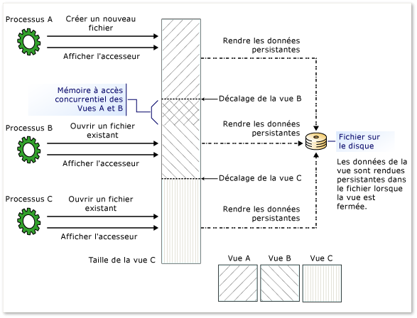

# <a name="memory-mapped-files"></a><span data-ttu-id="5b097-102">Fichiers mappés en mémoire</span><span class="sxs-lookup"><span data-stu-id="5b097-102">Memory-Mapped Files</span></span>
<span data-ttu-id="5b097-103">Un fichier mappé en mémoire comporte le contenu d'un fichier en mémoire virtuelle.</span><span class="sxs-lookup"><span data-stu-id="5b097-103">A memory-mapped file contains the contents of a file in virtual memory.</span></span> <span data-ttu-id="5b097-104">Ce mappage entre un espace de fichier et de la mémoire permet à une application, y compris plusieurs processus modifier le fichier à lire et écrire directement dans la mémoire.</span><span class="sxs-lookup"><span data-stu-id="5b097-104">This mapping between a file and memory space enables an application, including multiple processes, to modify the file by reading and writing directly to the memory.</span></span> <span data-ttu-id="5b097-105">En commençant par le [!INCLUDE[net_v40_long](../../../includes/net-v40-long-md.md)], vous pouvez utiliser du code managé pour accéder aux fichiers mappés en mémoire de la même façon que les fonctions Windows natives accéder aux fichiers mappés en mémoire, comme décrit dans [fichiers http://go.Microsoft.com/fwlink/?linkid=180801 dans Win32](http://go.microsoft.com/fwlink/?linkid=180801).</span><span class="sxs-lookup"><span data-stu-id="5b097-105">Starting with the [!INCLUDE[net_v40_long](../../../includes/net-v40-long-md.md)], you can use managed code to access memory-mapped files in the same way that native Windows functions access memory-mapped files, as described in [Managing Memory-Mapped Files in Win32](http://go.microsoft.com/fwlink/?linkid=180801).</span></span>  
  
 <span data-ttu-id="5b097-106">Il existe deux types de fichiers mappés en mémoire :</span><span class="sxs-lookup"><span data-stu-id="5b097-106">There are two types of memory-mapped files:</span></span>  
  
-   <span data-ttu-id="5b097-107">Fichiers mappés en mémoire persistantes</span><span class="sxs-lookup"><span data-stu-id="5b097-107">Persisted memory-mapped files</span></span>  
  
     <span data-ttu-id="5b097-108">Fichiers persistants sont des fichiers mappés en mémoire qui sont associés à un fichier source sur un disque.</span><span class="sxs-lookup"><span data-stu-id="5b097-108">Persisted files are memory-mapped files that are associated with a source file on a disk.</span></span> <span data-ttu-id="5b097-109">Lorsque le dernier processus a fini de travailler avec le fichier, les données sont enregistrées dans le fichier source sur le disque.</span><span class="sxs-lookup"><span data-stu-id="5b097-109">When the last process has finished working with the file, the data is saved to the source file on the disk.</span></span> <span data-ttu-id="5b097-110">Ces fichiers mappés en mémoire sont adaptés pour travailler avec les fichiers sources extrêmement volumineux.</span><span class="sxs-lookup"><span data-stu-id="5b097-110">These memory-mapped files are suitable for working with extremely large source files.</span></span>  
  
-   <span data-ttu-id="5b097-111">Fichiers mappés en mémoire non persistants</span><span class="sxs-lookup"><span data-stu-id="5b097-111">Non-persisted memory-mapped files</span></span>  
  
     <span data-ttu-id="5b097-112">Fichiers non persistants sont des fichiers mappés en mémoire qui ne sont pas associés à un fichier sur un disque.</span><span class="sxs-lookup"><span data-stu-id="5b097-112">Non-persisted files are memory-mapped files that are not associated with a file on a disk.</span></span> <span data-ttu-id="5b097-113">Lorsque le dernier processus a fini de travailler avec le fichier, les données sont perdues et le fichier est récupéré par le garbage collection.</span><span class="sxs-lookup"><span data-stu-id="5b097-113">When the last process has finished working with the file, the data is lost and the file is reclaimed by garbage collection.</span></span> <span data-ttu-id="5b097-114">Ces fichiers sont appropriés pour la création d’une mémoire partagée pour les communications entre processus (IPC).</span><span class="sxs-lookup"><span data-stu-id="5b097-114">These files are suitable for creating shared memory for inter-process communications (IPC).</span></span>  
  
## <a name="processes-views-and-managing-memory"></a><span data-ttu-id="5b097-115">Gestion de mémoire, des vues et des processus</span><span class="sxs-lookup"><span data-stu-id="5b097-115">Processes, Views, and Managing Memory</span></span>  
 <span data-ttu-id="5b097-116">Fichiers mappés en mémoire peuvent être partagés entre plusieurs processus.</span><span class="sxs-lookup"><span data-stu-id="5b097-116">Memory-mapped files can be shared across multiple processes.</span></span> <span data-ttu-id="5b097-117">Processus peuvent être mappés dans le même fichier mappé en mémoire à l’aide d’un nom commun qui est attribué par le processus qui a créé le fichier.</span><span class="sxs-lookup"><span data-stu-id="5b097-117">Processes can map to the same memory-mapped file by using a common name that is assigned by the process that created the file.</span></span>  
  
 <span data-ttu-id="5b097-118">Pour utiliser un fichier mappé en mémoire, vous devez créer une vue de l’intégralité du fichier mappé en mémoire ou une partie de celui-ci.</span><span class="sxs-lookup"><span data-stu-id="5b097-118">To work with a memory-mapped file, you must create a view of the entire memory-mapped file or a part of it.</span></span> <span data-ttu-id="5b097-119">Vous pouvez également créer plusieurs vues à la même partie du fichier mappé en mémoire, en créant la mémoire simultanés.</span><span class="sxs-lookup"><span data-stu-id="5b097-119">You can also create multiple views to the same part of the memory-mapped file, thereby creating concurrent memory.</span></span> <span data-ttu-id="5b097-120">Pour les deux vues restent simultanées, elles doivent être créées à partir du même fichier mappé en mémoire.</span><span class="sxs-lookup"><span data-stu-id="5b097-120">For two views to remain concurrent, they have to be created from the same memory-mapped file.</span></span>  
  
 <span data-ttu-id="5b097-121">Plusieurs vues peuvent également être nécessaires si le fichier est supérieur à la taille de l’espace de mémoire logique de l’application disponible pour le mappage (2 Go sur un ordinateur 32 bits) de mémoire.</span><span class="sxs-lookup"><span data-stu-id="5b097-121">Multiple views may also be necessary if the file is greater than the size of the application’s logical memory space available for memory mapping (2 GB on a 32-bit computer).</span></span>  
  
 <span data-ttu-id="5b097-122">Il existe deux types de vues : vue de l’accès et le mode d’accès aléatoire de flux.</span><span class="sxs-lookup"><span data-stu-id="5b097-122">There are two types of views: stream access view and random access view.</span></span> <span data-ttu-id="5b097-123">Utilisez les vues d’accès continu pour un accès séquentiel à un fichier ; Cela est recommandé pour les fichiers non persistants et IPC.</span><span class="sxs-lookup"><span data-stu-id="5b097-123">Use stream access views for sequential access to a file; this is recommended for non-persisted files and IPC.</span></span> <span data-ttu-id="5b097-124">Vues d’accès aléatoire sont privilégiés pour l’utilisation des fichiers persistants.</span><span class="sxs-lookup"><span data-stu-id="5b097-124">Random access views are preferred for working with persisted files.</span></span>  
  
 <span data-ttu-id="5b097-125">Fichiers mappés en mémoire sont accessibles via le Gestionnaire de mémoire du système d’exploitation, le fichier est donc automatiquement partitionné en un nombre de pages et accessibles en fonction des besoins.</span><span class="sxs-lookup"><span data-stu-id="5b097-125">Memory-mapped files are accessed through the operating system’s memory manager, so the file is automatically partitioned into a number of pages and accessed as needed.</span></span> <span data-ttu-id="5b097-126">Vous n’avez pas à gérer la mémoire vous-même.</span><span class="sxs-lookup"><span data-stu-id="5b097-126">You do not have to handle the memory management yourself.</span></span>  
  
 <span data-ttu-id="5b097-127">L’illustration suivante montre comment plusieurs processus peuvent avoir plusieurs et qui se chevauchent vues dans le même fichier mappé en mémoire en même temps.</span><span class="sxs-lookup"><span data-stu-id="5b097-127">The following illustration shows how multiple processes can have multiple and overlapping views to the same memory-mapped file at the same time.</span></span>  
  
 <span data-ttu-id="5b097-128">![Affiche les vues à une mémoire &#45; le fichier mappé. ] (../../../docs/standard/io/media/memmappersisted.png "MemMapPersisted")</span><span class="sxs-lookup"><span data-stu-id="5b097-128"></span></span>  
<span data-ttu-id="5b097-129">Plusieurs et avec chevauchement des vues dans un fichier mappé en mémoire</span><span class="sxs-lookup"><span data-stu-id="5b097-129">Multiple and overlapped views to a memory-mapped file</span></span>  
  
## <a name="programming-with-memory-mapped-files"></a><span data-ttu-id="5b097-130">Programmation avec les fichiers mappés en mémoire</span><span class="sxs-lookup"><span data-stu-id="5b097-130">Programming with Memory-Mapped Files</span></span>  
 <span data-ttu-id="5b097-131">Le tableau suivant fournit un guide pour l’utilisation des objets de fichier mappé en mémoire et leurs membres.</span><span class="sxs-lookup"><span data-stu-id="5b097-131">The following table provides a guide for using memory-mapped file objects and their members.</span></span>  
  
|<span data-ttu-id="5b097-132">Tâche</span><span class="sxs-lookup"><span data-stu-id="5b097-132">Task</span></span>|<span data-ttu-id="5b097-133">Méthodes ou propriétés à utiliser</span><span class="sxs-lookup"><span data-stu-id="5b097-133">Methods or properties to use</span></span>|  
|----------|----------------------------------|  
|<span data-ttu-id="5b097-134">Pour obtenir un <xref:System.IO.MemoryMappedFiles.MemoryMappedFile> objet qui représente un fichier mappé en mémoire persistant à partir d’un fichier sur disque.</span><span class="sxs-lookup"><span data-stu-id="5b097-134">To obtain a <xref:System.IO.MemoryMappedFiles.MemoryMappedFile> object that represents a persisted memory-mapped file from a file on disk.</span></span>|<span data-ttu-id="5b097-135">Méthode <xref:System.IO.MemoryMappedFiles.MemoryMappedFile.CreateFromFile%2A?displayProperty=nameWithType>.</span><span class="sxs-lookup"><span data-stu-id="5b097-135"><xref:System.IO.MemoryMappedFiles.MemoryMappedFile.CreateFromFile%2A?displayProperty=nameWithType> method.</span></span>|  
|<span data-ttu-id="5b097-136">Pour obtenir un <xref:System.IO.MemoryMappedFiles.MemoryMappedFile> objet qui représente un fichier mappé en mémoire non persistant (non associé à un fichier sur disque).</span><span class="sxs-lookup"><span data-stu-id="5b097-136">To obtain a <xref:System.IO.MemoryMappedFiles.MemoryMappedFile> object that represents a non-persisted memory-mapped file (not associated with a file on disk).</span></span>|<span data-ttu-id="5b097-137">Méthode <xref:System.IO.MemoryMappedFiles.MemoryMappedFile.CreateNew%2A?displayProperty=nameWithType>.</span><span class="sxs-lookup"><span data-stu-id="5b097-137"><xref:System.IO.MemoryMappedFiles.MemoryMappedFile.CreateNew%2A?displayProperty=nameWithType> method.</span></span><br /><br /> <span data-ttu-id="5b097-138">ou</span><span class="sxs-lookup"><span data-stu-id="5b097-138">- or -</span></span><br /><br /> <span data-ttu-id="5b097-139">Méthode <xref:System.IO.MemoryMappedFiles.MemoryMappedFile.CreateOrOpen%2A?displayProperty=nameWithType>.</span><span class="sxs-lookup"><span data-stu-id="5b097-139"><xref:System.IO.MemoryMappedFiles.MemoryMappedFile.CreateOrOpen%2A?displayProperty=nameWithType> method.</span></span>|  
|<span data-ttu-id="5b097-140">Pour obtenir un <xref:System.IO.MemoryMappedFiles.MemoryMappedFile> l’objet d’un fichier mappé en mémoire existant (persistant ou non persistant).</span><span class="sxs-lookup"><span data-stu-id="5b097-140">To obtain a <xref:System.IO.MemoryMappedFiles.MemoryMappedFile> object of an existing memory-mapped file (either persisted or non-persisted).</span></span>|<span data-ttu-id="5b097-141">Méthode <xref:System.IO.MemoryMappedFiles.MemoryMappedFile.OpenExisting%2A?displayProperty=nameWithType>.</span><span class="sxs-lookup"><span data-stu-id="5b097-141"><xref:System.IO.MemoryMappedFiles.MemoryMappedFile.OpenExisting%2A?displayProperty=nameWithType> method.</span></span>|  
|<span data-ttu-id="5b097-142">Pour obtenir un <xref:System.IO.UnmanagedMemoryStream> objet pour un accès séquentiel affichage au fichier mappé en mémoire.</span><span class="sxs-lookup"><span data-stu-id="5b097-142">To obtain a <xref:System.IO.UnmanagedMemoryStream> object for a sequentially accessed view to the memory-mapped file.</span></span>|<span data-ttu-id="5b097-143">Méthode <xref:System.IO.MemoryMappedFiles.MemoryMappedFile.CreateViewStream%2A?displayProperty=nameWithType>.</span><span class="sxs-lookup"><span data-stu-id="5b097-143"><xref:System.IO.MemoryMappedFiles.MemoryMappedFile.CreateViewStream%2A?displayProperty=nameWithType> method.</span></span>|  
|<span data-ttu-id="5b097-144">Pour obtenir un <xref:System.IO.UnmanagedMemoryAccessor> de l’objet pour une vue d’un accès aléatoire à un mappé en mémoire fichier.</span><span class="sxs-lookup"><span data-stu-id="5b097-144">To obtain a <xref:System.IO.UnmanagedMemoryAccessor> object for a random access view to a memory-mapped fie.</span></span>|<span data-ttu-id="5b097-145">Méthode <xref:System.IO.MemoryMappedFiles.MemoryMappedFile.CreateViewAccessor%2A?displayProperty=nameWithType>.</span><span class="sxs-lookup"><span data-stu-id="5b097-145"><xref:System.IO.MemoryMappedFiles.MemoryMappedFile.CreateViewAccessor%2A?displayProperty=nameWithType> method.</span></span>|  
|<span data-ttu-id="5b097-146">Pour obtenir un <xref:Microsoft.Win32.SafeHandles.SafeMemoryMappedViewHandle> objet à utiliser avec le code non managé.</span><span class="sxs-lookup"><span data-stu-id="5b097-146">To obtain a <xref:Microsoft.Win32.SafeHandles.SafeMemoryMappedViewHandle> object to use with unmanaged code.</span></span>|<span data-ttu-id="5b097-147">Propriété <xref:System.IO.MemoryMappedFiles.MemoryMappedFile.SafeMemoryMappedFileHandle%2A?displayProperty=nameWithType>.</span><span class="sxs-lookup"><span data-stu-id="5b097-147"><xref:System.IO.MemoryMappedFiles.MemoryMappedFile.SafeMemoryMappedFileHandle%2A?displayProperty=nameWithType> property.</span></span><br /><br /> <span data-ttu-id="5b097-148">ou</span><span class="sxs-lookup"><span data-stu-id="5b097-148">- or -</span></span><br /><br /> <span data-ttu-id="5b097-149">Propriété <xref:System.IO.MemoryMappedFiles.MemoryMappedViewAccessor.SafeMemoryMappedViewHandle%2A?displayProperty=nameWithType>.</span><span class="sxs-lookup"><span data-stu-id="5b097-149"><xref:System.IO.MemoryMappedFiles.MemoryMappedViewAccessor.SafeMemoryMappedViewHandle%2A?displayProperty=nameWithType> property.</span></span><br /><br /> <span data-ttu-id="5b097-150">ou</span><span class="sxs-lookup"><span data-stu-id="5b097-150">- or -</span></span><br /><br /> <span data-ttu-id="5b097-151">Propriété <xref:System.IO.MemoryMappedFiles.MemoryMappedViewStream.SafeMemoryMappedViewHandle%2A?displayProperty=nameWithType>.</span><span class="sxs-lookup"><span data-stu-id="5b097-151"><xref:System.IO.MemoryMappedFiles.MemoryMappedViewStream.SafeMemoryMappedViewHandle%2A?displayProperty=nameWithType> property.</span></span>|  
|<span data-ttu-id="5b097-152">Pour différer l’allocation de mémoire tant que la vue est créée (fichiers non persistants uniquement).</span><span class="sxs-lookup"><span data-stu-id="5b097-152">To delay allocating memory until a view is created (non-persisted files only).</span></span><br /><br /> <span data-ttu-id="5b097-153">(Pour déterminer la taille de page en cours du système, utilisez le <xref:System.Environment.SystemPageSize%2A?displayProperty=nameWithType> propriété.)</span><span class="sxs-lookup"><span data-stu-id="5b097-153">(To determine the current system page size, use the <xref:System.Environment.SystemPageSize%2A?displayProperty=nameWithType> property.)</span></span>|<span data-ttu-id="5b097-154"><xref:System.IO.MemoryMappedFiles.MemoryMappedFile.CreateNew%2A>méthode avec le <xref:System.IO.MemoryMappedFiles.MemoryMappedFileOptions.DelayAllocatePages?displayProperty=nameWithType> valeur.</span><span class="sxs-lookup"><span data-stu-id="5b097-154"><xref:System.IO.MemoryMappedFiles.MemoryMappedFile.CreateNew%2A> method with the <xref:System.IO.MemoryMappedFiles.MemoryMappedFileOptions.DelayAllocatePages?displayProperty=nameWithType> value.</span></span><br /><br /> <span data-ttu-id="5b097-155">ou</span><span class="sxs-lookup"><span data-stu-id="5b097-155">- or -</span></span><br /><br /> <span data-ttu-id="5b097-156"><xref:System.IO.MemoryMappedFiles.MemoryMappedFile.CreateOrOpen%2A>les méthodes qui ont un <xref:System.IO.MemoryMappedFiles.MemoryMappedFileOptions> énumération en tant que paramètre.</span><span class="sxs-lookup"><span data-stu-id="5b097-156"><xref:System.IO.MemoryMappedFiles.MemoryMappedFile.CreateOrOpen%2A> methods that have a <xref:System.IO.MemoryMappedFiles.MemoryMappedFileOptions> enumeration as a parameter.</span></span>|  
  
### <a name="security"></a><span data-ttu-id="5b097-157">Sécurité</span><span class="sxs-lookup"><span data-stu-id="5b097-157">Security</span></span>  
 <span data-ttu-id="5b097-158">Vous pouvez appliquer des droits d’accès lorsque vous créez un fichier mappé en mémoire, en utilisant les méthodes suivantes qui prennent un <xref:System.IO.MemoryMappedFiles.MemoryMappedFileAccess> énumération en tant que paramètre :</span><span class="sxs-lookup"><span data-stu-id="5b097-158">You can apply access rights when you create a memory-mapped file, by using the following methods that take a <xref:System.IO.MemoryMappedFiles.MemoryMappedFileAccess> enumeration as a parameter:</span></span>  
  
-   <xref:System.IO.MemoryMappedFiles.MemoryMappedFile.CreateFromFile%2A?displayProperty=nameWithType>  
  
-   <xref:System.IO.MemoryMappedFiles.MemoryMappedFile.CreateNew%2A?displayProperty=nameWithType>  
  
-   <xref:System.IO.MemoryMappedFiles.MemoryMappedFile.CreateOrOpen%2A?displayProperty=nameWithType>  
  
 <span data-ttu-id="5b097-159">Vous pouvez spécifier les droits d’accès pour l’ouverture d’un fichier mappé en mémoire à l’aide de la <xref:System.IO.MemoryMappedFiles.MemoryMappedFile.OpenExisting%2A> méthodes qui prennent un <xref:System.IO.MemoryMappedFiles.MemoryMappedFileRights> en tant que paramètre.</span><span class="sxs-lookup"><span data-stu-id="5b097-159">You can specify access rights for opening an existing memory-mapped file by using the <xref:System.IO.MemoryMappedFiles.MemoryMappedFile.OpenExisting%2A> methods that take an <xref:System.IO.MemoryMappedFiles.MemoryMappedFileRights> as a parameter.</span></span>  
  
 <span data-ttu-id="5b097-160">En outre, vous pouvez inclure un <xref:System.IO.MemoryMappedFiles.MemoryMappedFileSecurity> objet qui contient des règles d’accès prédéfinies.</span><span class="sxs-lookup"><span data-stu-id="5b097-160">In addition, you can include a <xref:System.IO.MemoryMappedFiles.MemoryMappedFileSecurity> object that contains predefined access rules.</span></span>  
  
 <span data-ttu-id="5b097-161">Pour appliquer des règles d’accès nouvelles ou modifiées dans un fichier mappé en mémoire, utilisez le <xref:System.IO.MemoryMappedFiles.MemoryMappedFile.SetAccessControl%2A> (méthode).</span><span class="sxs-lookup"><span data-stu-id="5b097-161">To apply new or changed access rules to a memory-mapped file, use the <xref:System.IO.MemoryMappedFiles.MemoryMappedFile.SetAccessControl%2A> method.</span></span> <span data-ttu-id="5b097-162">Pour récupérer l’accès ou d’audit à partir d’un fichier existant, utilisez la <xref:System.IO.MemoryMappedFiles.MemoryMappedFile.GetAccessControl%2A> (méthode).</span><span class="sxs-lookup"><span data-stu-id="5b097-162">To retrieve access or audit rules from an existing file, use the <xref:System.IO.MemoryMappedFiles.MemoryMappedFile.GetAccessControl%2A> method.</span></span>  
  
## <a name="examples"></a><span data-ttu-id="5b097-163">Exemples</span><span class="sxs-lookup"><span data-stu-id="5b097-163">Examples</span></span>  
  
### <a name="persisted-memory-mapped-files"></a><span data-ttu-id="5b097-164">Fichiers mappés en mémoire persistantes</span><span class="sxs-lookup"><span data-stu-id="5b097-164">Persisted Memory-Mapped Files</span></span>  
 <span data-ttu-id="5b097-165">Le <xref:System.IO.MemoryMappedFiles.MemoryMappedFile.CreateFromFile%2A> méthodes créent un fichier mappé en mémoire à partir d’un fichier existant sur le disque.</span><span class="sxs-lookup"><span data-stu-id="5b097-165">The <xref:System.IO.MemoryMappedFiles.MemoryMappedFile.CreateFromFile%2A> methods create a memory-mapped file from an existing file on disk.</span></span>  
  
 <span data-ttu-id="5b097-166">L’exemple suivant crée une vue mappé en mémoire d’une partie d’un fichier très volumineux et manipule une partie de celui-ci.</span><span class="sxs-lookup"><span data-stu-id="5b097-166">The following example creates a memory-mapped view of a part of an extremely large file and manipulates a portion of it.</span></span>  
  
 [!code-csharp[MemoryMappedFiles.MemoryMappedFile.CreateFromFile#1](../../../samples/snippets/csharp/VS_Snippets_CLR/memorymappedfiles.memorymappedfile.createfromfile/cs/program.cs#1)]
 [!code-vb[MemoryMappedFiles.MemoryMappedFile.CreateFromFile#1](../../../samples/snippets/visualbasic/VS_Snippets_CLR/memorymappedfiles.memorymappedfile.createfromfile/vb/program.vb#1)]  
  
 <span data-ttu-id="5b097-167">L’exemple suivant ouvre le même fichier mappé en mémoire pour un autre processus.</span><span class="sxs-lookup"><span data-stu-id="5b097-167">The following example opens the same memory-mapped file for another process.</span></span>  
  
 [!code-csharp[MemoryMappedFiles.MemoryMappedFile.OpenExisting#1](../../../samples/snippets/csharp/VS_Snippets_CLR/memorymappedfiles.memorymappedfile.openexisting/cs/program.cs#1)]
 [!code-vb[MemoryMappedFiles.MemoryMappedFile.OpenExisting#1](../../../samples/snippets/visualbasic/VS_Snippets_CLR/memorymappedfiles.memorymappedfile.openexisting/vb/program.vb#1)]  
  
### <a name="non-persisted-memory-mapped-files"></a><span data-ttu-id="5b097-168">Fichiers mappés en mémoire non persistants</span><span class="sxs-lookup"><span data-stu-id="5b097-168">Non-Persisted Memory-Mapped Files</span></span>  
 <span data-ttu-id="5b097-169">Le <xref:System.IO.MemoryMappedFiles.MemoryMappedFile.CreateNew%2A> et <xref:System.IO.MemoryMappedFiles.MemoryMappedFile.CreateOrOpen%2A> méthodes créent un fichier mappé en mémoire qui n’est pas mappé à un fichier existant sur le disque.</span><span class="sxs-lookup"><span data-stu-id="5b097-169">The <xref:System.IO.MemoryMappedFiles.MemoryMappedFile.CreateNew%2A> and <xref:System.IO.MemoryMappedFiles.MemoryMappedFile.CreateOrOpen%2A> methods create a memory-mapped file that is not mapped to an existing file on disk.</span></span>  
  
 <span data-ttu-id="5b097-170">L’exemple suivant se compose de trois processus distincts (applications console) qui écrivent des valeurs booléennes dans un fichier mappé en mémoire.</span><span class="sxs-lookup"><span data-stu-id="5b097-170">The following example consists of three separate processes (console applications) that write Boolean values to a memory-mapped file.</span></span> <span data-ttu-id="5b097-171">La séquence suivante d’actions se produisent :</span><span class="sxs-lookup"><span data-stu-id="5b097-171">The following sequence of actions occur:</span></span>  
  
1.  <span data-ttu-id="5b097-172">`Process A`crée le fichier mappé en mémoire et écrit une valeur.</span><span class="sxs-lookup"><span data-stu-id="5b097-172">`Process A` creates the memory-mapped file and writes a value to it.</span></span>  
  
2.  <span data-ttu-id="5b097-173">`Process B`Ouvre le fichier mappé en mémoire et écrit une valeur.</span><span class="sxs-lookup"><span data-stu-id="5b097-173">`Process B` opens the memory-mapped file and writes a value to it.</span></span>  
  
3.  <span data-ttu-id="5b097-174">`Process C`Ouvre le fichier mappé en mémoire et écrit une valeur.</span><span class="sxs-lookup"><span data-stu-id="5b097-174">`Process C` opens the memory-mapped file and writes a value to it.</span></span>  
  
4.  <span data-ttu-id="5b097-175">`Process A`lit et affiche les valeurs à partir du fichier mappé en mémoire.</span><span class="sxs-lookup"><span data-stu-id="5b097-175">`Process A` reads and displays the values from the memory-mapped file.</span></span>  
  
5.  <span data-ttu-id="5b097-176">Après avoir `Process A` est terminé avec le fichier mappé en mémoire, le fichier est immédiatement libéré par le garbage collection.</span><span class="sxs-lookup"><span data-stu-id="5b097-176">After `Process A` is finished with the memory-mapped file, the file is immediately reclaimed by garbage collection.</span></span>  
  
 <span data-ttu-id="5b097-177">Pour exécuter cet exemple, procédez comme suit :</span><span class="sxs-lookup"><span data-stu-id="5b097-177">To run this example, do the following:</span></span>  
  
1.  <span data-ttu-id="5b097-178">Compilez les applications et ouvrez trois fenêtres d’invite de commandes.</span><span class="sxs-lookup"><span data-stu-id="5b097-178">Compile the applications and open three Command Prompt windows.</span></span>  
  
2.  <span data-ttu-id="5b097-179">Dans la première fenêtre d’invite de commandes, exécutez `Process A`.</span><span class="sxs-lookup"><span data-stu-id="5b097-179">In the first Command Prompt window, run `Process A`.</span></span>  
  
3.  <span data-ttu-id="5b097-180">Dans la deuxième fenêtre d’invite de commandes, exécutez `Process B`.</span><span class="sxs-lookup"><span data-stu-id="5b097-180">In the second Command Prompt window, run `Process B`.</span></span>  
  
4.  <span data-ttu-id="5b097-181">Retour à `Process A` et appuyez sur ENTRÉE.</span><span class="sxs-lookup"><span data-stu-id="5b097-181">Return to `Process A` and press ENTER.</span></span>  
  
5.  <span data-ttu-id="5b097-182">Dans la troisième fenêtre d’invite de commandes, exécutez `Process C`.</span><span class="sxs-lookup"><span data-stu-id="5b097-182">In the third Command Prompt window, run `Process C`.</span></span>  
  
6.  <span data-ttu-id="5b097-183">Retour à `Process A` et appuyez sur ENTRÉE.</span><span class="sxs-lookup"><span data-stu-id="5b097-183">Return to `Process A` and press ENTER.</span></span>  
  
 <span data-ttu-id="5b097-184">La sortie de `Process A` est comme suit :</span><span class="sxs-lookup"><span data-stu-id="5b097-184">The output of `Process A` is as follows:</span></span>  
  
```  
Start Process B and press ENTER to continue.  
Start Process C and press ENTER to continue.  
Process A says: True  
Process B says: False  
Process C says: True  
```  
  
 <span data-ttu-id="5b097-185">**Processus A**</span><span class="sxs-lookup"><span data-stu-id="5b097-185">**Process A**</span></span>  
  
 [!code-csharp[System.IO.MemoryMappedFiles_IPC_X#1](../../../samples/snippets/csharp/VS_Snippets_CLR_System/system.io.memorymappedfiles_ipc_x/cs/program.cs#1)]
 [!code-vb[System.IO.MemoryMappedFiles_IPC_X#1](../../../samples/snippets/visualbasic/VS_Snippets_CLR_System/system.io.memorymappedfiles_ipc_x/vb/program.vb#1)]  
  
 <span data-ttu-id="5b097-186">**Processus B**</span><span class="sxs-lookup"><span data-stu-id="5b097-186">**Process B**</span></span>  
  
 [!code-csharp[System.IO.MemoryMappedFiles_IPC_A#1](../../../samples/snippets/csharp/VS_Snippets_CLR_System/system.io.memorymappedfiles_ipc_a/cs/program.cs#1)]
 [!code-vb[System.IO.MemoryMappedFiles_IPC_A#1](../../../samples/snippets/visualbasic/VS_Snippets_CLR_System/system.io.memorymappedfiles_ipc_a/vb/program.vb#1)]  
  
 <span data-ttu-id="5b097-187">**Processus C**</span><span class="sxs-lookup"><span data-stu-id="5b097-187">**Process C**</span></span>  
  
 [!code-csharp[System.IO.MemoryMappedFiles_IPC_B#1](../../../samples/snippets/csharp/VS_Snippets_CLR_System/system.io.memorymappedfiles_ipc_b/cs/program.cs#1)]
 [!code-vb[System.IO.MemoryMappedFiles_IPC_B#1](../../../samples/snippets/visualbasic/VS_Snippets_CLR_System/system.io.memorymappedfiles_ipc_b/vb/program.vb#1)]  
  
## <a name="see-also"></a><span data-ttu-id="5b097-188">Voir aussi</span><span class="sxs-lookup"><span data-stu-id="5b097-188">See Also</span></span>  
 [<span data-ttu-id="5b097-189">Fichier et flux de données E/S</span><span class="sxs-lookup"><span data-stu-id="5b097-189">File and Stream I-O</span></span>](../../../docs/standard/io/index.md)
