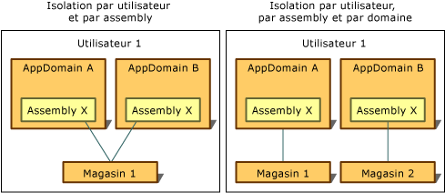

# Types d'isolationTypes of Isolation
Accès au stockage isolé est toujours limité à l’utilisateur qui l’a créée.Access to isolated storage is always restricted to the user who created it. Pour implémenter ce type d’isolation, le common language runtime utilise la même notion d’identité de l’utilisateur que le système d’exploitation reconnaît, qui est l’identité associée au processus dans lequel le code s’exécute lorsque le magasin est ouvert.To implement this type of isolation, the common language runtime uses the same notion of user identity that the operating system recognizes, which is the identity associated with the process in which the code is running when the store is opened. Cette identité est une identité de l’utilisateur authentifié, mais l’emprunt d’identité peut provoquer l’identité de l’utilisateur actuel pour modifier dynamiquement.This identity is an authenticated user identity, but impersonation can cause the identity of the current user to change dynamically.  
  
 Accès au stockage isolé est également limité en fonction de l’identité associée avec le domaine et d’assembly de l’application ou à l’assembly uniquement.Access to isolated storage is also restricted according to the identity associated with the application's domain and assembly, or with the assembly alone. Le runtime obtient ces identités des façons suivantes :The runtime obtains these identities in the following ways:  
  
-   Identité de domaine représente la preuve de l’application, dans le cas d’une application web peut être l’URL complète.Domain identity represents the evidence of the application, which in the case of a web application might be the full URL. Pour le code hébergé par l’interpréteur de commandes, l’identité de domaine peut être basée sur le chemin de répertoire d’application.For shell-hosted code, the domain identity might be based on the application directory path. Par exemple, si l’exécutable s’exécute à partir du chemin d’accès C:\Office\MyApp.exe, l’identité de domaine serait C:\Office\MyApp.exe.For example, if the executable runs from the path C:\Office\MyApp.exe, the domain identity would be C:\Office\MyApp.exe.  
  
-   Identité d’assembly est la preuve de l’assembly.Assembly identity is the evidence of the assembly. Cela peut provenir d’une signature numérique de chiffrement, qui peut être l’assembly [nom fort](../../../docs/framework/app-domains/strong-named-assemblies.md), l’éditeur de logiciel de l’assembly ou son identité URL.This might come from a cryptographic digital signature, which can be the assembly's [strong name](../../../docs/framework/app-domains/strong-named-assemblies.md), the software publisher of the assembly, or its URL identity. Si un assembly porte un nom fort et une identité d’éditeur de logiciel, l’identité de serveur de publication de logiciels est utilisée.If an assembly has both a strong name and a software publisher identity, then the software publisher identity is used. Si l’assembly provenance d’Internet et n’est pas signé, l’identité de l’URL est utilisée.If the assembly comes from the Internet and is unsigned, the URL identity is used. Pour plus d’informations sur les assemblys et les noms forts, consultez [programmation avec des assemblys](../../../docs/framework/app-domains/programming-with-assemblies.md).For more information about assemblies and strong names, see [Programming with Assemblies](../../../docs/framework/app-domains/programming-with-assemblies.md).  
  
-   Magasins itinérants se déplacent avec un utilisateur qui dispose d’un profil utilisateur itinérant.Roaming stores move with a user that has a roaming user profile. Les fichiers sont écrits dans un répertoire réseau et sont téléchargés à n’importe quel ordinateur, l’utilisateur se connecte.Files are written to a network directory and are downloaded to any computer the user logs into. Pour plus d’informations sur les profils utilisateur itinérants, consultez <xref:System.IO.IsolatedStorage.IsolatedStorageScope.Roaming?displayProperty=nameWithType>.For more information about roaming user profiles, see <xref:System.IO.IsolatedStorage.IsolatedStorageScope.Roaming?displayProperty=nameWithType>.  
  
 En combinant les concepts de l’utilisateur, le domaine et identité de l’assembly, le stockage isolé peut isoler des données de plusieurs manières, chacune ayant ses propres scénarios d’utilisation :By combining the concepts of user, domain, and assembly identity, isolated storage can isolate data in the following ways, each of which has its own usage scenarios:  
  
-   [Isolation par utilisateur et par assemblyIsolation by user and assembly](#UserAssembly)  
  
-   [Isolation par utilisateur, domaine et par assemblyIsolation by user, domain, and assembly](#UserDomainAssembly)  
  
 Chacune de ces isolations peuvent être combinées avec un profil utilisateur itinérant.Either of these isolations can be combined with a roaming user profile. Pour plus d’informations, consultez la section [le stockage isolé et profil itinérant](#Roaming).For more information, see the section [Isolated Storage and Roaming](#Roaming).  
  
 L’illustration suivante montre comment les magasins sont isolés dans différentes portées.The following illustration demonstrates how stores are isolated in different scopes.  
  
   
Types de stockage isoléTypes of isolated storage  
  
 Notez que, à l’exception des magasins itinérants, le stockage isolé est toujours implicitement isolé par l’ordinateur, car il utilise les installations de stockage qui sont locales sur un ordinateur donné.Note that except for roaming stores, isolated storage is always implicitly isolated by computer because it uses the storage facilities that are local to a given computer.  
  
> [!IMPORTANT]
>  Le stockage isolé n'est pas disponible pour les applications [!INCLUDE[win8_appname_long](../../../includes/win8-appname-long-md.md)].Isolated storage is not available for [!INCLUDE[win8_appname_long](../../../includes/win8-appname-long-md.md)] apps. À la place, utilisez les classes de données d'application des espaces de noms `Windows.Storage` inclus dans l'API [!INCLUDE[wrt](../../../includes/wrt-md.md)] pour stocker des données locales et des fichiers.Instead, use the application data classes in the `Windows.Storage` namespaces included in the [!INCLUDE[wrt](../../../includes/wrt-md.md)] API to store local data and files. Pour plus d’informations, consultez [Données d’applications](http://go.microsoft.com/fwlink/?LinkId=229175) dans le Centre de développement Windows.For more information, see [Application data](http://go.microsoft.com/fwlink/?LinkId=229175) in the Windows Dev Center.  
  
   
## Isolation par utilisateur et par assemblyIsolation by User and Assembly  
 Lorsque l’assembly qui utilise les données de magasin doit être accessible à partir de n’importe quel domaine d’application, l’isolation par utilisateur et par assembly est appropriée.When the assembly that uses the data store needs to be accessible from any application's domain, isolation by user and assembly is appropriate. En règle générale, dans ce cas, le stockage isolé est utilisé pour stocker les données qui s’applique à plusieurs applications et ne sont pas liées à une application spécifique, tel que le nom d’utilisateur ou des informations de licence.Typically, in this situation, isolated storage is used to store data that applies across multiple applications and is not tied to any particular application, such as the user's name or license information. Pour accéder au stockage isolé par utilisateur et par assembly, le code doit être approuvé pour transférer des informations entre les applications.To access storage isolated by user and assembly, code must be trusted to transfer information between applications. En règle générale, l’isolation par utilisateur et par assembly est autorisée sur les intranets mais pas sur Internet.Typically, isolation by user and assembly is allowed on intranets but not on the Internet. Appel de la méthode statique <xref:System.IO.IsolatedStorage.IsolatedStorageFile.GetStore%2A?displayProperty=nameWithType> (méthode) et le passage d’un utilisateur et un assembly <xref:System.IO.IsolatedStorage.IsolatedStorageScope> retourne le stockage avec ce type d’isolation.Calling the static <xref:System.IO.IsolatedStorage.IsolatedStorageFile.GetStore%2A?displayProperty=nameWithType> method and passing in a user and an assembly <xref:System.IO.IsolatedStorage.IsolatedStorageScope> returns storage with this kind of isolation.  
  
 L’exemple de code suivant extrait un magasin isolé par utilisateur et par assembly.The following code example retrieves a store that is isolated by user and assembly. Le magasin est accessible via la `isoFile` objet.The store can be accessed through the `isoFile` object.  
  
 [!code-cpp[Conceptual.IsolatedStorage#17](../../../samples/snippets/cpp/VS_Snippets_CLR/conceptual.isolatedstorage/cpp/source11.cpp#17)]
 [!code-csharp[Conceptual.IsolatedStorage#17](../../../samples/snippets/csharp/VS_Snippets_CLR/conceptual.isolatedstorage/cs/source11.cs#17)]
 [!code-vb[Conceptual.IsolatedStorage#17](../../../samples/snippets/visualbasic/VS_Snippets_CLR/conceptual.isolatedstorage/vb/source11.vb#17)]  
  
 Pour obtenir un exemple qui utilise les paramètres de la preuve, consultez <xref:System.IO.IsolatedStorage.IsolatedStorageFile.GetStore%28System.IO.IsolatedStorage.IsolatedStorageScope%2CSystem.Security.Policy.Evidence%2CSystem.Type%2CSystem.Security.Policy.Evidence%2CSystem.Type%29>.For an example that uses the evidence parameters, see <xref:System.IO.IsolatedStorage.IsolatedStorageFile.GetStore%28System.IO.IsolatedStorage.IsolatedStorageScope%2CSystem.Security.Policy.Evidence%2CSystem.Type%2CSystem.Security.Policy.Evidence%2CSystem.Type%29>.  
  
 Le <xref:System.IO.IsolatedStorage.IsolatedStorageFile.GetUserStoreForAssembly%2A> méthode est disponible comme un raccourci, comme illustré dans l’exemple de code suivant.The <xref:System.IO.IsolatedStorage.IsolatedStorageFile.GetUserStoreForAssembly%2A> method is available as a shortcut, as shown in the following code example. Ce raccourci ne peut pas être utilisé pour ouvrir des magasins capables d’itinérance ; utiliser <xref:System.IO.IsolatedStorage.IsolatedStorageFile.GetStore%2A> dans ce cas.This shortcut cannot be used to open stores that are capable of roaming; use <xref:System.IO.IsolatedStorage.IsolatedStorageFile.GetStore%2A> in such cases.  
  
 [!code-cpp[Conceptual.IsolatedStorage#18](../../../samples/snippets/cpp/VS_Snippets_CLR/conceptual.isolatedstorage/cpp/source11.cpp#18)]
 [!code-csharp[Conceptual.IsolatedStorage#18](../../../samples/snippets/csharp/VS_Snippets_CLR/conceptual.isolatedstorage/cs/source11.cs#18)]
 [!code-vb[Conceptual.IsolatedStorage#18](../../../samples/snippets/visualbasic/VS_Snippets_CLR/conceptual.isolatedstorage/vb/source11.vb#18)]  
  
   
## Isolation par utilisateur, par domaine et par assemblyIsolation by User, Domain, and Assembly  
 Si votre application utilise un assembly tiers qui nécessite une banque de données privées, vous pouvez utiliser le stockage isolé pour stocker les données privées.If your application uses a third-party assembly that requires a private data store, you can use isolated storage to store the private data. Isolation par utilisateur, domaine et par assembly garantit que seul code d’un assembly donné peut accéder aux données et uniquement lorsque l’assembly est utilisé par l’application en cours d’exécution lorsque l’assembly créé le magasin et uniquement lors de l’exécution de l’utilisateur pour lequel le magasin a été créé le  application.Isolation by user, domain, and assembly ensures that only code in a given assembly can access the data, and only when the assembly is used by the application that was running when the assembly created the store, and only when the user for whom the store was created runs the application. Isolation par utilisateur, domaine et par assembly empêche l’assembly de tiers à partir de la fuite de données à d’autres applications.Isolation by user, domain, and assembly keeps the third-party assembly from leaking data to other applications. Ce type d’isolation doit être votre choix par défaut si vous savez que vous souhaitez utiliser le stockage isolé, mais ne savez pas vraiment le type d’isolation à utiliser.This isolation type should be your default choice if you know that you want to use isolated storage but are not sure which type of isolation to use. Appel de la méthode statique <xref:System.IO.IsolatedStorage.IsolatedStorageFile.GetStore%2A> méthode de <xref:System.IO.IsolatedStorage.IsolatedStorageFile> et en passant un utilisateur, domaine et par assembly <xref:System.IO.IsolatedStorage.IsolatedStorageScope> retourne le stockage avec ce type d’isolation.Calling the static <xref:System.IO.IsolatedStorage.IsolatedStorageFile.GetStore%2A> method of <xref:System.IO.IsolatedStorage.IsolatedStorageFile> and passing in a user, domain, and assembly <xref:System.IO.IsolatedStorage.IsolatedStorageScope> returns storage with this kind of isolation.  
  
 L’exemple de code suivant extrait un magasin isolé par utilisateur, domaine et par assembly.The following code example retrieves a store isolated by user, domain, and assembly. Le magasin est accessible via la `isoFile` objet.The store can be accessed through the `isoFile` object.  
  
 [!code-cpp[Conceptual.IsolatedStorage#14](../../../samples/snippets/cpp/VS_Snippets_CLR/conceptual.isolatedstorage/cpp/source10.cpp#14)]
 [!code-csharp[Conceptual.IsolatedStorage#14](../../../samples/snippets/csharp/VS_Snippets_CLR/conceptual.isolatedstorage/cs/source10.cs#14)]
 [!code-vb[Conceptual.IsolatedStorage#14](../../../samples/snippets/visualbasic/VS_Snippets_CLR/conceptual.isolatedstorage/vb/source10.vb#14)]  
  
 Une autre méthode est disponible comme un raccourci, comme illustré dans l’exemple de code suivant.Another method is available as a shortcut, as shown in the following code example. Ce raccourci ne peut pas être utilisé pour ouvrir des magasins capables d’itinérance ; utiliser <xref:System.IO.IsolatedStorage.IsolatedStorageFile.GetStore%2A> dans ce cas.This shortcut cannot be used to open stores that are capable of roaming; use <xref:System.IO.IsolatedStorage.IsolatedStorageFile.GetStore%2A> in such cases.  
  
 [!code-cpp[Conceptual.IsolatedStorage#15](../../../samples/snippets/cpp/VS_Snippets_CLR/conceptual.isolatedstorage/cpp/source10.cpp#15)]
 [!code-csharp[Conceptual.IsolatedStorage#15](../../../samples/snippets/csharp/VS_Snippets_CLR/conceptual.isolatedstorage/cs/source10.cs#15)]
 [!code-vb[Conceptual.IsolatedStorage#15](../../../samples/snippets/visualbasic/VS_Snippets_CLR/conceptual.isolatedstorage/vb/source10.vb#15)]  
  
   
## Stockage et profil itinérant isoléIsolated Storage and Roaming  
 Les profils utilisateur itinérants sont une fonctionnalité de Windows qui permet à un utilisateur de configurer une identité sur un réseau et utiliser cette identité pour se connecter à n’importe quel ordinateur du réseau, exécution sur tous les paramètres personnalisés.Roaming user profiles are a Windows feature that enables a user to set up an identity on a network and use that identity to log into any network computer, carrying over all personalized settings. Un assembly qui utilise le stockage isolé peut spécifier que le stockage isolé de l’utilisateur doit se déplacer avec le profil utilisateur itinérant.An assembly that uses isolated storage can specify that the user's isolated storage should move with the roaming user profile. Itinérance utilisable conjointement avec l’isolation par utilisateur et par assembly ou avec l’isolation par utilisateur, domaine et par assembly.Roaming can be used in conjunction with isolation by user and assembly or with isolation by user, domain, and assembly. Si une portée itinérante n’est pas utilisée, magasins ne suivront pas même si un profil utilisateur itinérant est utilisé.If a roaming scope is not used, stores will not roam even if a roaming user profile is used.  
  
 L’exemple de code suivant récupère un magasin itinérant isolé par utilisateur et par assembly.The following code example retrieves a roaming store isolated by user and assembly. Le magasin est accessible via la `isoFile` objet.The store can be accessed through the `isoFile` object.  
  
 [!code-cpp[Conceptual.IsolatedStorage#11](../../../samples/snippets/cpp/VS_Snippets_CLR/conceptual.isolatedstorage/cpp/source9.cpp#11)]
 [!code-csharp[Conceptual.IsolatedStorage#11](../../../samples/snippets/csharp/VS_Snippets_CLR/conceptual.isolatedstorage/cs/source9.cs#11)]
 [!code-vb[Conceptual.IsolatedStorage#11](../../../samples/snippets/visualbasic/VS_Snippets_CLR/conceptual.isolatedstorage/vb/source9.vb#11)]  
  
 Une étendue de domaine peut être ajoutée pour créer un magasin itinérant isolé par utilisateur, de domaine et d’application.A domain scope can be added to create a roaming store isolated by user, domain, and application. L’exemple de code suivant illustre cela.The following code example demonstrates this.  
  
 [!code-cpp[Conceptual.IsolatedStorage#12](../../../samples/snippets/cpp/VS_Snippets_CLR/conceptual.isolatedstorage/cpp/source9.cpp#12)]
 [!code-csharp[Conceptual.IsolatedStorage#12](../../../samples/snippets/csharp/VS_Snippets_CLR/conceptual.isolatedstorage/cs/source9.cs#12)]
 [!code-vb[Conceptual.IsolatedStorage#12](../../../samples/snippets/visualbasic/VS_Snippets_CLR/conceptual.isolatedstorage/vb/source9.vb#12)]  
  
## Voir aussiSee Also  
 <xref:System.IO.IsolatedStorage.IsolatedStorageScope>  
 [Stockage isoléIsolated Storage](../../../docs/standard/io/isolated-storage.md)
