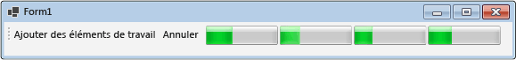

# Comment : annuler un bloc de flux de données
Ce document montre comment activer l’annulation dans votre application. Cet exemple utilise des Windows Forms pour montrer où les éléments de travail sont actifs dans un pipeline de flux de données, ainsi que les effets de l’annulation.  
  
> [!TIP]
>  La bibliothèque de flux de données TPL (espace de noms <xref:System.Threading.Tasks.Dataflow?displayProperty=nameWithType>) n'est pas distribuée avec le [!INCLUDE[net_v45](../../../includes/net-v45-md.md)]. Pour installer l'espace de noms <xref:System.Threading.Tasks.Dataflow>, ouvrez votre projet dans [!INCLUDE[vs_dev11_long](../../../includes/vs-dev11-long-md.md)], dans le menu Projet choisissez **Gérer les packages NuGet**, puis recherchez en ligne le package `Microsoft.Tpl.Dataflow`.  
  
### Pour créer une Application Windows Forms  
  
1.  Créez un projet C# ou **Application Windows Forms** Visual Basic. Dans les étapes suivantes, le projet est nommé `CancellationWinForms`.  
  
2.  Dans le Concepteur de formulaires pour le formulaire principal, Form1.cs (Form1.vb pour [!INCLUDE[vbprvb](../../../includes/vbprvb-md.md)]), ajoutez un <xref:System.Windows.Forms.ToolStrip> contrôle.  
  
3.  Ajouter un <xref:System.Windows.Forms.ToolStripButton> le contrôle à la <xref:System.Windows.Forms.ToolStrip> contrôle. Définir le <xref:System.Windows.Forms.ToolStripItem.DisplayStyle%2A> propriété <xref:System.Windows.Forms.ToolStripItemDisplayStyle.Text> et <xref:System.Windows.Forms.ToolStripItem.Text%2A> propriété **ajouter des éléments de travail**.  
  
4.  Ajoutez un deuxième <xref:System.Windows.Forms.ToolStripButton> le contrôle à la <xref:System.Windows.Forms.ToolStrip> contrôle. Définir le <xref:System.Windows.Forms.ToolStripItem.DisplayStyle%2A> propriété <xref:System.Windows.Forms.ToolStripItemDisplayStyle.Text>, le <xref:System.Windows.Forms.ToolStripItem.Text%2A> propriété **Annuler**et le <xref:System.Windows.Forms.ToolStripItem.Enabled%2A> propriété `False`.  
  
5.  Ajoutez quatre <xref:System.Windows.Forms.ToolStripProgressBar> des objets sur le <xref:System.Windows.Forms.ToolStrip> contrôle.  
  
## Création du pipeline de flux de données  
 Cette section décrit comment créer le pipeline de flux de données qui traite les éléments de travail et met à jour les barres de progression.  
  
#### Pour créer le pipeline de flux de données  
  
1.  Dans votre projet, ajoutez une référence à System.Threading.Tasks.Dataflow.dll.  
  
2.  Vérifiez que Form1.cs (Form1.vb pour [!INCLUDE[vbprvb](../../../includes/vbprvb-md.md)]) contient les `using` instructions (`Imports` dans les instructions [!INCLUDE[vbprvb](../../../includes/vbprvb-md.md)]).  
  
     [!code-csharp[TPLDataflow_CancellationWinForms#1](../../../samples/snippets/csharp/VS_Snippets_Misc/tpldataflow_cancellationwinforms/cs/cancellationwinforms/form1.cs#1)]
     [!code-vb[TPLDataflow_CancellationWinForms#1](../../../samples/snippets/visualbasic/VS_Snippets_Misc/tpldataflow_cancellationwinforms/vb/cancellationwinforms/form1.vb#1)]  
  
3.  Ajouter la classe `WorkItem` comme un type interne de la classe `Form1`.  
  
     [!code-csharp[TPLDataflow_CancellationWinForms#2](../../../samples/snippets/csharp/VS_Snippets_Misc/tpldataflow_cancellationwinforms/cs/cancellationwinforms/form1.cs#2)]
     [!code-vb[TPLDataflow_CancellationWinForms#2](../../../samples/snippets/visualbasic/VS_Snippets_Misc/tpldataflow_cancellationwinforms/vb/cancellationwinforms/form1.vb#2)]  
  
4.  Ajoutez les membres de données suivants à la classe `Form1`.  
  
     [!code-csharp[TPLDataflow_CancellationWinForms#3](../../../samples/snippets/csharp/VS_Snippets_Misc/tpldataflow_cancellationwinforms/cs/cancellationwinforms/form1.cs#3)]
     [!code-vb[TPLDataflow_CancellationWinForms#3](../../../samples/snippets/visualbasic/VS_Snippets_Misc/tpldataflow_cancellationwinforms/vb/cancellationwinforms/form1.vb#3)]  
  
5.  Ajoutez la méthode `CreatePipeline` suivante à la classe `Form1`.  
  
     [!code-csharp[TPLDataflow_CancellationWinForms#4](../../../samples/snippets/csharp/VS_Snippets_Misc/tpldataflow_cancellationwinforms/cs/cancellationwinforms/form1.cs#4)]
     [!code-vb[TPLDataflow_CancellationWinForms#4](../../../samples/snippets/visualbasic/VS_Snippets_Misc/tpldataflow_cancellationwinforms/vb/cancellationwinforms/form1.vb#4)]  
  
 Étant donné que les blocs de flux de données `incrementProgress` et `decrementProgress` agissent sur l’interface utilisateur, il est important que ces actions se produisent sur le thread de l’interface utilisateur. Pour ce faire, pendant la construction de ces objets, chacun d’eux fournit un <xref:System.Threading.Tasks.Dataflow.ExecutionDataflowBlockOptions> objet ayant la <xref:System.Threading.Tasks.Dataflow.DataflowBlockOptions.TaskScheduler%2A> propriété <xref:System.Threading.Tasks.TaskScheduler.FromCurrentSynchronizationContext%2A?displayProperty=nameWithType>. La méthode <xref:System.Threading.Tasks.TaskScheduler.FromCurrentSynchronizationContext%2A?displayProperty=nameWithType> crée un objet <xref:System.Threading.Tasks.TaskScheduler> qui effectue le travail dans le contexte actuel de synchronisation. Étant donné que le constructeur `Form1` est appelé depuis le thread de l’interface utilisateur, les actions des blocs de flux de données `incrementProgress` et `decrementProgress` fonctionnent aussi sur le thread de l’interface utilisateur.  
  
 Cet exemple définit le <xref:System.Threading.Tasks.Dataflow.DataflowBlockOptions.CancellationToken%2A> propriété lorsqu’il construit les membres du pipeline. Étant donné que le <xref:System.Threading.Tasks.Dataflow.DataflowBlockOptions.CancellationToken%2A> propriété définitivement annulé l’exécution du bloc de flux de données, le pipeline entier doit être recréé une fois que l’utilisateur annule l’opération et souhaite ensuite ajouter plusieurs éléments de travail pour le pipeline. Pour obtenir un exemple illustrant une autre méthode d’annulation d’un bloc de flux de données de sorte que les autres travaux puissent être effectués après l’annulation d’une opération, consultez [Walkthrough: Using Dataflow in a Windows Forms Application](../../../docs/standard/parallel-programming/walkthrough-using-dataflow-in-a-windows-forms-application.md) (Procédure pas à pas : utilisation d’un flux de données dans une application Windows Forms).  
  
## Connexion du pipeline de flux de données à l’interface utilisateur  
 Cette section décrit comment connecter le pipeline de flux de données à l’interface utilisateur. La création du pipeline et l’ajout d’éléments de travail au pipeline sont contrôlés par le gestionnaire d’événements pour le bouton **Add Work Items** (Ajouter des éléments de travail). L’annulation est lancée par le bouton **Annuler**. Lorsque l’utilisateur clique sur un de ces boutons, l’action appropriée est lancée de manière asynchrone.  
  
#### Pour connecter le pipeline de flux de données à l’interface utilisateur  
  
1.  Dans le Concepteur de formulaires pour le formulaire principal, créez un gestionnaire d’événements pour le <xref:System.Windows.Forms.ToolStripItem.Click> événement pour le **ajouter des éléments de travail** bouton.  
  
2.  Implémentez la <xref:System.Windows.Forms.ToolStripItem.Click> événement pour le **ajouter des éléments de travail** bouton.  
  
     [!code-csharp[TPLDataflow_CancellationWinForms#5](../../../samples/snippets/csharp/VS_Snippets_Misc/tpldataflow_cancellationwinforms/cs/cancellationwinforms/form1.cs#5)]
     [!code-vb[TPLDataflow_CancellationWinForms#5](../../../samples/snippets/visualbasic/VS_Snippets_Misc/tpldataflow_cancellationwinforms/vb/cancellationwinforms/form1.vb#5)]  
  
3.  Dans le Concepteur de formulaires pour le formulaire principal, créez un gestionnaire d’événements pour le <xref:System.Windows.Forms.ToolStripItem.Click> Gestionnaire d’événements pour le **Annuler** bouton.  
  
4.  Implémentez la <xref:System.Windows.Forms.ToolStripItem.Click> Gestionnaire d’événements pour le **Annuler** bouton.  
  
     [!code-csharp[TPLDataflow_CancellationWinForms#6](../../../samples/snippets/csharp/VS_Snippets_Misc/tpldataflow_cancellationwinforms/cs/cancellationwinforms/form1.cs#6)]
     [!code-vb[TPLDataflow_CancellationWinForms#6](../../../samples/snippets/visualbasic/VS_Snippets_Misc/tpldataflow_cancellationwinforms/vb/cancellationwinforms/form1.vb#6)]  
  
## Exemple  
 L'exemple suivant montre le code complet pour Form1.cs (Form1.vb pour [!INCLUDE[vbprvb](../../../includes/vbprvb-md.md)]).  
  
 [!code-csharp[TPLDataflow_CancellationWinForms#100](../../../samples/snippets/csharp/VS_Snippets_Misc/tpldataflow_cancellationwinforms/cs/cancellationwinforms/form1.cs#100)]
 [!code-vb[TPLDataflow_CancellationWinForms#100](../../../samples/snippets/visualbasic/VS_Snippets_Misc/tpldataflow_cancellationwinforms/vb/cancellationwinforms/form1.vb#100)]  
  
 L'illustration suivante présente l'application en cours d'exécution.  
  
   
  
## Programmation fiable  
  
## Voir aussi  
 [Le flux de données](../../../docs/standard/parallel-programming/dataflow-task-parallel-library.md)
