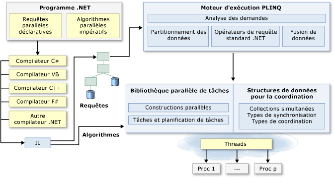

# Programmation parallèle en .NET
De nombreux ordinateurs personnels et stations de travail ont deux ou quatre cœurs (c-à-d, unités centrales) qui permettent à plusieurs threads de s'exécuter simultanément. Les ordinateurs, dans un proche avenir, sont supposés être dotés d'un nombre significativement plus élevé de cœurs. Pour tirer parti du matériel actuel et futur, vous pouvez paralléliser votre code pour distribuer le travail sur plusieurs processeurs. Dans le passé, la parallélisation nécessitait un niveau peu élevé de manipulation de threads et de verrous. [!INCLUDE[vs_dev10_long](../../../includes/vs-dev10-long-md.md)] et le [!INCLUDE[net_v40_short](../../../includes/net-v40-short-md.md)] améliorent la prise en charge de la programmation parallèle en fournissant une nouvelle exécution, des nouveaux types de bibliothèques de classes et de nouveaux outils de diagnostics. Ces fonctionnalités simplifient le développement parallèle et vous permettent d’écrire du code parallèle efficace, à grains fins et évolutif dans un idiome naturel sans devoir utiliser directement des threads ou le pool de threads. L'illustration suivante fournit une vue d'ensemble générale de l'architecture de programmation parallèle dans le [!INCLUDE[net_v40_short](../../../includes/net-v40-short-md.md)].  
  
   
  
## Rubriques connexes  
  
|Technologie|Description|  
|----------------|-----------------|  
|[La bibliothèque parallèle de tâches](../../../docs/standard/parallel-programming/task-parallel-library-tpl.md)|Fournit la documentation pour la classe <xref:System.Threading.Tasks.Parallel?displayProperty=nameWithType>, qui inclut des versions parallèles de `For` et des boucles `ForEach`, et également pour la classe <xref:System.Threading.Tasks.Task?displayProperty=nameWithType>, qui représente la meilleure façon d'exprimer des opérations asynchrones.|  
|[Parallel LINQ (PLINQ)](../../../docs/standard/parallel-programming/parallel-linq-plinq.md)|Implémentation parallèle de LINQ to Objects qui améliore de manière significative la performance dans de nombreux scénarios.|  
|[Structures de données pour la programmation parallèle](../../../docs/standard/parallel-programming/data-structures-for-parallel-programming.md)|Fournit des liens vers la documentation pour les classes de collection thread-safe, les types de synchronisation légers et les types pour l’initialisation tardive.|  
|[Outils de diagnostic parallèle](../../../docs/standard/parallel-programming/parallel-diagnostic-tools.md)|Fournit des liens vers la documentation relative aux fenêtres du débogueur Visual Studio pour les tâches et les piles parallèles, et le [visualiseur concurrentiel](/visualstudio/profiling/concurrency-visualizer), qui se compose d’un jeu de vues dans le profileur [!INCLUDE[vsprvsts](../../../includes/vsprvsts-md.md)] que vous pouvez utiliser pour déboguer et régler la performance du code parallèle.|  
|[Partitionneurs personnalisés pour PLINQ et la bibliothèque parallèle de tâches (TPL)](../../../docs/standard/parallel-programming/custom-partitioners-for-plinq-and-tpl.md)|Décrit le fonctionnement des partitionneurs et comment configurer les partitionneurs par défaut ou en créer.|  
|[Planificateurs de tâches](http://msdn.microsoft.com/library/638f8ea5-21db-47a2-a934-86e1e961bf65)|Décrit le fonctionnement des planificateurs et comment les planificateurs par défaut peuvent être configurés.|  
|[Expressions lambda en PLINQ et dans la bibliothèque parallèle de tâches](../../../docs/standard/parallel-programming/lambda-expressions-in-plinq-and-tpl.md)|Fournit une vue d’ensemble d’expressions lambda en C#  et Visual Basic, et affiche comment elles sont utilisées dans PLINQ et la bibliothèque parallèle de tâches.|  
|[Pour aller plus loin](../../../docs/standard/parallel-programming/for-further-reading-parallel-programming.md)|Fournit des liens vers la documentation supplémentaire et des exemples de ressources pour la programmation parallèle dans le .NET Framework.|  
  
## Voir aussi  
 [Modèles de programmation parallèle : présentation et application des modèles parallèles avec le .NET Framework 4 (page éventuellement en anglais)](http://go.microsoft.com/fwlink/?LinkID=185142)  
 [Exemples de programmation parallèle avec .NET Framework](http://code.msdn.microsoft.com/Samples-for-Parallel-b4b76364)
