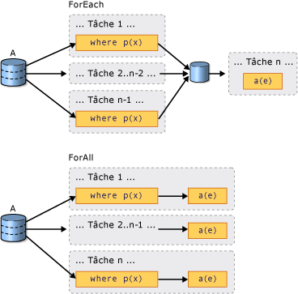

# Introduction à PLINQ
## Qu’est une requête parallèle ?  
 Language-Integrated Query (LINQ) a été présenté dans le [!INCLUDE[net_v35_long](../../../includes/net-v35-long-md.md)].  Elle propose un modèle unifié pour interroger les <xref:System.Collections.IEnumerable?displayProperty=nameWithType> ou <xref:System.Collections.Generic.IEnumerable%601?displayProperty=nameWithType> source de données de manière sécurisée. LINQ to Objects est le nom pour les requêtes LINQ exécutées sur les collections en mémoire comme <xref:System.Collections.Generic.List%601> et les tableaux. Cet article suppose que vous avez des connaissances de base de LINQ. Pour plus d’informations, consultez [LINQ (Language-Integrated Query)](http://msdn.microsoft.com/library/a73c4aec-5d15-4e98-b962-1274021ea93d).  
  
 Parallel LINQ (PLINQ) est une implémentation parallèle du modèle de requête LINQ. Une requête PLINQ ressemble à bien des égards à une requête LINQ to Objects non parallèle. Requêtes PLINQ, tout comme séquentiel [!INCLUDE[vbteclinq](../../../includes/vbteclinq-md.md)] requêtes, ne fonctionne pas sur toute mémoire <xref:System.Collections.IEnumerable> ou <xref:System.Collections.Generic.IEnumerable%601> données source et ont une exécution différée, ce qui signifie qu’ils ne commencent pas l’exécution jusqu'à ce que la requête est énumérée. La principale différence est que PLINQ essaie d’utiliser pleinement tous les processeurs sur le système. Cela s’effectue par le partitionnement de la source de données en segments et l’exécution de la requête sur chaque segment sur des threads de travail distincts en parallèle sur plusieurs processeurs. Dans de nombreux cas, l’exécution parallèle signifie une exécution beaucoup plus rapide de la requête.  
  
 Via l’exécution parallèle, PLINQ peut accomplir améliorations significatives des performances code hérité pour certains types de requêtes, souvent en ajoutant simplement la <xref:System.Linq.ParallelEnumerable.AsParallel%2A> opération à la source de données de requête. Toutefois, le parallélisme peut présenter ses propres complexités et toutes les opérations de requête ne s’exécutent pas plus rapidement dans PLINQ. En fait, la parallélisation ralentit réellement certaines requêtes. Par conséquent, vous devez comprendre comment des problèmes, tels que ceux liés à l’ordre, affectent les requêtes parallèles. Pour plus d’informations, consultez [Fonctionnement de l’accélération dans PLINQ](../../../docs/standard/parallel-programming/understanding-speedup-in-plinq.md).  
  
> [!NOTE]
>  Cette documentation utilise des expressions lambda pour définir les délégués en PLINQ. Si les expressions lambda en C# ou Visual Basic ne vous sont pas familières, consultez [Expressions lambda en PLINQ et dans la bibliothèque parallèle de tâches](../../../docs/standard/parallel-programming/lambda-expressions-in-plinq-and-tpl.md).  
  
 Le reste de cet article donne une vue d’ensemble des principales classes PLINQ et explique comment créer des requêtes PLINQ. Chaque section contient des liens vers des exemples de code et des informations plus détaillées.  
  
## Classe ParallelEnumerable  
 La <xref:System.Linq.ParallelEnumerable?displayProperty=nameWithType> classe expose presque toutes les fonctionnalités de PLINQ.  Il et le reste de la <xref:System.Linq?displayProperty=nameWithType> types de l’espace de noms sont compilés dans l’assembly System.Core.dll. Les projets C# et Visual Basic par défaut de Visual Studio font tous deux référence à l’assembly et importent l’espace de noms.  
  
 <xref:System.Linq.ParallelEnumerable>inclut les implémentations de tous les opérateurs de requête standard LINQ to Objects prend en charge, bien qu’il ne tente pas de paralléliser chacun d’eux. Si [!INCLUDE[vbteclinq](../../../includes/vbteclinq-md.md)] ne vous est pas familier, consultez [Introduction to LINQ](http://msdn.microsoft.com/library/24dddf19-12a0-4707-a4bc-eba4fa7f219e) (Présentation de LINQ).  
  
 Outre les opérateurs de requête standard, la <xref:System.Linq.ParallelEnumerable> classe contient un ensemble de méthodes qui permettent aux comportements spécifiques à l’exécution en parallèle. Ces méthodes spécifiques de PLINQ sont répertoriées dans le tableau suivant.  
  
|Opérateur ParallelEnumerable|Description|  
|---------------------------------|-----------------|  
|<xref:System.Linq.ParallelEnumerable.AsParallel%2A>|Point d’entrée de PLINQ. Indique que le reste de la requête doit être parallélisé, si possible.|  
|<xref:System.Linq.ParallelEnumerable.AsSequential%2A>|Indique que le reste de la requête doit être exécuté de manière séquentielle, comme requête LINQ non parallèle.|  
|<xref:System.Linq.ParallelEnumerable.AsOrdered%2A>|Indique que PLINQ doit conserver l’ordre de la séquence source pour le reste de la requête, ou jusqu’à ce que l’ordre soit modifié, par exemple à l’aide d’une clause orderby (Order By en Visual Basic).|  
|<xref:System.Linq.ParallelEnumerable.AsUnordered%2A>|Indique que PLINQ ne doit pas conserver l’ordre de la séquence source pour le reste de la requête.|  
|<xref:System.Linq.ParallelEnumerable.WithCancellation%2A>|Indique que PLINQ doit régulièrement surveiller l’état du jeton d’annulation fourni et annuler l’exécution si cela est demandé.|  
|<xref:System.Linq.ParallelEnumerable.WithDegreeOfParallelism%2A>|Spécifie le nombre maximal de processeurs que PLINQ doit utiliser pour paralléliser la requête.|  
|<xref:System.Linq.ParallelEnumerable.WithMergeOptions%2A>|Fournit une indication sur la manière dont PLINQ doit, si possible, fusionner les résultats parallèles en une seule séquence sur le thread utilisé.|  
|<xref:System.Linq.ParallelEnumerable.WithExecutionMode%2A>|Indique si PLINQ doit paralléliser la requête même si le comportement par défaut consisterait à l’exécuter de manière séquentielle.|  
|<xref:System.Linq.ParallelEnumerable.ForAll%2A>|Méthode d’énumération multithread qui, contrairement à l’itération sur les résultats de la requête, permet leur traitement en parallèle sans nécessiter la fusion préalable dans le thread utilisé.|  
|<xref:System.Linq.ParallelEnumerable.Aggregate%2A>surcharge|Surcharge propre à PLINQ qui permet l’agrégation intermédiaire sur des partitions locales des threads,et fonction d’agrégation finale permettant de combiner les résultats de toutes les partitions.|  
  
## Modèle Opt-in  
 Lorsque vous écrivez une requête, déclarez PLINQ en appelant le <xref:System.Linq.ParallelEnumerable.AsParallel%2A?displayProperty=nameWithType> méthode d’extension sur la source de données, comme indiqué dans l’exemple suivant.  
  
 [!code-csharp[PLINQ#1](../../../samples/snippets/csharp/VS_Snippets_Misc/plinq/cs/plinq2_cs.cs#1)]
 [!code-vb[PLINQ#1](../../../samples/snippets/visualbasic/VS_Snippets_Misc/plinq/vb/plinq2_vb.vb#1)]  
  
 Le <xref:System.Linq.ParallelEnumerable.AsParallel%2A> méthode d’extension lie les opérateurs de requête suivants, dans ce cas, `where` et `select`, à la <xref:System.Linq.ParallelEnumerable?displayProperty=nameWithType> implémentations.  
  
## Modes d’exécution  
 Par défaut, PLINQ est conservateur. Au moment de l’exécution, l’infrastructure PLINQ analyse la structure globale de la requête. Si la requête est susceptible de produire des accélérations par parallélisation, PLINQ partitionne la séquence source en tâches pouvant être exécutées simultanément. Si la parallélisation d’une requête présente un risque, PLINQ exécute uniquement la requête de manière séquentielle. Si PLINQ a le choix entre un algorithme parallèle potentiellement coûteux ou un algorithme séquentiel abordable, il choisit l’algorithme séquentiel par défaut. Vous pouvez utiliser la <xref:System.Linq.ParallelEnumerable.WithExecutionMode%2A> (méthode) et le <xref:System.Linq.ParallelExecutionMode?displayProperty=nameWithType> énumération pour indiquer à PLINQ de sélectionner l’algorithme parallèle. Cela est utile lorsque vous savez suite à des tests ou des mesures qu’une requête spécifique s’exécute plus rapidement en parallèle. Pour plus d’informations, consultez [How to: Specify the Execution Mode in PLINQ](../../../docs/standard/parallel-programming/how-to-specify-the-execution-mode-in-plinq.md) (Guide pratique pour spécifier le mode d’exécution dans PLINQ).  
  
## Degré de parallélisme  
 Par défaut, PLINQ utilise tous les processeurs sur l’ordinateur hôte. Vous pouvez demander à PLINQ d’utiliser pas plus d’un nombre spécifié de processeurs à l’aide de la <xref:System.Linq.ParallelEnumerable.WithDegreeOfParallelism%2A> (méthode). Cela est utile lorsque vous souhaitez vous assurer que les autres processus en cours d’exécution sur l’ordinateur reçoivent une certaine quantité de temps CPU. L’extrait suivant limite la requête à l’utilisation de deux processeurs maximum.  
  
 [!code-csharp[PLINQ#5](../../../samples/snippets/csharp/VS_Snippets_Misc/plinq/cs/plinqsamples.cs#5)]
 [!code-vb[PLINQ#5](../../../samples/snippets/visualbasic/VS_Snippets_Misc/plinq/vb/plinq2_vb.vb#5)]  
  
 Si une requête effectue une quantité importante de travaux non liés au calcul, comme des E/S de fichier, il peut être utile de spécifier un degré de parallélisme supérieur au nombre de cœurs de l’ordinateur.  
  
## Comparatif des requêtes parallèles ordonnées et non ordonnées  
 Dans certaines requêtes, un opérateur de requête doit produire des résultats qui conservent l’ordre de la séquence source. PLINQ fournit le <xref:System.Linq.ParallelEnumerable.AsOrdered%2A> opérateur à cet effet. <xref:System.Linq.ParallelEnumerable.AsOrdered%2A>est différent de celui à partir de <xref:System.Linq.ParallelEnumerable.AsSequential%2A>. Un <xref:System.Linq.ParallelEnumerable.AsOrdered%2A> séquence est toujours traitée en parallèle, mais ses résultats sont mis en mémoire tampon et triés. Étant donné que la conservation de l’ordre implique généralement un travail supplémentaire, un <xref:System.Linq.ParallelEnumerable.AsOrdered%2A> séquence peut être traitée plus lentement que la valeur par défaut <xref:System.Linq.ParallelEnumerable.AsUnordered%2A> séquence. Le fait qu’une opération parallèle ordonnée de manière spécifique soit plus rapide qu’une version séquentielle de l’opération dépend de nombreux facteurs.  
  
 L’exemple de code suivant montre comment utiliser la conservation de l’ordre.  
  
 [!code-csharp[PLINQ#3](../../../samples/snippets/csharp/VS_Snippets_Misc/plinq/cs/plinq2_cs.cs#3)]
 [!code-vb[PLINQ#3](../../../samples/snippets/visualbasic/VS_Snippets_Misc/plinq/vb/plinq2_vb.vb#3)]  
  
 Pour plus d’informations, consultez [Order Preservation in PLINQ](../../../docs/standard/parallel-programming/order-preservation-in-plinq.md) (Conservation de l’ordre dans PLINQ).  
  
## Les requêtes parallèles comparées aux requêtes séquentielles  
 Certaines opérations requièrent que la source de données soit proposée de manière séquentielle. Le <xref:System.Linq.ParallelEnumerable> requête opérateurs revenir au mode séquentiel automatiquement lorsqu’il est requis. Pour les opérateurs de requête définie par l’utilisateur et les délégués utilisateurs qui nécessitent une exécution séquentielle, PLINQ fournit le <xref:System.Linq.ParallelEnumerable.AsSequential%2A> (méthode). Lorsque vous utilisez <xref:System.Linq.ParallelEnumerable.AsSequential%2A>, tous les opérateurs suivants dans la requête sont exécutés séquentiellement jusqu'à ce que <xref:System.Linq.ParallelEnumerable.AsParallel%2A> est appelée à nouveau. Pour plus d’informations, voir [Comment : combiner des requêtes LINQ parallèles et séquentielles](../../../docs/standard/parallel-programming/how-to-combine-parallel-and-sequential-linq-queries.md).  
  
## Options de fusion des résultats de requête  
 Lorsqu’une requête PLINQ s’exécute en parallèle, les résultats issus de chaque thread de travail doivent être refusionnés sur le thread principal pour être utilisés par une boucle `foreach` (`For Each` dans [!INCLUDE[vbprvb](../../../includes/vbprvb-md.md)]), ou insérés dans une liste ou un tableau. Dans certains cas, il peut être utile de spécifier un type particulier d’opération de fusion, par exemple, pour commencer à générer des résultats plus rapidement. Pour cela, PLINQ prend en charge la <xref:System.Linq.ParallelEnumerable.WithMergeOptions%2A> (méthode) et le <xref:System.Linq.ParallelMergeOptions> énumération. Pour plus d’informations, consultez l’article [Merge Options in PLINQ](../../../docs/standard/parallel-programming/merge-options-in-plinq.md) (Options de fusion de PLINQ).  
  
## Opérateur ForAll  
 Dans séquentiel [!INCLUDE[vbteclinq](../../../includes/vbteclinq-md.md)] requêtes, l’exécution est différée jusqu'à ce que la requête est énumérée dans un `foreach` (`For Each` dans [!INCLUDE[vbprvb](../../../includes/vbprvb-md.md)]) en boucle ou en appelant une méthode comme <xref:System.Linq.ParallelEnumerable.ToList%2A> , <xref:System.Linq.ParallelEnumerable.ToArray%2A> , ou <xref:System.Linq.ParallelEnumerable.ToDictionary%2A>. Dans PLINQ, vous pouvez également utiliser `foreach` pour exécuter la requête et itérer dans les résultats. Toutefois, `foreach` lui-même ne s’exécute pas en parallèle, et par conséquent, requiert que les résultats de toutes les tâches parallèles soient refusionnés dans le thread sur lequel la boucle s’exécute. Dans PLINQ, vous pouvez utiliser `foreach` lorsque vous devez conserver l’ordre final des résultats de requête, et également chaque fois que vous traitez des résultats en série, par exemple, lorsque vous appelez `Console.WriteLine` pour chaque élément. Pour plus rapidement l’exécution de requête lors de la conservation de l’ordre n’est pas obligatoire et lorsque le traitement des résultats peut lui-même être parallélisé, utilisez la <xref:System.Linq.ParallelEnumerable.ForAll%2A> méthode pour exécuter une requête PLINQ. <xref:System.Linq.ParallelEnumerable.ForAll%2A>n’effectue pas cette dernière étape de fusion. L'exemple de code suivant montre comment utiliser la méthode <xref:System.Linq.ParallelEnumerable.ForAll%2A>. <xref:System.Collections.Concurrent.ConcurrentBag%601?displayProperty=nameWithType>est utilisé ici, car il est optimisé pour l’ajout simultané sans essayer de supprimer des éléments de plusieurs threads.  
  
 [!code-csharp[PLINQ#4](../../../samples/snippets/csharp/VS_Snippets_Misc/plinq/cs/plinq2_cs.cs#4)]
 [!code-vb[PLINQ#4](../../../samples/snippets/visualbasic/VS_Snippets_Misc/plinq/vb/plinq2_vb.vb#4)]  
  
 L’illustration suivante montre la différence entre `foreach` et <xref:System.Linq.ParallelEnumerable.ForAll%2A> en ce qui concerne l’exécution de la requête.  
  
   
  
## Annulation  
 PLINQ est intégré aux types d’annulation dans [!INCLUDE[net_v40_short](../../../includes/net-v40-short-md.md)]. Pour plus d’informations, consultez [Cancellation in Managed Threads](../../../docs/standard/threading/cancellation-in-managed-threads.md) (Annulation dans les threads managés). Par conséquent, contrairement aux requêtes LINQ to Objects séquentielles, les requêtes PLINQ peuvent être annulées. Pour créer une requête PLINQ annulable, utilisez le <xref:System.Linq.ParallelEnumerable.WithCancellation%2A> opérateur sur la requête et fournir un <xref:System.Threading.CancellationToken> instance comme argument. Lorsque le <xref:System.Threading.CancellationToken.IsCancellationRequested%2A> propriété sur le jeton est définie sur true, PLINQ se remarque, arrêter le traitement sur tous les threads et lèvera une <xref:System.OperationCanceledException>.  
  
 Il est possible qu’une requête PLINQ continue de traiter certains éléments après la définition du jeton d’annulation.  
  
 Pour une plus grande réactivité, vous pouvez également répondre aux demandes d’annulation dans les délégués d’utilisateur de longue durée. Pour plus d’informations, consultez [How to: Cancel a PLINQ Query](../../../docs/standard/parallel-programming/how-to-cancel-a-plinq-query.md) (Guide pratique pour annuler une requête PLINQ).  
  
## Exceptions  
 Lorsqu’une requête PLINQ s’exécute, plusieurs exceptions peuvent être générées simultanément à partir de plusieurs threads. En outre, le code destiné à traiter l’exception peut se trouver sur un thread différent de celui du code ayant généré l’exception. PLINQ utilise le <xref:System.AggregateException> tapez pour encapsuler toutes les exceptions levées par une requête et marshale ces exceptions sur le thread appelant. Le thread appelant ne requiert qu’un seul bloc try-catch. Toutefois, vous pouvez parcourir toutes les exceptions sont encapsulées dans le <xref:System.AggregateException> et intercepter celles que vous pouvez récupérer en toute sécurité à partir de. Dans de rares cas, certaines exceptions peuvent être levées ne sont pas encapsulées dans une <xref:System.AggregateException>, et <xref:System.Threading.ThreadAbortException>s également non encapsulées.  
  
 Lorsque les exceptions sont autorisées à se propager vers le thread lié, il est possible qu'une requête puisse continuer à traiter des éléments après que l'exception ait été levée.  
  
 Pour plus d’informations, consultez [How to: Handle Exceptions in a PLINQ Query](../../../docs/standard/parallel-programming/how-to-handle-exceptions-in-a-plinq-query.md) (Comment : traiter des exceptions dans une requête PLINQ).  
  
## Partitionneurs personnalisés  
 Dans certains cas, vous pouvez améliorer les performances des requêtes en écrivant un partitionneur personnalisé qui tire parti de certaines caractéristiques de la source de données. Dans la requête, le partitionneur personnalisé lui-même est l’objet énumérable interrogé.  
  
 [!code-csharp[PLINQ#2](../../../samples/snippets/csharp/VS_Snippets_Misc/plinq/cs/plinq2_cs.cs#2)]
 [!code-vb[PLINQ#2](../../../samples/snippets/visualbasic/VS_Snippets_Misc/plinq/vb/plinq3.vb#2)]  
  
 PLINQ prend en charge un nombre fixe de partitions (bien que les données puissent être réaffectées de manière dynamique à ces partitions pendant l’exécution pour l’équilibrage de charge.). <xref:System.Threading.Tasks.Parallel.For%2A>et <xref:System.Threading.Tasks.Parallel.ForEach%2A> prennent en charge uniquement le partitionnement dynamique, ce qui signifie que le nombre de modifications de partitions en cours d’exécution. Pour plus d’informations, consultez [Partitionneurs personnalisés pour PLINQ et la bibliothèque parallèle de tâches (TPL)](../../../docs/standard/parallel-programming/custom-partitioners-for-plinq-and-tpl.md).  
  
## Mesure des performances de PLINQ  
 Dans de nombreux cas, une requête peut être parallélisée, mais la surcharge liée à la configuration de la requête parallèle annule le gain obtenu en termes de performances. Si une requête n’effectue pas beaucoup de calculs ou si la source de données est petite, une requête PLINQ peut être plus lente qu’une requête LINQ to Objects séquentielle. Vous pouvez utiliser l’outil d’analyse des performances parallèles de Visual Studio Team Server pour comparer les performances de diverses requêtes, localiser des goulots d’étranglement et déterminer si votre requête s’exécute en parallèle ou de manière séquentielle. Pour plus d’informations, consultez [Visualiseur concurrentiel](/visualstudio/profiling/concurrency-visualizer) et [How to: Measure PLINQ Query Performance](../../../docs/standard/parallel-programming/how-to-measure-plinq-query-performance.md) (Comment : mesurer les performances des requêtes PLINQ).  
  
## Voir aussi  
 [Parallel LINQ (PLINQ)](../../../docs/standard/parallel-programming/parallel-linq-plinq.md)  
 [Fonctionnement de l’accélération dans PLINQ](../../../docs/standard/parallel-programming/understanding-speedup-in-plinq.md)
