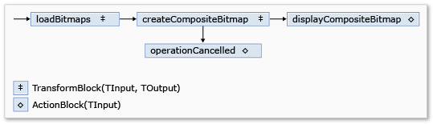
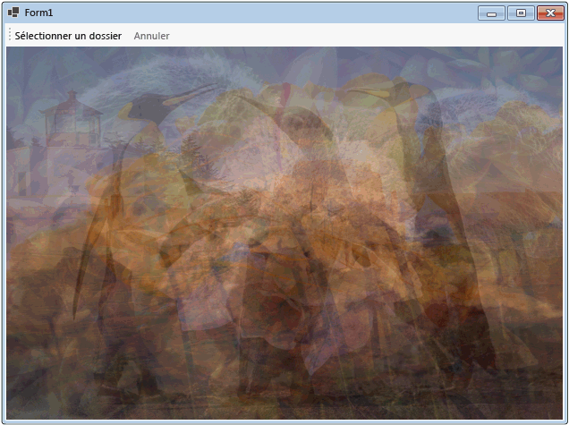

# Walkthrough: Using Dataflow in a Windows Forms Application
Ce document montre comment créer un réseau des blocs de flux de données qui effectuent le traitement d'images dans une application Windows Forms.  
  
 Cet exemple charge les fichiers image du dossier spécifié, crée une image composite, et affiche le résultat.  L'exemple utilise le modèle de flux de données pour router des images dans le réseau.  Dans le modèle de flux de données, les composants indépendants d'un programme communiquent entre eux en envoyant des messages.  Lorsqu'un composant reçoit un message, il exécute une action, puis passe le résultat à un autre composant.  Comparez ceci avec le modèle de flux de contrôle, dans lequel une application utilise des structures de contrôle, par exemple, des instructions conditionnelles, des boucles, etc., pour contrôler l'ordre des événements dans un programme.  
  
## Composants requis  
 Lisez la rubrique [Flux de données](../../../docs/standard/parallel-programming/dataflow-task-parallel-library.md), avant de démarrer cette procédure pas à pas.  
  
> [!TIP]
>  La bibliothèque de flux de données de TPL \(espace de noms<xref:System.Threading.Tasks.Dataflow?displayProperty=fullName> \) n'est pas distribuée avec [!INCLUDE[net_v45](../../../includes/net-v45-md.md)].  Pour installer l'espace de noms <xref:System.Threading.Tasks.Dataflow>, ouvrez votre projet dans [!INCLUDE[vs_dev11_long](../../../includes/vs-dev11-long-md.md)], choisissez **Gérer les packages NuGet** dans le menu Projet, puis recherchez en ligne le package `Microsoft.Tpl.Dataflow`.  
  
> [!TIP]
>  La bibliothèque de flux de données de TPL \(espace de noms<xref:System.Threading.Tasks.Dataflow?displayProperty=fullName> \) n'est pas distribuée avec [!INCLUDE[net_v45](../../../includes/net-v45-md.md)].  Pour installer l'espace de noms <xref:System.Threading.Tasks.Dataflow>, ouvrez votre projet dans [!INCLUDE[vs_dev11_long](../../../includes/vs-dev11-long-md.md)], choisissez **Gérer les packages NuGet** dans le menu Projet, puis recherchez en ligne le package `Microsoft.Tpl.Dataflow`.  
  
## Sections  
 Cette procédure pas\-à\-pas contient les sections suivantes :  
  
-   [Création de l'application Windows Forms](#winforms)  
  
-   [Création du réseau de flux de données](#network)  
  
-   [Connexion au réseau de flux de données à l'interface utilisateur](#ui)  
  
-   [Exemple complet](#complete)  
  
   
## Création de l'application Windows Forms  
 Cette section explique comment créer une application Windows Forms de base et ajouter les contrôles du formulaire principal.  
  
#### Pour Créer une Application Windows Forms  
  
1.  Dans [!INCLUDE[vsprvs](../../../includes/vsprvs-md.md)], créer un projet [!INCLUDE[csprcs](../../../includes/csprcs-md.md)]d'Application **Windows Forms Application** Visual Basic.  Dans ce document, le projet est nommé `CompositeImages`.  
  
2.  Dans le concepteur de formulaires pour le formulaire principal, Form1.cs \(Form1.vb pour [!INCLUDE[vbprvb](../../../includes/vbprvb-md.md)]\), ajouter un contrôle <xref:System.Windows.Forms.ToolStrip>.  
  
3.  Ajoutez un contrôle <xref:System.Windows.Forms.ToolStripButton> au contrôle <xref:System.Windows.Forms.ToolStrip>.  Attribuez à la propriété <xref:System.Windows.Forms.ToolStripItem.DisplayStyle%2A> la valeur <xref:System.Windows.Forms.ToolStripItemDisplayStyle> et à la propriété <xref:System.Windows.Forms.ToolStripItem.Text%2A> Le Dossier Choisir.  
  
4.  Ajoutez un deuxième contrôle <xref:System.Windows.Forms.ToolStripButton> au contrôle <xref:System.Windows.Forms.ToolStrip> .  Affectez la propriété <xref:System.Windows.Forms.ToolStripItem.DisplayStyle%2A> à la valeur <xref:System.Windows.Forms.ToolStripItemDisplayStyle>, la propriété <xref:System.Windows.Forms.ToolStripItem.Text%2A> pour annuler, et la propriété <xref:System.Windows.Forms.ToolStripItem.Enabled%2A> à `False`.  
  
5.  Ajoutez un objet <xref:System.Windows.Forms.PictureBox> au formulaire principal.  Affectez à la propriété <xref:System.Windows.Forms.Control.Dock%2A> la valeur <xref:System.Windows.Forms.DockStyle>.  
  
   
## Création du réseau de flux de données  
 Cette section explique comment créer le réseau de flux de données qui effectue le traitement des images.  
  
#### Pour créer le réseau de flux de données  
  
1.  Ajoutez une référence à System.Threading.Tasks.Dataflow.dll à votre projet.  
  
2.  Vérifiez que Form1.cs \(Form1.vb pour [!INCLUDE[vbprvb](../../../includes/vbprvb-md.md)]\) contient `using` \(`Using` dans [!INCLUDE[vbprvb](../../../includes/vbprvb-md.md)]\) les instructions :  
  
     [!code-csharp[TPLDataflow_CompositeImages#1](../../../samples/snippets/csharp/VS_Snippets_Misc/tpldataflow_compositeimages/cs/compositeimages/form1.cs#1)]  
  
3.  Ajoutez les membres de données suivants à la classe `Form1` :  
  
     [!code-csharp[TPLDataflow_CompositeImages#2](../../../samples/snippets/csharp/VS_Snippets_Misc/tpldataflow_compositeimages/cs/compositeimages/form1.cs#2)]  
  
4.  Ajoutez la méthode suivante `CreateImageProcessingNetwork` , à la classe `Form1`.  Cette méthode crée le réseau du traitement des images.  
  
     [!code-csharp[TPLDataflow_CompositeImages#3](../../../samples/snippets/csharp/VS_Snippets_Misc/tpldataflow_compositeimages/cs/compositeimages/form1.cs#3)]  
  
5.  Implémentez la méthode `LoadBitmaps`.  
  
     [!code-csharp[TPLDataflow_CompositeImages#4](../../../samples/snippets/csharp/VS_Snippets_Misc/tpldataflow_compositeimages/cs/compositeimages/form1.cs#4)]  
  
6.  Implémentez la méthode `CreateCompositeBitmap`.  
  
     [!code-csharp[TPLDataflow_CompositeImages#5](../../../samples/snippets/csharp/VS_Snippets_Misc/tpldataflow_compositeimages/cs/compositeimages/form1.cs#5)]  
  
    > [!NOTE]
    >  La version C\# de la méthode `CreateCompositeBitmap` utilise des pointeurs pour activer le traitement efficace des objets <xref:System.Drawing.Bitmap?displayProperty=fullName>.  Par conséquent, vous devez activer l'option **Autoriser du code non\-sécurisé** dans votre projet afin d'utiliser le mot clé [non\-sécurisé](../Topic/unsafe%20\(C%23%20Reference\).md).  Pour plus d'informations sur l'activation du code non sécurisé dans un projet [!INCLUDE[csprcs](../../../includes/csprcs-md.md)], consultez [Générer, page du Concepteur de projets \(C\#\)](../Topic/Build%20Page,%20Project%20Designer%20\(C%23\).md).  
  
 Le tableau suivant décrit les membres du réseau.  
  
|Membre|Type|Description|  
|------------|----------|-----------------|  
|`loadBitmaps`|<xref:System.Threading.Tasks.Dataflow.TransformBlock%602>|Prend un chemin d'accès au dossier comme entrée et génère une collection d'objets <xref:System.Drawing.Bitmap> comme sortie.|  
|`createCompositeBitmap`|<xref:System.Threading.Tasks.Dataflow.TransformBlock%602>|Obtient une collection d'objets <xref:System.Drawing.Bitmap> comme entrés et produit une image bitmap composite comme sortie.|  
|`displayCompositeBitmap`|<xref:System.Threading.Tasks.Dataflow.ActionBlock%601>|Affiche l'image bitmap composite sur le formulaire.|  
|`operationCancelled`|<xref:System.Threading.Tasks.Dataflow.ActionBlock%601>|Affiche une image pour indiquer que l'opération est annulée et permet à l'utilisateur de sélectionner un autre dossier.|  
  
 Pour connecter les blocs de flux de données pour former un réseau, cet exemple utilise la méthode <xref:System.Threading.Tasks.Dataflow.ISourceBlock%601.LinkTo%2A>.  La méthode <xref:System.Threading.Tasks.Dataflow.ISourceBlock%601.LinkTo%2A> contient une version surchargée qui prend un objet <xref:System.Predicate%601> qui détermine si le bloc cible accepte ou refuse un message.  Ce mécanisme de filtrage permet à des blocs de message de recevoir uniquement certaines valeurs.  Dans cet exemple, le réseau peut créer une branche dans une des deux directions.  La branche principale charge les images à partir d'un disque, crée l'image composite, et affiche cette image sur le formulaire.  L'autre branche annule l'opération actuelle.  Les objets <xref:System.Predicate%601> permettent aux blocs de flux de données le long de la branche principale de basculer vers l'autre branche en refusant certains messages.  Par exemple, si l'utilisateur annule l'opération, le bloc de flux de données `createCompositeBitmap` produit `null` \(`Nothing` dans [!INCLUDE[vbprvb](../../../includes/vbprvb-md.md)]\) comme sortie.  Le bloc de flux de données `displayCompositeBitmap` rejette les valeurs d'entrée `null` et, par conséquent, le message est proposé à `operationCancelled`.  Le bloc de flux de données `operationCancelled` reçoit tous les messages et, affiche donc une image pour indiquer que l'opération est annulée.  
  
 L'illustration suivante montre le réseau de traitement d'images.  
  
   
  
 Étant donné que les blocs de flux de données `displayCompositeBitmap` et `operationCancelled` agissent sur l'interface utilisateur, il est important que ces actions se produisent sur le thread de l'interface utilisateur.  Pour ce faire, lors de la construction, ces objets fournissent chacun un objet <xref:System.Threading.Tasks.Dataflow.ExecutionDataflowBlockOptions> qui contient le jeu de propriétés <xref:System.Threading.Tasks.Dataflow.DataflowBlockOptions.TaskScheduler%2A> à <xref:System.Threading.Tasks.TaskScheduler.FromCurrentSynchronizationContext%2A?displayProperty=fullName>.  La méthode <xref:System.Threading.Tasks.TaskScheduler.FromCurrentSynchronizationContext%2A?displayProperty=fullName> crée un objet <xref:System.Threading.Tasks.TaskScheduler> qui effectue le travail dans le contexte actuel de synchronisation.  Comme la méthode `CreateImageProcessingNetwork` est appelée depuis le gestionnaire du bouton du dossier choisir, qui s'exécute sur le thread de l'interface utilisateur, les actions pour les blocs de flux de données `displayCompositeBitmap` et `operationCancelled` s'exécutent également sur le thread de l'interface utilisateur.  
  
 Cet exemple utilise un jeton d'annulation partagé au lieu d'affecter la propriété <xref:System.Threading.Tasks.Dataflow.DataflowBlockOptions.CancellationToken%2A> car la propriété <xref:System.Threading.Tasks.Dataflow.DataflowBlockOptions.CancellationToken%2A> supprime définitivement l'exécution du bloc de flux de données.  Un jeton d'annulation permet à cet exemple de réutiliser plusieurs fois le même réseau de flux de données, même lorsque l'utilisateur supprime une ou plusieurs opérations.  Pour obtenir un exemple qui utilise <xref:System.Threading.Tasks.Dataflow.DataflowBlockOptions.CancellationToken%2A> pour annuler définitivement l'exécution d'un bloc de flux de données, consultez [How to: Cancel a Dataflow Block](../../../docs/standard/parallel-programming/how-to-cancel-a-dataflow-block.md).  
  
   
## Connexion au réseau de flux de données à l'interface utilisateur  
 Cette section décrit comment connecter le réseau de flux de données à l'interface utilisateur.  La création de l'image composite et l'annulation de l'opération sont initialisées des bouton de dossier choisir et Annuler.  Lorsque l'utilisateur choisit l'un ou l'autre de ces boutons, l'action appropriée est initialisée de manière asynchrone.  
  
#### Pour connecter le réseau de flux de données à l'interface utilisateur  
  
1.  Dans le concepteur de formulaires pour le formulaire principal, créez un gestionnaire d'événements pour l'événement <xref:System.Windows.Forms.ToolStripItem.Click> pour le bouton du dossier choisir.  
  
2.  Implémentez l'événement <xref:System.Windows.Forms.ToolStripItem.Click> pour le bouton du dossier choisir.  
  
     [!code-csharp[TPLDataflow_CompositeImages#6](../../../samples/snippets/csharp/VS_Snippets_Misc/tpldataflow_compositeimages/cs/compositeimages/form1.cs#6)]  
  
3.  Dans le concepteur de formulaires pour le formulaire principal, créez un gestionnaire d'événements pour l'événement <xref:System.Windows.Forms.ToolStripItem.Click> pour le bouton Annuler.  
  
4.  Implémentez l'événement <xref:System.Windows.Forms.ToolStripItem.Click> pour le bouton Annuler.  
  
     [!code-csharp[TPLDataflow_CompositeImages#7](../../../samples/snippets/csharp/VS_Snippets_Misc/tpldataflow_compositeimages/cs/compositeimages/form1.cs#7)]  
  
   
## Exemple complet  
 L'exemple suivant présente le code complet pour cette visite  
  
 [!code-csharp[TPLDataflow_CompositeImages#100](../../../samples/snippets/csharp/VS_Snippets_Misc/tpldataflow_compositeimages/cs/compositeimages/form1.cs#100)]  
  
 L'illustration suivante montre des sorties usuels pour le courant\\image exemple\\ dossier.  
  
   
  
## Étapes suivantes  
  
## Voir aussi  
 [Flux de données](../../../docs/standard/parallel-programming/dataflow-task-parallel-library.md)