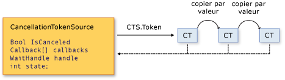

# Cancellation in Managed Threads
[!INCLUDE[net_v40_long](../../../includes/net-v40-long-md.md)] et versions ultérieures utilisent un modèle unifié pour l'annulation coopérative des opérations asynchrones ou des opérations synchrones de longue durée.  Ce modèle est basé sur un objet léger appelé jeton d'annulation.  L'objet qui appelle une ou plusieurs opérations annulables, par exemple en créant de nouveaux threads ou de nouvelles tâches, passe le jeton à chaque opération.  Chaque opération peut, à son tour, passer des copies du jeton à d'autres opérations.  Ultérieurement, l'objet qui a créé le jeton peut l'utiliser pour demander que les opérations arrêtent leur action.  Seul l'objet demandeur peut émettre la demande d'annulation. Chaque écouteur est chargé d'accepter la demande et d'y répondre de manière appropriée et en temps voulu.  
  
 Le modèle général d'implémentation du modèle d'annulation coopérative est le suivant :  
  
-   Instanciez un objet <xref:System.Threading.CancellationTokenSource> qui gère et envoie une notification d'annulation pour chaque jeton d'annulation.  
  
-   Passez le jeton retourné par la propriété <xref:System.Threading.CancellationTokenSource.Token%2A?displayProperty=fullName> à chaque tâche ou thread qui écoute l'annulation.  
  
-   Fournissez un mécanisme pour chaque tâche ou thread pour répondre à l'annulation.  
  
-   Appelez la méthode <xref:System.Threading.CancellationTokenSource.Cancel%2A?displayProperty=fullName> pour fournir une notification d'annulation.  
  
> [!IMPORTANT]
>  La classe <xref:System.Threading.CancellationTokenSource> implémente l'interface <xref:System.IDisposable>.  Quand vous aurez terminé d'utiliser la source du jeton d'annulation, vous devrez appeler la méthode <xref:System.Threading.CancellationTokenSource.Dispose%2A?displayProperty=fullName> pour libérer les ressources non managées qu'elle contient.  
  
 L'illustration suivante montre la relation entre une source de jeton et toutes les copies de ce jeton.  
  
   
  
 Le nouveau modèle d'annulation facilite la création d'applications et de bibliothèques prenant en charge l'annulation. De plus, il prend en charge les fonctionnalités suivantes :  
  
-   L'annulation est coopérative et n'est pas imposée à l'écouteur.  L'écouteur choisit comment s'arrêter correctement en réponse à une demande d'annulation.  
  
-   La demande est différente de l'écoute.  Un objet qui appelle une opération annulable peut contrôler à quel moment l'annulation est demandée \(le cas échéant\).  
  
-   L'objet demandeur émet la demande d'annulation vers toutes les copies du jeton à l'aide d'un seul appel de méthode.  
  
-   Un écouteur peut écouter plusieurs jetons simultanément en les rassemblant sous la forme d'un même *jeton lié*.  
  
-   Le code utilisateur peut remarquer et répondre aux demandes d'annulation à partir du code de bibliothèque, et ce dernier peut remarquer et répondre aux demandes d'annulation à partir du code utilisateur.  
  
-   Les écouteurs peuvent être avertis des demandes d'annulation par le biais d'une interrogation, d'une inscription de rappel ou bien en attendant des handles d'attente.  
  
## Types d'annulation  
 L'infrastructure d'annulation est implémentée comme un ensemble de types connexes, qui sont répertoriés dans le tableau suivant.  
  
|Nom de type|Description|  
|-----------------|-----------------|  
|<xref:System.Threading.CancellationTokenSource>|Objet qui crée un jeton d'annulation et émet également la demande d'annulation pour toutes les copies de ce jeton.|  
|<xref:System.Threading.CancellationToken>|Type valeur léger passé à un ou plusieurs écouteurs, généralement sous la forme d'un paramètre de méthode.  Les écouteurs surveillent la valeur de la propriété `IsCancellationRequested` du jeton par le biais d'interrogations, de rappels ou de handles d'attente.|  
|<xref:System.OperationCanceledException>|Les surcharges du constructeur de cette exception acceptent <xref:System.Threading.CancellationToken> comme paramètre.  Les écouteurs peuvent éventuellement lever cette exception pour vérifier la source de l'annulation et informer les autres qu'elle a répondu à une demande d'annulation.|  
  
 Le nouveau modèle d'annulation est intégré à [!INCLUDE[dnprdnshort](../../../includes/dnprdnshort-md.md)] dans plusieurs types. Les plus importants sont <xref:System.Threading.Tasks.Parallel?displayProperty=fullName>, <xref:System.Threading.Tasks.Task?displayProperty=fullName>, <xref:System.Threading.Tasks.Task%601?displayProperty=fullName> et <xref:System.Linq.ParallelEnumerable?displayProperty=fullName>.  Nous vous recommandons d'utiliser ce nouveau modèle d'annulation pour tout nouveau code de bibliothèque et d'application.  
  
## Exemple de code  
 Dans l'exemple suivant, l'objet demandeur crée un objet <xref:System.Threading.CancellationTokenSource>, puis passe sa propriété <xref:System.Threading.CancellationTokenSource.Token%2A> à l'opération annulable.  L'opération qui reçoit la demande surveille la valeur de la propriété <xref:System.Threading.CancellationToken.IsCancellationRequested%2A> du jeton par le biais d'une interrogation.  Quand la valeur devient `true`, l'écouteur peut s'arrêter de quelque manière appropriée que ce soit.  Dans cet exemple, la méthode s'arrête, ce qui suffit dans de nombreux cas.  
  
> [!NOTE]
>  L'exemple utilise la méthode <xref:System.Threading.ThreadPool.QueueUserWorkItem%2A> pour montrer que la nouvelle infrastructure d'annulation est compatible avec les API héritées.  Pour obtenir un exemple qui utilise le nouveau type préféré <xref:System.Threading.Tasks.Task?displayProperty=fullName>, voir [How to: Cancel a Task and Its Children](../../../docs/standard/parallel-programming/how-to-cancel-a-task-and-its-children.md).  
  
 [!code-csharp[Cancellation#1](../../../samples/snippets/csharp/VS_Snippets_Misc/cancellation/cs/cancellationex1.cs#1)]
 [!code-vb[Cancellation#1](../../../samples/snippets/visualbasic/VS_Snippets_Misc/cancellation/vb/cancellationex1.vb#1)]  
  
## Annulation d'opération et annulation d'objet  
 Dans la nouvelle infrastructure d'annulation, l'annulation fait référence aux opérations, et non aux objets.  La demande d'annulation signifie que l'opération doit s'arrêter dès que possible après l'exécution de tout nettoyage nécessaire.  Un jeton d'annulation doit faire référence à une opération annulable. Toutefois, cette opération peut être implémentée dans votre programme.  Après avoir défini la propriété <xref:System.Threading.CancellationToken.IsCancellationRequested%2A> du jeton sur `true`, celle\-ci ne peut pas être réinitialisée à la valeur `false`.  Les jetons d'annulation ne peuvent donc pas être réutilisés après avoir été annulés.  
  
 Si vous avez besoin d'un mécanisme d'annulation d'objets, vous pouvez le baser sur le mécanisme d'annulation d'opérations en appelant la méthode <xref:System.Threading.CancellationToken.Register%2A?displayProperty=fullName>, comme indiqué dans l'exemple suivant.  
  
 [!code-csharp[Cancellation#2](../../../samples/snippets/csharp/VS_Snippets_Misc/cancellation/cs/objectcancellation1.cs#2)]
 [!code-vb[Cancellation#2](../../../samples/snippets/visualbasic/VS_Snippets_Misc/cancellation/vb/objectcancellation1.vb#2)]  
  
 Si un objet prend en charge plusieurs opérations annulables simultanées, passez un jeton en tant qu'entrée à chaque opération annulable.  De cette façon, une opération peut être annulée sans affecter les autres.  
  
## Demandes d'annulation : écoute et réponse  
 Dans le délégué utilisateur, l'implémenteur d'une opération annulable détermine la façon de terminer l'opération en réponse à une demande d'annulation.  Dans de nombreux cas, le délégué utilisateur peut simplement effectuer le nettoyage nécessaire, puis être immédiatement retourné.  
  
 Toutefois, dans des cas plus complexes, le délégué utilisateur devra notifier le code de bibliothèque qu'une annulation s'est produite.  Dans ce cas, il convient de terminer l'opération en appelant le délégué de la méthode <xref:System.Threading.CancellationToken.ThrowIfCancellationRequested%2A>, ce qui entraînera la levée de <xref:System.OperationCanceledException>.  Le code de bibliothèque peut intercepter cette exception sur le thread du délégué utilisateur et examiner le jeton de l'exception pour déterminer si l'exception indique une annulation coopérative ou une autre situation exceptionnelle.  
  
 La classe <xref:System.Threading.Tasks.Task> gère <xref:System.OperationCanceledException> de cette façon.  Pour plus d'informations, voir [Task Cancellation](../../../docs/standard/parallel-programming/task-cancellation.md).  
  
### Écoute par interrogation  
 Pour les calculs de longue durée qui effectuent des boucles récursives ou non, vous pouvez écouter une demande d'annulation en interrogeant régulièrement la valeur de la propriété <xref:System.Threading.CancellationToken.IsCancellationRequested%2A?displayProperty=fullName>.  Si sa valeur est de `true`, la méthode doit effectuer un nettoyage et se terminer aussi rapidement que possible.  La fréquence d'interrogation optimale varie selon le type d'application.  Il incombe au développeur de déterminer la meilleure fréquence d'interrogation pour un programme donné.  L'interrogation elle\-même n'altère pas beaucoup les performances.  L'exemple suivant montre une méthode d'interrogation.  
  
 [!code-csharp[Cancellation#3](../../../samples/snippets/csharp/VS_Snippets_Misc/cancellation/cs/cancellationex11.cs#3)]
 [!code-vb[Cancellation#3](../../../samples/snippets/visualbasic/VS_Snippets_Misc/cancellation/vb/cancellationex11.vb#3)]  
  
 Pour obtenir un exemple plus complet, voir [How to: Listen for Cancellation Requests by Polling](../../../docs/standard/threading/how-to-listen-for-cancellation-requests-by-polling.md).  
  
### Écoute par inscription de rappel  
 Certaines opérations peuvent être bloquées et ne plus pouvoir vérifier la valeur des jetons d'annulation en temps voulu.  Dans ce cas, vous pouvez inscrire une méthode de rappel qui débloque la méthode quand une demande d'annulation est reçue.  
  
 La méthode <xref:System.Threading.CancellationToken.Register%2A> retourne un objet <xref:System.Threading.CancellationTokenRegistration> utilisé spécialement à cet effet.  L'exemple suivant montre comment utiliser la méthode <xref:System.Threading.CancellationToken.Register%2A> pour annuler une requête web asynchrone.  
  
 [!code-csharp[Cancellation#4](../../../samples/snippets/csharp/VS_Snippets_Misc/cancellation/cs/cancellationex4.cs#4)]
 [!code-vb[Cancellation#4](../../../samples/snippets/visualbasic/VS_Snippets_Misc/cancellation/vb/cancellationex4.vb#4)]  
  
 L'objet <xref:System.Threading.CancellationTokenRegistration> gère la synchronisation des threads et s'assure que le rappel cessera de s'exécuter à un point précis dans le temps.  
  
 Pour garantir la réactivité du système et éviter les interblocages, les instructions suivantes doivent être suivies lors de l'inscription des rappels :  
  
-   La méthode de rappel doit être rapide, car elle est appelée de façon synchrone. L'appel à <xref:System.Threading.CancellationTokenSource.Cancel%2A> ne sera donc pas retourné avant le retour du rappel.  
  
-   Si vous appelez <xref:System.Threading.CancellationTokenRegistration.Dispose%2A> pendant l'exécution du rappel et détenez un verrou que le rappel attend, votre programme peut connaître un interblocage.  Après le retour de `Dispose`, vous pourrez libérer toutes les ressources requises par le rappel.  
  
-   Les rappels ne doivent pas exécuter n'importe quel thread manuel ou n'importe quelle utilisation de <xref:System.Threading.SynchronizationContext> dans un rappel.  Si un rappel doit s'exécuter sur un thread particulier, utilisez le constructeur <xref:System.Threading.CancellationTokenRegistration?displayProperty=fullName> qui permet de spécifier que la cible syncContext est le <xref:System.Threading.SynchronizationContext.Current%2A?displayProperty=fullName> actif.  L'exécution de threads manuels dans un rappel peut entraîner un interblocage.  
  
 Pour obtenir un exemple plus complet, voir [How to: Register Callbacks for Cancellation Requests](../../../docs/standard/threading/how-to-register-callbacks-for-cancellation-requests.md).  
  
### Écoute à l'aide d'un handle d'attente  
 Quand une opération annulable risque de se bloquer en attendant une primitive de synchronisation, telle que <xref:System.Threading.ManualResetEvent?displayProperty=fullName> ou <xref:System.Threading.Semaphore?displayProperty=fullName>, vous pouvez utiliser la propriété <xref:System.Threading.CancellationToken.WaitHandle%2A?displayProperty=fullName> pour que l'opération attende à la fois l'événement et la demande d'annulation.  Le handle d'attente du jeton d'annulation sera signalé en réponse à une demande d'annulation et la méthode pourra utiliser la valeur de retour de la méthode <xref:System.Threading.WaitHandle.WaitAny%2A> pour déterminer s'il s'agit de l'annulation du jeton à l'origine du signalement.  L'opération peut alors simplement s'arrêter ou lever une <xref:System.OperationCanceledException>, selon le cas.  
  
 [!code-csharp[Cancellation#5](../../../samples/snippets/csharp/VS_Snippets_Misc/cancellation/cs/cancellationex9.cs#5)]
 [!code-vb[Cancellation#5](../../../samples/snippets/visualbasic/VS_Snippets_Misc/cancellation/vb/cancellationex9.vb#5)]  
  
 Dans le nouveau code qui cible [!INCLUDE[net_v40_long](../../../includes/net-v40-long-md.md)], <xref:System.Threading.ManualResetEventSlim?displayProperty=fullName> et <xref:System.Threading.SemaphoreSlim?displayProperty=fullName> prennent en charge la nouvelle infrastructure d'annulation dans leurs méthodes `Wait`.  Vous pouvez passer <xref:System.Threading.CancellationToken> à la méthode. Quand l'annulation sera demandée, l'événement se réveillera et lèvera une <xref:System.OperationCanceledException>.  
  
 [!code-csharp[Cancellation#6](../../../samples/snippets/csharp/VS_Snippets_Misc/cancellation/cs/cancellationex10.cs#6)]
 [!code-vb[Cancellation#6](../../../samples/snippets/visualbasic/VS_Snippets_Misc/cancellation/vb/cancellationex10.vb#6)]  
  
 Pour obtenir un exemple plus complet, voir [How to: Listen for Cancellation Requests That Have Wait Handles](../../../docs/standard/threading/how-to-listen-for-cancellation-requests-that-have-wait-handles.md).  
  
### Écoute simultanée de plusieurs jetons  
 Dans certains cas, un écouteur peut avoir à écouter simultanément plusieurs jetons d'annulation.  Par exemple, une opération annulable peut avoir à surveiller un jeton d'annulation interne en plus d'un jeton passé de manière externe comme argument à un paramètre de méthode.  Pour ce faire, créez une source de jeton lié rassemblant plusieurs jetons au sein d'un même jeton, comme illustré dans l'exemple suivant.  
  
 [!code-csharp[Cancellation#7](../../../samples/snippets/csharp/VS_Snippets_Misc/cancellation/cs/cancellationex13.cs#7)]
 [!code-vb[Cancellation#7](../../../samples/snippets/visualbasic/VS_Snippets_Misc/cancellation/vb/cancellationex13.vb#7)]  
  
 Notez que vous devez appeler `Dispose` sur la source de jeton lié quand vous en avez terminé avec lui.  Pour obtenir un exemple plus complet, voir [How to: Listen for Multiple Cancellation Requests](../../../docs/standard/threading/how-to-listen-for-multiple-cancellation-requests.md).  
  
## Coopération entre du code de bibliothèque et du code utilisateur  
 L'infrastructure d'annulation unifiée permet au code de bibliothèque d'annuler du code utilisateur, et au code utilisateur d'annuler du code de bibliothèque de façon coopérative.  Pour une coopération harmonieuse, chaque côté doit respecter les recommandations suivantes :  
  
-   Si le code de bibliothèque fournit des opérations annulables, il doit également fournir des méthodes publiques qui acceptent un jeton d'annulation externe pour que le code utilisateur puisse demander une annulation.  
  
-   Si le code de bibliothèque émet un appel dans le code utilisateur, le code de bibliothèque doit interpréter un OperationCanceledException\(externalToken\) comme une *annulation coopérative*, et pas nécessairement comme une exception d'échec.  
  
-   Les délégués utilisateurs doivent tenter de répondre aux demandes d'annulation du code de bibliothèque en temps voulu.  
  
 <xref:System.Threading.Tasks.Task?displayProperty=fullName> et <xref:System.Linq.ParallelEnumerable?displayProperty=fullName> sont des exemples de classes qui suivent ces recommandations.  Pour plus d'informations, voir [Task Cancellation](../../../docs/standard/parallel-programming/task-cancellation.md) et [How to: Cancel a PLINQ Query](../../../docs/standard/parallel-programming/how-to-cancel-a-plinq-query.md).  
  
## Voir aussi  
 [Managed Threading Basics](../../../docs/standard/threading/managed-threading-basics.md)