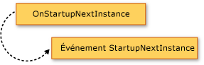
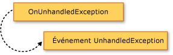

# Extension du modèle d'application Visual BasicExtending the Visual Basic Application Model
Vous pouvez ajouter des fonctionnalités au modèle d’application en substituant les `Overridable` les membres de la <xref:Microsoft.VisualBasic.ApplicationServices.WindowsFormsApplicationBase>classe.</xref:Microsoft.VisualBasic.ApplicationServices.WindowsFormsApplicationBase>You can add functionality to the application model by overriding the `Overridable` members of the <xref:Microsoft.VisualBasic.ApplicationServices.WindowsFormsApplicationBase> class. Cette technique vous permet de personnaliser le comportement du modèle d’application et ajouter des appels à vos propres méthodes lorsque l’application démarre et s’arrête.This technique allows you to customize the behavior of the application model and add calls to your own methods as the application starts up and shuts down.  
  
## Présentation visuelle du modèle d’ApplicationVisual Overview of the Application Model  
 Cette section présente visuellement la séquence des appels de fonction dans le modèle d’Application Visual Basic.This section visually presents the sequence of function calls in the Visual Basic Application Model. La section suivante décrit l’objectif de chaque fonction en détail.The next section describes the purpose of each function in detail.  
  
 Le graphique suivant illustre la séquence d’appels du modèle application dans une application Visual Basic Windows Forms normale.The following graphic shows the application model call sequence in a normal Visual Basic Windows Forms application. La séquence commence lorsque la `Sub Main` les appels de procédure du <xref:Microsoft.VisualBasic.ApplicationServices.WindowsFormsApplicationBase.Run%2A>méthode.</xref:Microsoft.VisualBasic.ApplicationServices.WindowsFormsApplicationBase.Run%2A>The sequence starts when the `Sub Main` procedure calls the <xref:Microsoft.VisualBasic.ApplicationServices.WindowsFormsApplicationBase.Run%2A> method.  
  
   
  
 Le modèle d’Application Visual Basic fournit également les <xref:Microsoft.VisualBasic.ApplicationServices.WindowsFormsApplicationBase.StartupNextInstance>et <xref:Microsoft.VisualBasic.ApplicationServices.WindowsFormsApplicationBase.UnhandledException>événements.</xref:Microsoft.VisualBasic.ApplicationServices.WindowsFormsApplicationBase.UnhandledException> </xref:Microsoft.VisualBasic.ApplicationServices.WindowsFormsApplicationBase.StartupNextInstance>The Visual Basic Application Model also provides the <xref:Microsoft.VisualBasic.ApplicationServices.WindowsFormsApplicationBase.StartupNextInstance> and <xref:Microsoft.VisualBasic.ApplicationServices.WindowsFormsApplicationBase.UnhandledException> events. Les graphiques suivants illustrent le mécanisme de déclenchement de ces événements.The following graphics show the mechanism for raising these events.  
  
   
  
   
  
## Substituer les méthodes de BaseOverriding the Base Methods  
 Le <xref:Microsoft.VisualBasic.ApplicationServices.WindowsFormsApplicationBase.Run%2A>méthode définit l’ordre dans lequel les `Application` méthodes exécuter.</xref:Microsoft.VisualBasic.ApplicationServices.WindowsFormsApplicationBase.Run%2A>The <xref:Microsoft.VisualBasic.ApplicationServices.WindowsFormsApplicationBase.Run%2A> method defines the order in which the `Application` methods run. Par défaut, le `Sub Main` procédure pour une application Windows Forms appelle la <xref:Microsoft.VisualBasic.ApplicationServices.WindowsFormsApplicationBase.Run%2A>méthode.</xref:Microsoft.VisualBasic.ApplicationServices.WindowsFormsApplicationBase.Run%2A>By default, the `Sub Main` procedure for a Windows Forms application calls the <xref:Microsoft.VisualBasic.ApplicationServices.WindowsFormsApplicationBase.Run%2A> method.  
  
 Si l’application est une application normale (plusieurs instances d’application) ou la première instance d’une application à instance unique, la <xref:Microsoft.VisualBasic.ApplicationServices.WindowsFormsApplicationBase.Run%2A>méthode s’exécute le `Overridable` méthodes dans l’ordre suivant :</xref:Microsoft.VisualBasic.ApplicationServices.WindowsFormsApplicationBase.Run%2A>If the application is a normal application (multiple-instance application), or the first instance of a single-instance application, the <xref:Microsoft.VisualBasic.ApplicationServices.WindowsFormsApplicationBase.Run%2A> method executes the `Overridable` methods in the following order:  
  
1.  <xref:Microsoft.VisualBasic.ApplicationServices.WindowsFormsApplicationBase.OnInitialize%2A>.</xref:Microsoft.VisualBasic.ApplicationServices.WindowsFormsApplicationBase.OnInitialize%2A><xref:Microsoft.VisualBasic.ApplicationServices.WindowsFormsApplicationBase.OnInitialize%2A>. Par défaut, cette méthode définit les styles visuels, styles d’affichage du texte et principal actuel pour le thread d’application principal (si l’application utilise l’authentification Windows) et les appels `ShowSplashScreen` si aucun `/nosplash` ni `-nosplash` est utilisé comme un argument de ligne de commande.By default, this method sets the visual styles, text display styles, and current principal for the main application thread (if the application uses Windows authentication), and calls `ShowSplashScreen` if neither `/nosplash` nor `-nosplash` is used as a command-line argument.  
  
     La séquence de démarrage d’application est annulée si cette fonction renvoie `False`.The application startup sequence is canceled if this function returns `False`. Cela peut être utile s’il existe des circonstances dans lesquelles l’application ne doit pas exécutée.This can be useful if there are circumstances in which the application should not run.  
  
     Le <xref:Microsoft.VisualBasic.ApplicationServices.WindowsFormsApplicationBase.OnInitialize%2A>méthode appelle les méthodes suivantes :</xref:Microsoft.VisualBasic.ApplicationServices.WindowsFormsApplicationBase.OnInitialize%2A>The <xref:Microsoft.VisualBasic.ApplicationServices.WindowsFormsApplicationBase.OnInitialize%2A> method calls the following methods:  
  
    1.  <xref:Microsoft.VisualBasic.ApplicationServices.WindowsFormsApplicationBase.ShowSplashScreen%2A>.</xref:Microsoft.VisualBasic.ApplicationServices.WindowsFormsApplicationBase.ShowSplashScreen%2A><xref:Microsoft.VisualBasic.ApplicationServices.WindowsFormsApplicationBase.ShowSplashScreen%2A>. Détermine si l’application a un écran de démarrage défini et si c’est le cas, affiche l’écran de démarrage sur un thread distinct.Determines if the application has a splash screen defined and if it does, displays the splash screen on a separate thread.  
  
         Le <xref:Microsoft.VisualBasic.ApplicationServices.WindowsFormsApplicationBase.ShowSplashScreen%2A>méthode contient le code qui affiche l’écran d’accueil de l’écran au moins le nombre de millisecondes spécifié par le <xref:Microsoft.VisualBasic.ApplicationServices.WindowsFormsApplicationBase.MinimumSplashScreenDisplayTime%2A>propriété.</xref:Microsoft.VisualBasic.ApplicationServices.WindowsFormsApplicationBase.MinimumSplashScreenDisplayTime%2A> </xref:Microsoft.VisualBasic.ApplicationServices.WindowsFormsApplicationBase.ShowSplashScreen%2A>The <xref:Microsoft.VisualBasic.ApplicationServices.WindowsFormsApplicationBase.ShowSplashScreen%2A> method contains the code that displays the splash screen for at least the number of milliseconds specified by the <xref:Microsoft.VisualBasic.ApplicationServices.WindowsFormsApplicationBase.MinimumSplashScreenDisplayTime%2A> property. Pour utiliser cette fonctionnalité, vous devez ajouter l’écran de démarrage à votre application à l’aide de la **Concepteur de projets** (qui affecte le `My.Application.MinimumSplashScreenDisplayTime` deux secondes à la propriété), ou définir le `My.Application.MinimumSplashScreenDisplayTime` propriété dans une méthode qui substitue le <xref:Microsoft.VisualBasic.ApplicationServices.WindowsFormsApplicationBase.OnInitialize%2A>ou <xref:Microsoft.VisualBasic.ApplicationServices.WindowsFormsApplicationBase.OnCreateSplashScreen%2A>(méthode).</xref:Microsoft.VisualBasic.ApplicationServices.WindowsFormsApplicationBase.OnCreateSplashScreen%2A> </xref:Microsoft.VisualBasic.ApplicationServices.WindowsFormsApplicationBase.OnInitialize%2A>To use this functionality, you must add the splash screen to your application using the **Project Designer** (which sets the `My.Application.MinimumSplashScreenDisplayTime` property to two seconds), or set the `My.Application.MinimumSplashScreenDisplayTime` property in a method that overrides the <xref:Microsoft.VisualBasic.ApplicationServices.WindowsFormsApplicationBase.OnInitialize%2A> or <xref:Microsoft.VisualBasic.ApplicationServices.WindowsFormsApplicationBase.OnCreateSplashScreen%2A> method. Pour plus d’informations, consultez <xref:Microsoft.VisualBasic.ApplicationServices.WindowsFormsApplicationBase.MinimumSplashScreenDisplayTime%2A>.</xref:Microsoft.VisualBasic.ApplicationServices.WindowsFormsApplicationBase.MinimumSplashScreenDisplayTime%2A>For more information, see <xref:Microsoft.VisualBasic.ApplicationServices.WindowsFormsApplicationBase.MinimumSplashScreenDisplayTime%2A>.  
  
    2.  <xref:Microsoft.VisualBasic.ApplicationServices.WindowsFormsApplicationBase.OnCreateSplashScreen%2A>.</xref:Microsoft.VisualBasic.ApplicationServices.WindowsFormsApplicationBase.OnCreateSplashScreen%2A><xref:Microsoft.VisualBasic.ApplicationServices.WindowsFormsApplicationBase.OnCreateSplashScreen%2A>. Permet à un concepteur d’émettre du code qui initialise l’écran de démarrage.Allows a designer to emit code that initializes the splash screen.  
  
         Par défaut, cette méthode ne fait rien.By default, this method does nothing. Si vous sélectionnez un écran de démarrage pour votre application dans le [!INCLUDE[vbprvb](../../../csharp/programming-guide/concepts/linq/includes/vbprvb_md.md)] **Concepteur de projets**, le concepteur substitue la <xref:Microsoft.VisualBasic.ApplicationServices.WindowsFormsApplicationBase.OnCreateSplashScreen%2A>par une méthode qui définit le <xref:Microsoft.VisualBasic.ApplicationServices.WindowsFormsApplicationBase.SplashScreen%2A>propriété à une nouvelle instance de la forme de l’écran de démarrage.</xref:Microsoft.VisualBasic.ApplicationServices.WindowsFormsApplicationBase.SplashScreen%2A> </xref:Microsoft.VisualBasic.ApplicationServices.WindowsFormsApplicationBase.OnCreateSplashScreen%2A>If you select a splash screen for your application in the [!INCLUDE[vbprvb](../../../csharp/programming-guide/concepts/linq/includes/vbprvb_md.md)] **Project Designer**, the designer overrides the <xref:Microsoft.VisualBasic.ApplicationServices.WindowsFormsApplicationBase.OnCreateSplashScreen%2A> method with a method that sets the <xref:Microsoft.VisualBasic.ApplicationServices.WindowsFormsApplicationBase.SplashScreen%2A> property to a new instance of the splash-screen form.  
  
2.  <xref:Microsoft.VisualBasic.ApplicationServices.WindowsFormsApplicationBase.OnStartup%2A>.</xref:Microsoft.VisualBasic.ApplicationServices.WindowsFormsApplicationBase.OnStartup%2A><xref:Microsoft.VisualBasic.ApplicationServices.WindowsFormsApplicationBase.OnStartup%2A>. Fournit un point d’extensibilité pour déclencher le `Startup` événement.Provides an extensibility point for raising the `Startup` event. La séquence de démarrage de l’application s’arrête si cette fonction retourne `False`.The application startup sequence stops if this function returns `False`.  
  
     Par défaut, cette méthode déclenche la <xref:Microsoft.VisualBasic.ApplicationServices.WindowsFormsApplicationBase.Startup>événements.</xref:Microsoft.VisualBasic.ApplicationServices.WindowsFormsApplicationBase.Startup>By default, this method raises the <xref:Microsoft.VisualBasic.ApplicationServices.WindowsFormsApplicationBase.Startup> event. Si le Gestionnaire d’événements définit les @System.ComponentModel.CancelEventArgs.Cancel propriété de l’argument d’événement pour `True`, la méthode retourne `False` pour annuler le démarrage de l’application.If the event handler sets the @System.ComponentModel.CancelEventArgs.Cancel property of the event argument to `True`, the method returns `False` to cancel the application startup.  
  
3.  <xref:Microsoft.VisualBasic.ApplicationServices.WindowsFormsApplicationBase.OnRun%2A>.</xref:Microsoft.VisualBasic.ApplicationServices.WindowsFormsApplicationBase.OnRun%2A><xref:Microsoft.VisualBasic.ApplicationServices.WindowsFormsApplicationBase.OnRun%2A>. Fournit le point de départ lorsque l’application principale est prête à s’exécuter, une fois l’initialisation terminée.Provides the starting point for when the main application is ready to start running, after the initialization is done.  
  
     Par défaut, avant d’entrer dans la boucle de message Windows Forms, cette méthode appelle la `OnCreateMainForm` (pour créer le formulaire principal de l’application) et `HideSplashScreen` (pour fermer l’écran de démarrage) méthodes :By default, before it enters the Windows Forms message loop, this method calls the `OnCreateMainForm` (to create the application's main form) and `HideSplashScreen` (to close the splash screen) methods:  
  
    1.  <xref:Microsoft.VisualBasic.ApplicationServices.WindowsFormsApplicationBase.OnCreateMainForm%2A>.</xref:Microsoft.VisualBasic.ApplicationServices.WindowsFormsApplicationBase.OnCreateMainForm%2A><xref:Microsoft.VisualBasic.ApplicationServices.WindowsFormsApplicationBase.OnCreateMainForm%2A>. Offre un moyen pour un concepteur d’émettre du code qui initialise le formulaire principal.Provides a way for a designer to emit code that initializes the main form.  
  
         Par défaut, cette méthode ne fait rien.By default, this method does nothing. Toutefois, lorsque vous sélectionnez un formulaire principal pour votre application dans le [!INCLUDE[vbprvb](../../../csharp/programming-guide/concepts/linq/includes/vbprvb_md.md)] **Concepteur de projet**, le concepteur substitue la <xref:Microsoft.VisualBasic.ApplicationServices.WindowsFormsApplicationBase.OnCreateMainForm%2A>par une méthode qui définit la <xref:Microsoft.VisualBasic.ApplicationServices.WindowsFormsApplicationBase.MainForm%2A>propriété vers une nouvelle instance du formulaire principal.</xref:Microsoft.VisualBasic.ApplicationServices.WindowsFormsApplicationBase.MainForm%2A> </xref:Microsoft.VisualBasic.ApplicationServices.WindowsFormsApplicationBase.OnCreateMainForm%2A>However, when you select a main form for your application in the [!INCLUDE[vbprvb](../../../csharp/programming-guide/concepts/linq/includes/vbprvb_md.md)] **Project Designer**, the designer overrides the <xref:Microsoft.VisualBasic.ApplicationServices.WindowsFormsApplicationBase.OnCreateMainForm%2A> method with a method that sets the <xref:Microsoft.VisualBasic.ApplicationServices.WindowsFormsApplicationBase.MainForm%2A> property to a new instance of the main form.  
  
    2.  <xref:Microsoft.VisualBasic.ApplicationServices.WindowsFormsApplicationBase.HideSplashScreen%2A>.</xref:Microsoft.VisualBasic.ApplicationServices.WindowsFormsApplicationBase.HideSplashScreen%2A><xref:Microsoft.VisualBasic.ApplicationServices.WindowsFormsApplicationBase.HideSplashScreen%2A>. Si l’application a un écran de démarrage défini et ouvert, cette méthode ferme l’écran de démarrage.If application has a splash screen defined and it is open, this method closes the splash screen.  
  
         Par défaut, cette méthode ferme l’écran de démarrage.By default, this method closes the splash screen.  
  
4.  <xref:Microsoft.VisualBasic.ApplicationServices.WindowsFormsApplicationBase.OnStartupNextInstance%2A>.</xref:Microsoft.VisualBasic.ApplicationServices.WindowsFormsApplicationBase.OnStartupNextInstance%2A><xref:Microsoft.VisualBasic.ApplicationServices.WindowsFormsApplicationBase.OnStartupNextInstance%2A>. Fournit un moyen de personnaliser le comportement d’une application à instance unique lorsqu’une autre instance de l’application démarre.Provides a way to customize how a single-instance application behaves when another instance of the application starts.  
  
     Par défaut, cette méthode déclenche la <xref:Microsoft.VisualBasic.ApplicationServices.WindowsFormsApplicationBase.StartupNextInstance>événements.</xref:Microsoft.VisualBasic.ApplicationServices.WindowsFormsApplicationBase.StartupNextInstance>By default, this method raises the <xref:Microsoft.VisualBasic.ApplicationServices.WindowsFormsApplicationBase.StartupNextInstance> event.  
  
5.  <xref:Microsoft.VisualBasic.ApplicationServices.WindowsFormsApplicationBase.OnShutdown%2A>.</xref:Microsoft.VisualBasic.ApplicationServices.WindowsFormsApplicationBase.OnShutdown%2A><xref:Microsoft.VisualBasic.ApplicationServices.WindowsFormsApplicationBase.OnShutdown%2A>. Fournit un point d’extensibilité pour déclencher le `Shutdown` événement.Provides an extensibility point for raising the `Shutdown` event. Cette méthode ne s’exécute pas si une exception non gérée se produit dans l’application principale.This method does not run if an unhandled exception occurs in the main application.  
  
     Par défaut, cette méthode déclenche la <xref:Microsoft.VisualBasic.ApplicationServices.WindowsFormsApplicationBase.Shutdown>événements.</xref:Microsoft.VisualBasic.ApplicationServices.WindowsFormsApplicationBase.Shutdown>By default, this method raises the <xref:Microsoft.VisualBasic.ApplicationServices.WindowsFormsApplicationBase.Shutdown> event.  
  
6.  <xref:Microsoft.VisualBasic.ApplicationServices.WindowsFormsApplicationBase.OnUnhandledException%2A>.</xref:Microsoft.VisualBasic.ApplicationServices.WindowsFormsApplicationBase.OnUnhandledException%2A><xref:Microsoft.VisualBasic.ApplicationServices.WindowsFormsApplicationBase.OnUnhandledException%2A>. Exécuté si une exception non gérée se produit dans une des méthodes répertoriées ci-dessus.Executed if an unhandled exception occurs in any of the above listed methods.  
  
     Par défaut, cette méthode déclenche la <xref:Microsoft.VisualBasic.ApplicationServices.WindowsFormsApplicationBase.UnhandledException>événement tant qu’un débogueur n’est pas attaché et que l’application gère le `UnhandledException` événements.</xref:Microsoft.VisualBasic.ApplicationServices.WindowsFormsApplicationBase.UnhandledException>By default, this method raises the <xref:Microsoft.VisualBasic.ApplicationServices.WindowsFormsApplicationBase.UnhandledException> event as long as a debugger is not attached and the application is handling the `UnhandledException` event.  
  
 Si l’application est une application à instance unique et que l’application est déjà en cours d’exécution, l’instance suivante de l’application appelle la <xref:Microsoft.VisualBasic.ApplicationServices.WindowsFormsApplicationBase.OnStartupNextInstance%2A>méthode sur l’instance d’origine de l’application, puis se ferme.</xref:Microsoft.VisualBasic.ApplicationServices.WindowsFormsApplicationBase.OnStartupNextInstance%2A>If the application is a single-instance application, and the application is already running, the subsequent instance of the application calls the <xref:Microsoft.VisualBasic.ApplicationServices.WindowsFormsApplicationBase.OnStartupNextInstance%2A> method on the original instance of the application, and then exits.  
  
 Le <xref:Microsoft.VisualBasic.ApplicationServices.WindowsFormsApplicationBase>constructeur appelle la <xref:Microsoft.VisualBasic.ApplicationServices.WindowsFormsApplicationBase.UseCompatibleTextRendering%2A>propriété pour déterminer le moteur de rendu de texte à utiliser pour les formulaires de l’application.</xref:Microsoft.VisualBasic.ApplicationServices.WindowsFormsApplicationBase.UseCompatibleTextRendering%2A> </xref:Microsoft.VisualBasic.ApplicationServices.WindowsFormsApplicationBase>The <xref:Microsoft.VisualBasic.ApplicationServices.WindowsFormsApplicationBase> constructor calls the <xref:Microsoft.VisualBasic.ApplicationServices.WindowsFormsApplicationBase.UseCompatibleTextRendering%2A> property to determine which text rendering engine to use for the application's forms. Par défaut, le <xref:Microsoft.VisualBasic.ApplicationServices.WindowsFormsApplicationBase.UseCompatibleTextRendering%2A>propriété renvoie `False`, indiquant que le moteur de rendu de texte GDI est utilisé, qui est la valeur par défaut dans [!INCLUDE[vbprvblong](../../../visual-basic/developing-apps/customizing-extending-my/includes/vbprvblong_md.md)].</xref:Microsoft.VisualBasic.ApplicationServices.WindowsFormsApplicationBase.UseCompatibleTextRendering%2A>By default, the <xref:Microsoft.VisualBasic.ApplicationServices.WindowsFormsApplicationBase.UseCompatibleTextRendering%2A> property returns `False`, indicating that the GDI text rendering engine be used, which is the default in [!INCLUDE[vbprvblong](../../../visual-basic/developing-apps/customizing-extending-my/includes/vbprvblong_md.md)]. Vous pouvez remplacer le <xref:Microsoft.VisualBasic.ApplicationServices.WindowsFormsApplicationBase.UseCompatibleTextRendering%2A>propriété à retourner `True`, ce qui signifie que le moteur de rendu de texte GDI + est utilisé, qui est la valeur par défaut dans Visual Basic .NET 2002 et Visual Basic .NET 2003.</xref:Microsoft.VisualBasic.ApplicationServices.WindowsFormsApplicationBase.UseCompatibleTextRendering%2A>You can override the <xref:Microsoft.VisualBasic.ApplicationServices.WindowsFormsApplicationBase.UseCompatibleTextRendering%2A> property to return `True`, which indicates that the GDI+ text rendering engine be used, which is the default in Visual Basic .NET 2002 and Visual Basic .NET 2003.  
  
## Configuration de l’ApplicationConfiguring the Application  
 Dans le cadre de la [!INCLUDE[vbprvb](../../../csharp/programming-guide/concepts/linq/includes/vbprvb_md.md)] modèle d’Application, la <xref:Microsoft.VisualBasic.ApplicationServices.WindowsFormsApplicationBase>classe fournit des propriétés protégées qui configurent l’application.</xref:Microsoft.VisualBasic.ApplicationServices.WindowsFormsApplicationBase>As a part of the [!INCLUDE[vbprvb](../../../csharp/programming-guide/concepts/linq/includes/vbprvb_md.md)] Application model, the <xref:Microsoft.VisualBasic.ApplicationServices.WindowsFormsApplicationBase> class provides protected properties that configure the application. Ces propriétés doivent être définies dans le constructeur de la classe d’implémentation.These properties should be set in the constructor of the implementing class.  
  
 Dans un projet Windows Forms par défaut, le **Concepteur de projet** crée du code pour définir les propriétés avec les paramètres du concepteur.In a default Windows Forms project, the **Project Designer** creates code to set the properties with the designer settings. Les propriétés sont utilisées uniquement au démarrage de l’application ; leur définition après le démarrage de l’application n’a aucun effet.The properties are used only when the application is starting; setting them after the application starts has no effect.  
  
|PropriétéProperty|DétermineDetermines|Dans le volet Application du Concepteur de projetsSetting in the Application pane of  the Project Designer|  
|---|---|---|  
|<xref:Microsoft.VisualBasic.ApplicationServices.WindowsFormsApplicationBase.IsSingleInstance%2A></xref:Microsoft.VisualBasic.ApplicationServices.WindowsFormsApplicationBase.IsSingleInstance%2A><xref:Microsoft.VisualBasic.ApplicationServices.WindowsFormsApplicationBase.IsSingleInstance%2A>|Si l’application s’exécute comme une application à instance unique ou à plusieurs instances.Whether the application runs as a single-instance or multiple-instance application.|**Application à instance unique** case à cocher**Make single instance application** check box|  
|<xref:Microsoft.VisualBasic.ApplicationServices.WindowsFormsApplicationBase.EnableVisualStyles%2A></xref:Microsoft.VisualBasic.ApplicationServices.WindowsFormsApplicationBase.EnableVisualStyles%2A><xref:Microsoft.VisualBasic.ApplicationServices.WindowsFormsApplicationBase.EnableVisualStyles%2A>|Si l’application utilise des styles visuels qui correspond à Windows XP.If the application will use visual styles that match Windows XP.|**Activer des styles visuels XP** case à cocher**Enable XP visual styles** check box|  
|<xref:Microsoft.VisualBasic.ApplicationServices.WindowsFormsApplicationBase.SaveMySettingsOnExit%2A></xref:Microsoft.VisualBasic.ApplicationServices.WindowsFormsApplicationBase.SaveMySettingsOnExit%2A><xref:Microsoft.VisualBasic.ApplicationServices.WindowsFormsApplicationBase.SaveMySettingsOnExit%2A>|Si l’application enregistre automatiquement les modifications des paramètres utilisateur de l’application lors de la fermeture de l’application.If application automatically saves application's user-settings changes when the application exits.|**Enregistrer My.Settings lors de l’arrêt** case à cocher**Save My.Settings on Shutdown** check box|  
|<xref:Microsoft.VisualBasic.ApplicationServices.WindowsFormsApplicationBase.ShutdownStyle%2A></xref:Microsoft.VisualBasic.ApplicationServices.WindowsFormsApplicationBase.ShutdownStyle%2A><xref:Microsoft.VisualBasic.ApplicationServices.WindowsFormsApplicationBase.ShutdownStyle%2A>|Ce qui entraîne l’application à arrêter, par exemple lorsque le formulaire de démarrage ferme ou lorsque le dernier formulaire.What causes the application to terminate, such as when the startup form closes or when the last form closes.|**En mode arrêt** liste**Shutdown mode** list|  
  
## Voir aussiSee Also  
 <xref:Microsoft.VisualBasic.ApplicationServices.ApplicationBase></xref:Microsoft.VisualBasic.ApplicationServices.ApplicationBase><xref:Microsoft.VisualBasic.ApplicationServices.ApplicationBase>   
 <xref:Microsoft.VisualBasic.ApplicationServices.WindowsFormsApplicationBase.Startup></xref:Microsoft.VisualBasic.ApplicationServices.WindowsFormsApplicationBase.Startup><xref:Microsoft.VisualBasic.ApplicationServices.WindowsFormsApplicationBase.Startup>   
 <xref:Microsoft.VisualBasic.ApplicationServices.WindowsFormsApplicationBase.StartupNextInstance></xref:Microsoft.VisualBasic.ApplicationServices.WindowsFormsApplicationBase.StartupNextInstance><xref:Microsoft.VisualBasic.ApplicationServices.WindowsFormsApplicationBase.StartupNextInstance>   
 <xref:Microsoft.VisualBasic.ApplicationServices.WindowsFormsApplicationBase.UnhandledException></xref:Microsoft.VisualBasic.ApplicationServices.WindowsFormsApplicationBase.UnhandledException><xref:Microsoft.VisualBasic.ApplicationServices.WindowsFormsApplicationBase.UnhandledException>   
 <xref:Microsoft.VisualBasic.ApplicationServices.WindowsFormsApplicationBase.Shutdown></xref:Microsoft.VisualBasic.ApplicationServices.WindowsFormsApplicationBase.Shutdown><xref:Microsoft.VisualBasic.ApplicationServices.WindowsFormsApplicationBase.Shutdown>   
 <xref:Microsoft.VisualBasic.ApplicationServices.WindowsFormsApplicationBase.NetworkAvailabilityChanged></xref:Microsoft.VisualBasic.ApplicationServices.WindowsFormsApplicationBase.NetworkAvailabilityChanged><xref:Microsoft.VisualBasic.ApplicationServices.WindowsFormsApplicationBase.NetworkAvailabilityChanged>   
 <xref:Microsoft.VisualBasic.ApplicationServices.WindowsFormsApplicationBase></xref:Microsoft.VisualBasic.ApplicationServices.WindowsFormsApplicationBase><xref:Microsoft.VisualBasic.ApplicationServices.WindowsFormsApplicationBase>   
 [Vue d’ensemble du modèle d’Application Visual Basic](../../../visual-basic/developing-apps/development-with-my/overview-of-the-visual-basic-application-model.md)  [Overview of the Visual Basic Application Model](../../../visual-basic/developing-apps/development-with-my/overview-of-the-visual-basic-application-model.md)   
 [Page Application, Concepteur de projet (Visual Basic)](https://docs.microsoft.com/visualstudio/ide/reference/application-page-project-designer-visual-basic) [Application Page, Project Designer (Visual Basic)](https://docs.microsoft.com/visualstudio/ide/reference/application-page-project-designer-visual-basic)
