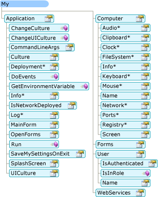

# Comment My dépend du type de projet (Visual Basic)How My Depends on Project Type (Visual Basic)
`My`expose uniquement les objets requis par un type de projet particulier.`My` exposes only those objects required by a particular project type. Par exemple, le `My.Forms` objet est disponible dans une application Windows Forms et non dans une application console.For example, the `My.Forms` object is available in a Windows Forms application but not available in a console application. Cette rubrique décrit ce qui `My` les objets sont disponibles dans différents types de projets.This topic describes which `My` objects are available in different project types.  
  
## Mon Windows dans les Applications et Sites WebMy in Windows Applications and Web Sites  
 `My`expose uniquement les objets qui sont utiles dans le type de projet en cours ; Il supprime tous les objets qui ne sont pas applicables.`My` exposes only objects that are useful in the current project type; it suppresses objects that are not applicable. Par exemple, l’illustration suivante montre la `My` modèle d’objet dans un projet Windows Forms.For example, the following image shows the `My` object model in a Windows Forms project.  
  
   
  
 Dans un projet de site Web, `My` expose les objets qui concernent un développeur Web (tel que le `My.Request` et `My.Response` objets) en supprimant ceux qui n’est pas pertinentes (tels que le `My.Forms` objet).In a Web site project, `My` exposes objects that are relevant to a Web developer (such as the `My.Request` and `My.Response` objects) while suppressing objects that are not relevant (such as the `My.Forms` object). L’illustration suivante montre la `My` modèle d’objet dans un projet de site Web :The following image shows the `My` object model in a Web site project:  
  
   
  
## Détails du projetProject Details  
 Le tableau suivant indique les `My` objets sont activés par défaut pour huit types de projet : application Windows, bibliothèque de classes, application console, bibliothèque de contrôles Windows, bibliothèque de contrôles Web, service Windows, vide et site Web.The following table shows which `My` objects are enabled by default for eight project types: Windows application, class Library, console application, Windows control library, Web control library, Windows service, empty, and Web site.  
  
 Il existe trois versions de la `My.Application` (objet), les deux versions de la `My.Computer` objet et deux versions de `My.User` de l’objet ; plus d’informations sur ces versions sont fournis dans les notes de bas de page après le tableau.There are three versions of the `My.Application` object, two versions of the `My.Computer` object, and two versions of `My.User` object; details about these versions are given in the footnotes after the table.  
  
|My (objet)My Object|Application WindowsWindows Application|Bibliothèque de classesClass Library|Application consoleConsole Application|Bibliothèque de contrôles WindowsWindows Control Library|Bibliothèque de contrôles webWeb Control Library|Service WindowsWindows Service|EmptyEmpty|Site webWeb Site|  
|---|---|---|---|---|---|---|---|---|  
|`My.Application`|**Yes** 1**Yes** 1|**Yes** 2**Yes** 2|**Yes** 3**Yes** 3|**Yes** 2**Yes** 2|NonNo|**Yes** 3**Yes** 3|NonNo|NonNo|  
|`My.Computer`|**Yes** 4**Yes** 4|**Yes** 4**Yes** 4|**Yes** 4**Yes** 4|**Yes** 4**Yes** 4|**Yes** 5**Yes** 5|**Yes** 4**Yes** 4|NonNo|**Yes** 5**Yes** 5|  
|`My.Forms`|**Oui****Yes**|NonNo|NonNo|**Oui****Yes**|NonNo|NonNo|NonNo|NonNo|  
|`My.Log`|NonNo|NonNo|NonNo|NonNo|NonNo|NonNo|NonNo|**Oui****Yes**|  
|`My.Request`|NonNo|NonNo|NonNo|NonNo|NonNo|NonNo|NonNo|**Oui****Yes**|  
|`My.Resources`|**Oui****Yes**|**Oui****Yes**|**Oui****Yes**|**Oui****Yes**|**Oui****Yes**|**Oui****Yes**|NonNo|NonNo|  
|`My.Response`|NonNo|NonNo|NonNo|NonNo|NonNo|NonNo|NonNo|**Oui****Yes**|  
|`My.Settings`|**Oui****Yes**|**Oui****Yes**|**Oui****Yes**|**Oui****Yes**|**Oui****Yes**|**Oui****Yes**|NonNo|NonNo|  
|`My.User`|**Yes** 6**Yes** 6|**Yes** 6**Yes** 6|**Yes** 6**Yes** 6|**Yes** 6**Yes** 6|**Yes** 7**Yes** 7|**Yes** 6**Yes** 6|NonNo|**Yes** 7**Yes** 7|  
|`My.WebServices`|**Oui****Yes**|**Oui****Yes**|**Oui****Yes**|**Oui****Yes**|**Oui****Yes**|**Oui****Yes**|NonNo|NonNo|  
  
 1 version Windows Forms de `My.Application`.1 Windows Forms version of `My.Application`. Dérive de la version de la console (voir Remarque 3) ; Ajoute la prise en charge pour interagir avec les fenêtres de l’application et fournit le [!INCLUDE[vbprvb](../../../csharp/programming-guide/concepts/linq/includes/vbprvb_md.md)] modèle d’Application.Derives from the console version (see Note 3); adds support for interacting with the application's windows and provides the [!INCLUDE[vbprvb](../../../csharp/programming-guide/concepts/linq/includes/vbprvb_md.md)] Application model.  
  
 2 de version de la bibliothèque `My.Application`.2 Library version of `My.Application`. Fournit les fonctionnalités de base requises par une application : fournit des membres pour l’écriture dans le journal des applications et l’accès aux informations de l’application.Provides the basic functionality needed by an application: provides members for writing to the application log and accessing application information.  
  
 3 version de console de `My.Application`.3 Console version of `My.Application`. Dérive de la version de la bibliothèque (voir Remarque 2), et ajoute des membres supplémentaires pour accéder aux arguments de ligne de commande et les informations de déploiement ClickOnce de l’application.Derives from the library version (see Note 2), and adds additional members for accessing the application's command-line arguments and ClickOnce deployment information.  
  
 4 version Windows de `My.Computer`.4 Windows version of `My.Computer`. Dérive de la version du serveur (voir Remarque 5) et fournit l’accès aux objets utiles sur un ordinateur client, tels que le clavier, écran et souris.Derives from the Server version (see Note 5), and provides access to useful objects on a client machine, such as the keyboard, screen, and mouse.  
  
 5 version du serveur de `My.Computer`.5 Server version of `My.Computer`. Fournit des informations de base sur l’ordinateur, telles que le nom, l’accès à l’horloge et ainsi de suite.Provides basic information about the computer, such as the name, access to the clock, and so on.  
  
 6 version Windows de `My.User`.6 Windows version of `My.User`. Cet objet est associé à l’identité du thread actuel.This object is associated with the thread's current identity.  
  
 7 version web de `My.User`.7 Web version of `My.User`. Cet objet est associé à l’identité de la requête HTTP actuelle de l’application.This object is associated with the user identity of the application's current HTTP request.  
  
## Voir aussiSee Also  
 <xref:Microsoft.VisualBasic.ApplicationServices.ApplicationBase></xref:Microsoft.VisualBasic.ApplicationServices.ApplicationBase><xref:Microsoft.VisualBasic.ApplicationServices.ApplicationBase>   
 <xref:Microsoft.VisualBasic.Devices.Computer></xref:Microsoft.VisualBasic.Devices.Computer><xref:Microsoft.VisualBasic.Devices.Computer>   
 <xref:Microsoft.VisualBasic.Logging.Log></xref:Microsoft.VisualBasic.Logging.Log><xref:Microsoft.VisualBasic.Logging.Log>   
 <xref:Microsoft.VisualBasic.ApplicationServices.User></xref:Microsoft.VisualBasic.ApplicationServices.User><xref:Microsoft.VisualBasic.ApplicationServices.User>   
 [Personnalisation des objets sont disponibles dans ma](../../../visual-basic/developing-apps/customizing-extending-my/customizing-which-objects-are-available-in-my.md)  [Customizing Which Objects are Available in My](../../../visual-basic/developing-apps/customizing-extending-my/customizing-which-objects-are-available-in-my.md)   
 [Compilation conditionnelle](../../../visual-basic/programming-guide/program-structure/conditional-compilation.md)  [Conditional Compilation](../../../visual-basic/programming-guide/program-structure/conditional-compilation.md)   
 [/define (Visual Basic)](../../../visual-basic/reference/command-line-compiler/define.md)  [/define (Visual Basic)](../../../visual-basic/reference/command-line-compiler/define.md)   
 [My.Forms, objet](../../../visual-basic/language-reference/objects/my-forms-object.md)  [My.Forms Object](../../../visual-basic/language-reference/objects/my-forms-object.md)   
 [My.Request, objet](../../../visual-basic/language-reference/objects/my-request-object.md)  [My.Request Object](../../../visual-basic/language-reference/objects/my-request-object.md)   
 [My.Response, objet](../../../visual-basic/language-reference/objects/my-response-object.md)  [My.Response Object](../../../visual-basic/language-reference/objects/my-response-object.md)   
 [My.WebServices (objet)](../../../visual-basic/language-reference/objects/my-webservices-object.md) [My.WebServices Object](../../../visual-basic/language-reference/objects/my-webservices-object.md)
