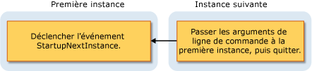

# Vue d'ensemble du modèle d'application Visual BasicOverview of the Visual Basic Application Model
[!INCLUDE[vbprvb](../../../csharp/programming-guide/concepts/linq/includes/vbprvb_md.md)]fournit un modèle précis pour contrôler le comportement des applications Windows Forms : le [!INCLUDE[vbprvb](../../../csharp/programming-guide/concepts/linq/includes/vbprvb_md.md)] modèle d’Application. provides a well-defined model for controlling the behavior of Windows Forms applications: the [!INCLUDE[vbprvb](../../../csharp/programming-guide/concepts/linq/includes/vbprvb_md.md)] Application model. Ce modèle inclut des événements pour de l’application démarrage et arrêt, ainsi que les événements pour l’interception des exceptions non gérées.This model includes events for handling the application's startup and shutdown, as well as events for catching unhandled exceptions. Il fournit également la prise en charge pour le développement d’applications à instance unique.It also provides support for developing single-instance applications. Le modèle d’application est extensible, afin que les développeurs nécessitant davantage de contrôle peuvent personnaliser ses méthodes substituables.The application model is extensible, so developers that need more control can customize its overridable methods.  
  
## Utilise le modèle d’ApplicationUses for the Application Model  
 Une application classique doit effectuer des tâches lorsqu’il démarre et s’arrête.A typical application needs to perform tasks when it starts up and shuts down. Par exemple, lorsqu’il démarre, l’application peut afficher un écran de démarrage, établir des connexions de base de données, charger un état enregistré et ainsi de suite.For example, when it starts up, the application can display a splash screen, make database connections, load a saved state, and so on. Lorsque l’application s’arrête, il peut fermer des connexions de base de données, enregistrer l’état actuel et ainsi de suite.When the application shuts down, it can close database connections, save the current state, and so on. En outre, l’application peut exécuter un code spécifique lors de la fermeture de l’application vers le bas, tel que lors d’une exception non gérée.In addition, the application can execute specific code when the application shuts down unexpectedly, such as during an unhandled exception.  
  
 Le [!INCLUDE[vbprvb](../../../csharp/programming-guide/concepts/linq/includes/vbprvb_md.md)] modèle d’Application facilite la création d’un *uniques* application.The [!INCLUDE[vbprvb](../../../csharp/programming-guide/concepts/linq/includes/vbprvb_md.md)] Application model makes it easy to create a *single-instance* application. Une application à instance unique diffère d’une application normale qui peut exécuter qu’une seule instance de l’application à la fois.A single-instance application differs from a normal application in that only one instance of the application can be running at a time. Essayez de lancer une autre instance d’une application à instance unique entraîne l’instance d’origine notifié — au moyen de la `StartupNextInstance` événement — une autre tentative de lancement a été effectuée.An attempt to launch another instance of a single-instance application results in the original instance being notified—by means of the `StartupNextInstance` event—that another launch attempt was made. La notification inclut les arguments de ligne de commande de l’instance suivante.The notification includes the subsequent instance's command-line arguments. L’instance suivante de l’application est fermée avant d’effectuer toute initialisation.The subsequent instance of the application is then closed before any initialization can occur.  
  
 Une application à instance unique démarre et vérifie s’il s’agit de la première instance ou une instance de l’application suivante :A single-instance application starts and checks whether it is the first instance or a subsequent instance of the application:  
  
-   Si elle est la première instance, elle démarre comme d’habitude.If it is the first instance, it starts as usual.  
  
-   Toute tentative ultérieure de démarrer l’application, tandis que la première instance s’exécute, entraîne un comportement très différent.Each subsequent attempt to start the application, while the first instance runs, results in very different behavior. La tentative suivante notifie la première instance sur les arguments de ligne de commande, puis quitte immédiatement.The subsequent attempt notifies the first instance about the command-line arguments, and then immediately exits. La première instance gère la `StartupNextInstance` événement afin de déterminer quelles étaient les arguments de ligne de commande de l’instance suivante et continue de s’exécuter.The first instance handles the `StartupNextInstance` event to determine what the subsequent instance's command-line arguments were, and continues to run.  
  
     Ce diagramme montre comment une instance suivante signale la première instance.This diagram shows how a subsequent instance signals the first instance.  
  
       
  
 En gérant la `StartupNextInstance` événement, vous pouvez contrôler le comportement de votre application à instance unique.By handling the `StartupNextInstance` event, you can control how your single-instance application behaves. Par exemple, Microsoft Outlook s’exécute généralement en tant qu’une application à instance unique ; Lorsque Outlook est en cours d’exécution et que vous essayez de démarrer Outlook, le focus se déplace vers l’instance d’origine mais une autre instance ne s’ouvre pas.For example, Microsoft Outlook typically runs as a single-instance application; when Outlook is running and you attempt to start Outlook again, focus shifts to the original instance but another instance does not open.  
  
## Événements dans le modèle d’ApplicationEvents in the Application Model  
 Les événements suivants sont trouvent dans le modèle d’application :The following events are found in the application model:  
  
-   **Démarrage de l’application**.**Application startup**. L’application déclenche le <xref:Microsoft.VisualBasic.ApplicationServices.WindowsFormsApplicationBase.Startup>événement lors de son démarrage.</xref:Microsoft.VisualBasic.ApplicationServices.WindowsFormsApplicationBase.Startup>The application raises the <xref:Microsoft.VisualBasic.ApplicationServices.WindowsFormsApplicationBase.Startup> event when it starts. En gérant cet événement, vous pouvez ajouter du code qui initialise l’application avant de charger le formulaire principal.By handling this event, you can add code that initializes the application before the main form is loaded. Le `Startup` événement prévoit également l’annulation de l’exécution de l’application pendant cette phase du processus de démarrage, si vous le souhaitez.The `Startup` event also provides for canceling execution of the application during that phase of the startup process, if desired.  
  
     Vous pouvez configurer l’application pour afficher un écran de démarrage pendant l’exécution de code de démarrage de l’application.You can configure the application to show a splash screen while the application startup code runs. Par défaut, le modèle d’application supprime l’écran de démarrage lorsque l’écran soit le `/nosplash` ou `-nosplash` sert d’argument de ligne de commande.By default, the application model suppresses the splash screen when either the `/nosplash` or `-nosplash` command-line argument is used.  
  
-   **Applications à instance unique**.**Single-instance applications**. Le <xref:Microsoft.VisualBasic.ApplicationServices.WindowsFormsApplicationBase.StartupNextInstance>événement est déclenché lorsqu’une instance suivante d’une application à instance unique démarre.</xref:Microsoft.VisualBasic.ApplicationServices.WindowsFormsApplicationBase.StartupNextInstance>The <xref:Microsoft.VisualBasic.ApplicationServices.WindowsFormsApplicationBase.StartupNextInstance> event is raised when a subsequent instance of a single-instance application starts. L’événement passe les arguments de ligne de commande de l’instance suivante.The event passes the command-line arguments of the subsequent instance.  
  
-   **Les exceptions non gérées**.**Unhandled exceptions**. Si l’application rencontre une exception non gérée, elle déclenche le <xref:Microsoft.VisualBasic.ApplicationServices.WindowsFormsApplicationBase.UnhandledException>événements.</xref:Microsoft.VisualBasic.ApplicationServices.WindowsFormsApplicationBase.UnhandledException>If the application encounters an unhandled exception, it raises the <xref:Microsoft.VisualBasic.ApplicationServices.WindowsFormsApplicationBase.UnhandledException> event. Votre gestionnaire pour cet événement peut examiner l’exception et déterminer s’il faut continuer l’exécution.Your handler for that event can examine the exception and determine whether to continue execution.  
  
     Le `UnhandledException` événement n’est pas déclenché dans certains cas.The `UnhandledException` event is not raised in some circumstances. Pour plus d’informations, consultez <xref:Microsoft.VisualBasic.ApplicationServices.WindowsFormsApplicationBase.UnhandledException>.</xref:Microsoft.VisualBasic.ApplicationServices.WindowsFormsApplicationBase.UnhandledException>For more information, see <xref:Microsoft.VisualBasic.ApplicationServices.WindowsFormsApplicationBase.UnhandledException>.  
  
-   **Changements de connectivité réseau**.**Network-connectivity changes**. Si la disponibilité du réseau de l’ordinateur change, l’application déclenche le <xref:Microsoft.VisualBasic.ApplicationServices.WindowsFormsApplicationBase.NetworkAvailabilityChanged>événements.</xref:Microsoft.VisualBasic.ApplicationServices.WindowsFormsApplicationBase.NetworkAvailabilityChanged>If the computer's network availability changes, the application raises the <xref:Microsoft.VisualBasic.ApplicationServices.WindowsFormsApplicationBase.NetworkAvailabilityChanged> event.  
  
     Le `NetworkAvailabilityChanged` événement n’est pas déclenché dans certains cas.The `NetworkAvailabilityChanged` event is not raised in some circumstances. Pour plus d’informations, consultez <xref:Microsoft.VisualBasic.ApplicationServices.WindowsFormsApplicationBase.NetworkAvailabilityChanged>.</xref:Microsoft.VisualBasic.ApplicationServices.WindowsFormsApplicationBase.NetworkAvailabilityChanged>For more information, see <xref:Microsoft.VisualBasic.ApplicationServices.WindowsFormsApplicationBase.NetworkAvailabilityChanged>.  
  
-   **Application arrêtée**.**Application shut down**. L’application fournit la <xref:Microsoft.VisualBasic.ApplicationServices.WindowsFormsApplicationBase.Shutdown>événement pour signaler quand il est sur le point d’arrêt.</xref:Microsoft.VisualBasic.ApplicationServices.WindowsFormsApplicationBase.Shutdown>The application provides the <xref:Microsoft.VisualBasic.ApplicationServices.WindowsFormsApplicationBase.Shutdown> event to signal when it is about to shut down. Dans ce cas gestionnaire, vous pouvez vous assurer que les opérations de votre application doivent effectuer, fermeture et l’enregistrement, par exemple, sont terminées.In that event handler, you can make sure that the operations your application needs to perform—closing and saving, for example—are completed. Vous pouvez configurer votre application s’arrête lorsque le formulaire principal, ou arrêter uniquement lorsque tous les formulaires se ferment.You can configure your application to shut down when the main form closes, or to shut down only when all forms close.  
  
## DisponibilitéAvailability  
 Par défaut, le [!INCLUDE[vbprvb](../../../csharp/programming-guide/concepts/linq/includes/vbprvb_md.md)] modèle d’Application est disponible pour les projets Windows Forms.By default, the [!INCLUDE[vbprvb](../../../csharp/programming-guide/concepts/linq/includes/vbprvb_md.md)] Application model is available for Windows Forms projects. Si vous configurez l’application pour utiliser un objet de démarrage différent, ou commencer le code d’application personnalisé `Sub Main`, cet objet ou classe devra éventuellement fournir une implémentation de la <xref:Microsoft.VisualBasic.ApplicationServices.WindowsFormsApplicationBase>classe à utiliser le modèle d’application.</xref:Microsoft.VisualBasic.ApplicationServices.WindowsFormsApplicationBase>If you configure the application to use a different startup object, or start the application code with a custom `Sub Main`, then that object or class may need to provide an implementation of the <xref:Microsoft.VisualBasic.ApplicationServices.WindowsFormsApplicationBase> class to use the application model. Pour plus d’informations sur la modification de l’objet de démarrage, consultez [Application Page, Project Designer (Visual Basic)](https://docs.microsoft.com/visualstudio/ide/reference/application-page-project-designer-visual-basic).For information about changing the startup object, see [Application Page, Project Designer (Visual Basic)](https://docs.microsoft.com/visualstudio/ide/reference/application-page-project-designer-visual-basic).  
  
## Voir aussiSee Also  
 <xref:Microsoft.VisualBasic.ApplicationServices.WindowsFormsApplicationBase></xref:Microsoft.VisualBasic.ApplicationServices.WindowsFormsApplicationBase><xref:Microsoft.VisualBasic.ApplicationServices.WindowsFormsApplicationBase>   
 <xref:Microsoft.VisualBasic.ApplicationServices.WindowsFormsApplicationBase.Startup></xref:Microsoft.VisualBasic.ApplicationServices.WindowsFormsApplicationBase.Startup><xref:Microsoft.VisualBasic.ApplicationServices.WindowsFormsApplicationBase.Startup>   
 <xref:Microsoft.VisualBasic.ApplicationServices.WindowsFormsApplicationBase.StartupNextInstance></xref:Microsoft.VisualBasic.ApplicationServices.WindowsFormsApplicationBase.StartupNextInstance><xref:Microsoft.VisualBasic.ApplicationServices.WindowsFormsApplicationBase.StartupNextInstance>   
 <xref:Microsoft.VisualBasic.ApplicationServices.WindowsFormsApplicationBase.UnhandledException></xref:Microsoft.VisualBasic.ApplicationServices.WindowsFormsApplicationBase.UnhandledException><xref:Microsoft.VisualBasic.ApplicationServices.WindowsFormsApplicationBase.UnhandledException>   
 <xref:Microsoft.VisualBasic.ApplicationServices.WindowsFormsApplicationBase.Shutdown></xref:Microsoft.VisualBasic.ApplicationServices.WindowsFormsApplicationBase.Shutdown><xref:Microsoft.VisualBasic.ApplicationServices.WindowsFormsApplicationBase.Shutdown>   
 <xref:Microsoft.VisualBasic.ApplicationServices.WindowsFormsApplicationBase.NetworkAvailabilityChanged></xref:Microsoft.VisualBasic.ApplicationServices.WindowsFormsApplicationBase.NetworkAvailabilityChanged><xref:Microsoft.VisualBasic.ApplicationServices.WindowsFormsApplicationBase.NetworkAvailabilityChanged>   
 <xref:Microsoft.VisualBasic.ApplicationServices.WindowsFormsApplicationBase></xref:Microsoft.VisualBasic.ApplicationServices.WindowsFormsApplicationBase><xref:Microsoft.VisualBasic.ApplicationServices.WindowsFormsApplicationBase>   
 [Extension du modèle d’application Visual Basic](../../../visual-basic/developing-apps/customizing-extending-my/extending-the-visual-basic-application-model.md) [Extending the Visual Basic Application Model](../../../visual-basic/developing-apps/customizing-extending-my/extending-the-visual-basic-application-model.md)
