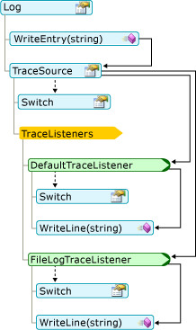
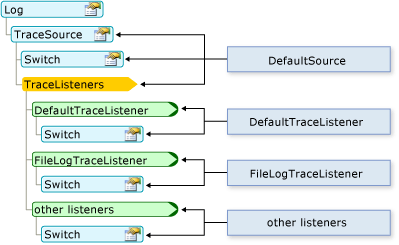

# <a name="working-with-application-logs-in-visual-basic"></a>Utilisation des journaux des applications dans Visual Basic
Les objets `My.Applicaton.Log` et `My.Log` facilitent l’écriture des informations de journalisation et de traçage dans les journaux.  
  
## <a name="how-messages-are-logged"></a>Comment les messages sont enregistrés  
 Tout d’abord, la gravité du message est vérifiée avec la propriété <xref:System.Diagnostics.TraceSource.Switch%2A> de la propriété <xref:Microsoft.VisualBasic.Logging.Log.TraceSource%2A> du journal. Par défaut, seuls les messages ayant une gravité de niveau « Informations » ou supérieur sont passés aux écouteurs de suivi, spécifiés dans la collection `TraceListener` du journal. Ensuite, chaque écouteur compare la gravité du message à la propriété <xref:System.Diagnostics.TraceSource.Switch%2A> de l’écouteur. Si la gravité du message est suffisamment élevée, l’écouteur écrit le message.  
  
 Le diagramme suivant montre comment un message écrit dans la méthode `WriteEntry` est passé aux méthodes `WriteLine` des écouteurs de suivi du journal :  
  
   
  
 Vous pouvez changer le comportement du journal et des écouteurs de suivi en modifiant le fichier de configuration de l’application. Le diagramme suivant montre la correspondance entre les parties du journal et le fichier de configuration.  
  
   
  
## <a name="where-messages-are-logged"></a>Emplacement d’enregistrement des messages  
 Si l’assembly n’a pas de fichier de configuration, les objets `My.Application.Log` et `My.Log` écrivent dans la sortie de débogage de l’application (via la classe <xref:System.Diagnostics.DefaultTraceListener> ). En outre, l’objet `My.Application.Log` écrit dans le fichier journal de l’assembly (par l’intermédiaire de la classe <xref:Microsoft.VisualBasic.Logging.FileLogTraceListener>), tandis que l’objet `My.Log` écrit dans la sortie de la page web ASP.NET (par l’intermédiaire de la classe <xref:System.Web.WebPageTraceListener>).  
  
 La sortie de débogage peut être affichée dans la fenêtre [!INCLUDE[vsprvs](~/includes/vsprvs-md.md)] **Output** window when running your application in debug mode. Pour ouvrir la fenêtre **Sortie** , cliquez sur l’élément de menu **Déboguer** , pointez sur **Windows**, puis cliquez sur **Sortie**. Dans la fenêtre **Sortie** , sélectionnez **Déboguer** dans la zone **Afficher la sortie à partir de** .  
  
 Par défaut, `My.Application.Log` écrit le fichier journal dans le chemin des données d’application de l’utilisateur. Vous pouvez obtenir le chemin dans la propriété <xref:Microsoft.VisualBasic.Logging.FileLogTraceListener.FullLogFileName%2A> de l’objet <xref:Microsoft.VisualBasic.Logging.Log.DefaultFileLogWriter%2A> . Le format de ce chemin est le suivant :  
  
 `BasePath`\\`CompanyName`\\`ProductName`\\`ProductVersion`  
  
 Voici une valeur habituelle de `BasePath` .  
  
 C:\Documents and Settings\\`username`\Application Data  
  
 Les valeurs de `CompanyName`, de `ProductName`et de `ProductVersion` proviennent des informations d’assembly de l’application. La forme du nom du fichier journal est *nom_assembly*.log, où *nom_assembly* est le nom de fichier de l’assembly sans l’extension. Si plusieurs fichiers journaux sont nécessaires, par exemple dans le cas où le journal d’origine n’est pas disponible au moment où l’application tente d’écrire dans le journal, la forme du nom du fichier journal est *nom_assembly*-*iteration*.log, où `iteration` est un nombre positif de type `Integer`.  
  
 Vous pouvez remplacer le comportement par défaut en ajoutant ou en modifiant les fichiers de configuration de l’ordinateur et de l’application. Pour plus d'informations, consultez [Walkthrough: Changing Where My.Application.Log Writes Information](../../../../visual-basic/developing-apps/programming/log-info/walkthrough-changing-where-my-application-log-writes-information.md).  
  
## <a name="configuring-log-settings"></a>Configuration des paramètres de journalisation  
 L’objet `Log` a une implémentation par défaut qui fonctionne sans app.config, qui est un fichier de configuration d’application. Pour modifier les valeurs par défaut, vous devez ajouter un fichier de configuration avec les nouveaux paramètres. Pour plus d'informations, consultez [Walkthrough: Filtering My.Application.Log Output](../../../../visual-basic/developing-apps/programming/log-info/walkthrough-filtering-my-application-log-output.md).  
  
 Les sections de configuration de la journalisation se trouvent dans le nœud `<system.diagnostics>` du nœud `<configuration>` principal du fichier app.config. Les informations de la journalisation sont définies dans plusieurs nœuds :  
  
-   Les écouteurs pour l’objet `Log` sont définis dans le nœud `<sources>` nommé DefaultSource.  
  
-   Le filtre de gravité pour l’objet `Log` est défini dans le nœud `<switches>` nommé DefaultSwitch.  
  
-   Les écouteurs de journalisation sont définis dans le nœud `<sharedListeners>` .  
  
 Le code suivant montre des exemples de nœuds `<sources>`, `<switches>`et `<sharedListeners>` :  
  
```xml  
<configuration>  
  <system.diagnostics>  
    <sources>  
      <source name="DefaultSource" switchName="DefaultSwitch">  
        <listeners>  
          <add name="FileLog"/>  
        </listeners>  
      </source>  
    </sources>  
    <switches>  
      <add name="DefaultSwitch" value="Information" />  
    </switches>  
    <sharedListeners>  
      <add name="FileLog"  
        type="Microsoft.VisualBasic.Logging.FileLogTraceListener,  
          Microsoft.VisualBasic, Version=8.0.0.0, Culture=neutral,   
          PublicKeyToken=b03f5f7f11d50a3a, processorArchitecture=MSIL"  
        initializeData="FileLogWriter"  
      />  
    </sharedListeners>  
  </system.diagnostics>  
</configuration>  
```  
  
## <a name="changing-log-settings-after-deployment"></a>Modification des paramètres du journalisation après le déploiement  
 Quand vous développez une application, ses paramètres de configuration sont stockés dans le fichier app.config, comme illustré dans les exemples ci-dessus. Après avoir déployé votre application, vous pouvez toujours configurer le journal en modifiant le fichier de configuration. Dans une application Windows, le nom de ce fichier est *nom_application*.exe.config et doit se trouver dans le même dossier que le fichier exécutable. Pour une application web, il s'agit du fichier Web.config associé au projet.  
  
 Quand votre application exécute le code qui crée une instance d’une classe pour la première fois, elle recherche des informations sur l’objet dans le fichier de configuration. Pour l’objet `Log` , cette action se produit lors du premier accès à cet objet `Log` . Le système examine le fichier de configuration une seule fois pour un objet particulier, la première fois que votre application crée l’objet. Par conséquent, il peut être nécessaire de redémarrer l’application pour que les modifications prennent effet.  
  
 Dans une application déployée, vous activez le traçage du code en reconfigurant les objets de commutateur avant que votre application démarre. Ceci implique généralement l’activation et la désactivation des objets de commutateur, ou le changement des niveaux de traçage, puis le redémarrage de votre application.  
  
## <a name="security-considerations"></a>Considérations relatives à la sécurité  
 Prenez en compte les éléments suivants lors de l’écriture de données dans le journal :  
  
-   **Évitez la fuite des informations utilisateur.** Vérifiez que votre application écrit seulement des informations approuvées dans le journal. Par exemple, il peut être acceptable que le journal de l’application contienne des noms d’utilisateurs, mais pas des mots de passe utilisateur.  
  
-   **Sécurisez les emplacements des journaux.** Les journaux qui contiennent des informations potentiellement sensibles doivent être stockés à un emplacement sécurisé.  
  
-   **Évitez les informations erronées.** En règle générale, votre application doit valider toutes les données entrées par un utilisateur avant de les utiliser. Ceci inclut l’écriture de données dans le journal de l’application.  
  
-   **Évitez les dénis de service.** Si votre application écrit trop d’informations dans le journal, elle peut remplir rapidement le journal ou rendre difficile la recherche d’informations importantes.  
  
## <a name="see-also"></a>Voir aussi  
 <xref:Microsoft.VisualBasic.Logging.Log?displayProperty=nameWithType>  
 [Enregistrement d’informations provenant de l’application](../../../../visual-basic/developing-apps/programming/log-info/logging-information-from-the-application.md)
