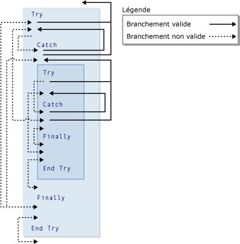

# GoTo Statement
[!INCLUDE[vs2017banner](../../../visual-basic/includes/vs2017banner.md)]

Crée une branche inconditionnelle vers une ligne spécifiée d'une procédure.  
  
## Syntaxe  
  
```  
GoTo line  
```  
  
## Élément  
 `line`  
 Obligatoire.  Toute étiquette de ligne.  
  
## Notes  
 L'instruction `GoTo` ne peut créer une branche que vers des lignes qui appartiennent à la procédure dans laquelle elle est utilisée.  La ligne doit contenir une étiquette de ligne à laquelle `GoTo` peut faire référence.  Pour plus d'informations, consultez [How to: Label Statements](../../../visual-basic/programming-guide/program-structure/how-to-label-statements.md).  
  
> [!NOTE]
>  Les instructions `GoTo` peuvent rendre le code difficile à lire et à gérer.  Si possible, utilisez à la place une structure de contrôle.  Pour plus d'informations, consultez [Control Flow](../../../visual-basic/programming-guide/language-features/control-flow/index.md).  
  
 Vous ne pouvez pas utiliser une instruction `GoTo` pour créer une branche depuis l'extérieur d'une construction `For`...`Next`, `For Each`...`Next`, `SyncLock`...`End SyncLock`, `Try`...`Catch`...`Finally`, `With`...`End With` ou `Using`...`End Using` vers une étiquette interne.  
  
## Création de branche et constructions Try  
 Dans une construction `Try`...`Catch`...`Finally`, les règles ci\-dessous s'appliquent à la création de branche à l'aide de l'instruction `GoTo`.  
  
|Bloc ou région|Création de branche depuis l'extérieur|Création de branche depuis l'intérieur|  
|--------------------|--------------------------------------------|--------------------------------------------|  
|Bloc `Try`|Uniquement à partir d'un bloc `Catch` de la même construction <sup>1</sup>|Uniquement vers l'extérieur de la construction entière|  
|Bloc `Catch`|Jamais autorisé|Uniquement vers l'extérieur de la construction entière, ou vers le bloc `Try` de la même construction <sup>1</sup>|  
|Bloc `Finally`|Jamais autorisé|Jamais autorisé|  
  
 <sup>1</sup> Si une construction `Try`...`Catch`...`Finally` est imbriquée dans une autre, un bloc `Catch` peut faire l'objet d'une création de branche vers le bloc `Try` à son propre niveau d'imbrication, mais pas vers un autre bloc `Try`.  Une construction `Try`...`Catch`...`Finally` imbriquée doit être entièrement contenue dans un bloc `Try` ou `Catch` de la construction dans laquelle elle est imbriquée.  
  
 L'illustration ci\-dessous présente une construction `Try` imbriquée dans une autre.  Les diverses branches entre les blocs des deux constructions sont indiquées comme étant correctes ou incorrectes.  
  
   
Branches correctes et incorrectes dans les constructions Try  
  
## Exemple  
 L'exemple ci\-dessous utilise l'instruction `GoTo` pour créer une branche vers les étiquettes de ligne au sein d'une procédure.  
  
 [!code-vb[VbVbalrStatements#31](../../../visual-basic/language-reference/error-messages/codesnippet/VisualBasic/goto-statement_1.vb)]  
  
## Voir aussi  
 [Do...Loop Statement](../../../visual-basic/language-reference/statements/do-loop-statement.md)   
 [For...Next, instruction](../../../visual-basic/language-reference/statements/for-next-statement.md)   
 [For Each...Next, instruction](../../../visual-basic/language-reference/statements/for-each-next-statement.md)   
 [If...Then...Else Statement](../../../visual-basic/language-reference/statements/if-then-else-statement.md)   
 [Select...Case Statement](../../../visual-basic/language-reference/statements/select-case-statement.md)   
 [Try...Catch...Finally Statement](../../../visual-basic/language-reference/statements/try-catch-finally-statement.md)   
 [While...End While Statement](../../../visual-basic/language-reference/statements/while-end-while-statement.md)   
 [With...End With Statement](../../../visual-basic/language-reference/statements/with-end-with-statement.md)