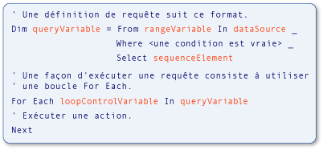

# Relations des types dans des opérations de requête (Visual Basic)
Variables utilisées dans [!INCLUDE[vbteclinqext](../../../../csharp/getting-started/includes/vbteclinqext_md.md)] requête opérations sont fortement typées et doivent être compatibles entre eux. Un typage fort est utilisé dans la source de données, dans la requête elle-même et dans l’exécution des requêtes. L’illustration suivante identifie les termes utilisés pour décrire un [!INCLUDE[vbteclinq](../../../../csharp/includes/vbteclinq_md.md)] requête. Pour plus d’informations sur les parties d’une requête, consultez [base des opérations de requête (Visual Basic)](../../../../visual-basic/programming-guide/concepts/linq/basic-query-operations.md).  
  
   
Parties d’une requête LINQ  
  
 Le type de la variable de portée dans la requête doit être compatible avec le type des éléments dans la source de données. Le type de la variable de requête doit être compatible avec l’élément de séquence défini dans la `Select` clause. Enfin, le type d’éléments de la séquence également doit être compatible avec le type de la variable de contrôle de boucle est utilisée dans la `For Each` instruction qui exécute la requête. Ce typage fort facilite l’identification des erreurs de type au moment de la compilation.  
  
 [!INCLUDE[vbprvb](../../../../csharp/programming-guide/concepts/linq/includes/vbprvb_md.md)]rend le typage plus pratique en implémentant l’inférence de type local, également appelé *typage implicite*. Fonctionnalité est utilisée dans l’exemple précédent et vous verrez qu’elle est utilisée dans toute la [!INCLUDE[vbteclinq](../../../../csharp/includes/vbteclinq_md.md)] documentation et exemples. Dans Visual Basic, l’inférence de type local s’effectue en utilisant simplement un `Dim` instruction sans un `As` clause. Dans l’exemple suivant, `city` est fortement typée en tant que chaîne.  
  
 [!code-vb[VbLINQTypeRels n °&1;](../../../../visual-basic/programming-guide/concepts/linq/codesnippet/VisualBasic/type-relationships-in-query-operations_1.vb)]  
  
> [!NOTE]
>  Inférence de type local fonctionne uniquement lorsque `Option Infer` est défini sur `On`. Pour plus d’informations, consultez [Option Infer, instruction](../../../../visual-basic/language-reference/statements/option-infer-statement.md).  
  
 Toutefois, même si vous utilisez l’inférence de type local dans une requête, les mêmes relations de type sont présentes parmi les variables dans la source de données, la variable de requête et la boucle d’exécution de requête. Il est utile d’avoir une connaissance élémentaire de ces relations de type lorsque vous écrivez [!INCLUDE[vbteclinq](../../../../csharp/includes/vbteclinq_md.md)] requêtes ou pour travailler avec les exemples et exemples de code dans la documentation.  
  
 Vous devrez peut-être spécifier un type explicite pour une variable de portée qui ne correspond pas au type retourné de la source de données. Vous pouvez spécifier le type de la variable de plage en utilisant une `As` clause. Toutefois, cela entraîne une erreur si la conversion est un [conversion restrictive](../../../../visual-basic/programming-guide/language-features/data-types/widening-and-narrowing-conversions.md) et `Option Strict` est défini sur `On`. Par conséquent, nous vous recommandons d’effectuer la conversion sur les valeurs récupérées de la source de données. Vous pouvez convertir les valeurs de la source de données pour le type de variable de portée explicite à l’aide de la <xref:System.Linq.Enumerable.Cast%2A>méthode.</xref:System.Linq.Enumerable.Cast%2A> Vous pouvez également convertir les valeurs sélectionnées dans la `Select` clause à un type explicite qui est différent du type de la variable de portée. Ces points sont illustrés dans le code suivant.  
  
 [!code-vb[VbLINQTypeRels n °&4;](../../../../visual-basic/programming-guide/concepts/linq/codesnippet/VisualBasic/type-relationships-in-query-operations_2.vb)]  
  
## Requêtes qui retournent des éléments entiers de la Source de données  
 L’exemple suivant illustre une [!INCLUDE[vbteclinq](../../../../csharp/includes/vbteclinq_md.md)] opération qui retourne une séquence d’éléments sélectionnés à partir de la source de données de requête. La source, `names`, contient un tableau de chaînes, et le résultat de la requête est une séquence contenant des chaînes qui commencent par la lettre M.  
  
 [!code-vb[VbLINQTypeRels n °&2;](../../../../visual-basic/programming-guide/concepts/linq/codesnippet/VisualBasic/type-relationships-in-query-operations_3.vb)]  
  
 Cela équivaut au code suivant, mais il est beaucoup plus court et plus facile à écrire. Dépendance par rapport à l’inférence de type local dans les requêtes est le style par défaut dans Visual Basic.  
  
 [!code-vb[VbLINQTypeRels n °&3;](../../../../visual-basic/programming-guide/concepts/linq/codesnippet/VisualBasic/type-relationships-in-query-operations_4.vb)]  
  
 Les relations suivantes existent dans les deux exemples de code précédents, si les types sont déterminés implicitement ou explicitement.  
  
1.  Le type des éléments dans la source de données `names`, est le type de la variable de plage, `name`, dans la requête.  
  
2.  Le type de l’objet sélectionné, `name`, détermine le type de la variable de requête, `mNames`. Ici `name` est une chaîne, donc la variable de requête est IEnumerable (Of String) en Visual Basic.  
  
3.  La requête définie dans `mNames` est exécutée dans le `For Each` boucle. La boucle parcourt le résultat de l’exécution de la requête. Étant donné que `mNames`, lorsqu’elle est exécutée, retourne une séquence de chaînes, la variable d’itération de boucle, `nm`, est une chaîne.  
  
## Requêtes qui retournent un champ d’éléments sélectionnés  
 L’exemple suivant illustre une [!INCLUDE[vbtecdlinq](../../../../csharp/includes/vbtecdlinq_md.md)] opération qui retourne une séquence qui contient uniquement une partie de chaque élément sélectionné à partir de la source de données de requête. La requête prend une collection de `Customer` objets comme source de données et projette uniquement la `Name` propriété dans le résultat. Étant donné que le nom du client est une chaîne, la requête produit une séquence de chaînes comme sortie.  
  
<CodeContentPlaceHolder>0</CodeContentPlaceHolder>  
 Les relations entre les variables sont semblables à celles de l’exemple simple.  
  
1.  Le type des éléments dans la source de données `customers`, est le type de la variable de plage, `cust`, dans la requête. Dans cet exemple, qui est de type `Customer`.  
  
2.  Le `Select` instruction retourne le `Name` propriété de chaque `Customer` objet au lieu de l’objet entier. Étant donné que `Name` est une chaîne, la variable de requête, `custNames`, seront encore IEnumerable (Of String), pas de `Customer`.  
  
3.  Étant donné que `custNames` représente une séquence de chaînes, la `For Each` variable d’itération de la boucle, `custName`, doit être une chaîne.  
  
 Sans inférence de type local, l’exemple précédent serait plus fastidieux à écrire et à comprendre, comme le montre l’exemple suivant.  
  
<CodeContentPlaceHolder>1</CodeContentPlaceHolder>  
## Requêtes qui requièrent des Types anonymes  
 L’exemple suivant illustre une situation plus complexe. Dans l’exemple précédent, il était fastidieux de spécifier explicitement des types pour toutes les variables. Dans cet exemple, il est impossible. Au lieu de sélectionner toute `Customer` éléments à partir de la source de données ou un champ unique de chaque élément, le `Select` clause dans cette requête retourne deux propriétés de l’original `Customer` objet : `Name` et `City`. En réponse à la `Select` clause, le compilateur définit un type anonyme qui contient ces deux propriétés. Le résultat de l’exécution `nameCityQuery` dans les `For Each` boucle est une collection d’instances du nouveau type anonyme. Étant donné que le type anonyme n’a pas de nom utilisable, vous ne pouvez pas spécifier le type de `nameCityQuery` ou `custInfo` explicitement. Autrement dit, avec un type anonyme, vous n’avez aucun nom de type à utiliser à la place de `String` dans `IEnumerable(Of String)`. Pour plus d’informations, consultez [les Types anonymes](../../../../visual-basic/programming-guide/language-features/objects-and-classes/anonymous-types.md).  
  
<CodeContentPlaceHolder>2</CodeContentPlaceHolder>  
 Bien qu’il n’est pas possible de spécifier des types pour toutes les variables dans l’exemple précédent, les relations restent les mêmes.  
  
1.  Le type des éléments dans la source de données est à nouveau le type de la variable de portée dans la requête. Dans cet exemple, `cust` est une instance de `Customer`.  
  
2.  Étant donné que la `Select` instruction produit un type anonyme, la variable de requête, `nameCityQuery`, doit être implicitement typée comme type anonyme. Un type anonyme n’a aucun nom utilisable et ne peut donc pas être spécifié explicitement.  
  
3.  Le type de la variable d’itération dans le `For Each` boucle est le type anonyme créé à l’étape 2. Étant donné que le type ne possède aucun nom utilisable, le type de la variable d’itération de boucle doit être déterminé implicitement.  
  
## Voir aussi  
 [Mise en route de LINQ en Visual Basic](../../../../visual-basic/programming-guide/concepts/linq/getting-started-with-linq.md)   
 [Types anonymes](../../../../visual-basic/programming-guide/language-features/objects-and-classes/anonymous-types.md)   
 [Inférence de Type local](../../../../visual-basic/programming-guide/language-features/variables/local-type-inference.md)   
 [Introduction à LINQ en Visual Basic](../../../../visual-basic/programming-guide/language-features/linq/introduction-to-linq.md)   
 [LINQ](../../../../visual-basic/programming-guide/language-features/linq/index.md)   
 [Requêtes](../../../../visual-basic/language-reference/queries/queries.md)
