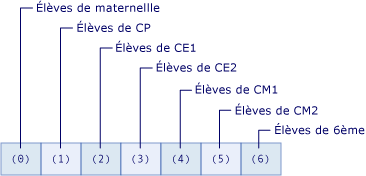

# <a name="arrays-in-visual-basic"></a>Tableaux dans Visual Basic
Un tableau est un ensemble de valeurs logiquement liées entre elles, comme le nombre d’élèves de chaque niveau scolaire dans une école primaire.  Si vous avez besoin d’aide sur les tableaux dans Visual Basic pour Applications (VBA), consultez les [informations de référence sur le langage](https://msdn.microsoft.com/library/office/gg264383\(v=office.14\).aspx).  
  
 Un tableau vous permet de faire référence à ces valeurs connexes avec un même nom et les différencier à l’aide d’un nombre appelé index ou indice. Les valeurs individuelles sont, ce que l’on appelle, les éléments du tableau. Elles sont contiguës de l’index 0 jusqu’à la valeur d’index la plus élevée.  
  
 Pas opposition à un tableau, une variable qui contient une seule valeur s’appelle une variable *scalaire* .  
  
 Voici quelques exemples sommaires avant d’entrer dans les détails :  
  
```vb  
  
'Declare a single-dimension array of 5 values  
Dim numbers(4) As Integer   
  
‘Declare a single-dimension array and set array element values  
Dim numbers = New Integer() {1, 2, 4, 8}  
  
 ‘Redefine the size of an existing array retaining the current values  
ReDim Preserve numbers(15)  
  
 ‘Redefine the size of an existing array, resetting the values  
ReDim numbers(15)  
  
‘Declare a multi-dimensional array  
Dim matrix(5, 5) As Double  
  
‘Declare a multi-dimensional array and set array element values  
Dim matrix = New Integer(4, 4) {{1, 2}, {3, 4}, {5, 6}, {7, 8}}  
  
 ‘Declare a jagged array  
Dim sales()() As Double = New Double(11)() {}  
```  
  
 **Dans cette rubrique**  
  
-   [Éléments de tableau dans un tableau simple](#BKMK_ArrayElements)  
  
-   [Création d’un tableau](#BKMK_CreatingAnArray)  
  
-   [Stockage de valeurs dans un tableau](#BKMK_StoringValues)  
  
-   [Remplissage d’un tableau avec des valeurs initiales](#BKMK_Populating)  
  
    -   [Littéraux de tableau imbriqués](#BKMK_NestedArrayLiterals)  
  
-   [Itération au sein d’un tableau](#BKMK_Iterating)  
  
-   [Tableaux en tant que valeurs de retour et paramètres](#BKMK_ReturnValues)  
  
-   [Tableaux en escalier](#BKMK_JaggedArrays)  
  
-   [Tableaux de longueur zéro](#BKMK_ZeroLength)  
  
-   [Taille de tableau](#BKMK_ArraySize)  
  
-   [Types de tableau et autres types](#BKMK_ArrayTypes)  
  
-   [Les collections comme alternative aux tableaux](#BKMK_Collections)  
  
##  <a name="BKMK_ArrayElements"></a> Éléments de tableau dans un tableau simple  
 L’exemple suivant déclare une variable tableau contenant le nombre d’élèves de chaque niveau scolaire dans une école primaire.  
  
 [!code-vb[VbVbalrArrays#2](../../../../visual-basic/programming-guide/language-features/arrays/codesnippet/VisualBasic/index_1.vb)]  
  
 Le tableau `students` de l’exemple précédent contient sept éléments. Les index des éléments s’échelonnent de 0 à 6. Il est plus simple d’utiliser ce tableau que de déclarer sept variables.  
  
 L’illustration suivante présente le tableau `students`. Pour chaque élément du tableau :  
  
-   L’index de l’élément représente le niveau scolaire (l’index 0 représente le niveau maternelle).  
  
-   La valeur contenue dans l’élément représente le nombre d’élèves de cette catégorie.  
  
   
Éléments du tableau « students » (élèves)  
  
 L’exemple suivant montre comment faire référence aux premier, deuxième et dernier éléments du tableau `students`.  
  
 [!code-vb[VbVbalrArrays#3](../../../../visual-basic/programming-guide/language-features/arrays/codesnippet/VisualBasic/index_2.vb)]  
  
 Vous pouvez faire référence au tableau dans son ensemble en utilisant uniquement le nom de la variable tableau sans index.  
  
 Le tableau `students` de l’exemple précédent utilise un seul index et est dit unidimensionnel. Un tableau qui utilise plusieurs index ou indices est dit multidimensionnel. Pour plus d’informations, consultez la suite de cette rubrique, ainsi que la page [Dimensions du tableau dans Visual Basic](../../../../visual-basic/programming-guide/language-features/arrays/array-dimensions.md).  
  
##  <a name="BKMK_CreatingAnArray"></a> Création d’un tableau  
 Vous pouvez définir la taille d’un tableau de différentes manières. Vous pouvez indiquer la taille au moment où vous déclarez le tableau, comme l’illustre l’exemple suivant.  
  
 [!code-vb[VbVbalrArrays#12](../../../../visual-basic/programming-guide/language-features/arrays/codesnippet/VisualBasic/index_3.vb)]  
  
 Vous pouvez aussi utiliser une clause `New` pour indiquer la taille d’un tableau au moment de le créer, comme l’illustre l’exemple suivant.  
  
 [!code-vb[VbVbalrArrays#11](../../../../visual-basic/programming-guide/language-features/arrays/codesnippet/VisualBasic/index_4.vb)]  
  
 Si vous disposez déjà d’un tableau, vous pouvez redéfinir sa taille à l’aide de l’instruction `Redim` . Vous pouvez faire en sorte que l’instruction `Redim` garde les valeurs qui se trouvent dans le tableau ou qu’elle crée un tableau vide. L’exemple suivant montre les différentes utilisations possibles de l’instruction `Redim` pour modifier la taille d’un tableau existant.  
  
 [!code-vb[VbVbalrArrays#13](../../../../visual-basic/programming-guide/language-features/arrays/codesnippet/VisualBasic/index_5.vb)]  
  
 Pour plus d’informations, consultez [Instruction ReDim](../../../../visual-basic/language-reference/statements/redim-statement.md).  
  
##  <a name="BKMK_StoringValues"></a> Stockage de valeurs dans un tableau  
 Vous pouvez accéder à chaque emplacement d’un tableau en utilisant un index de type `Integer`. Vous pouvez stocker des valeurs dans un tableau et les récupérer par la suite en référençant chaque emplacement du tableau en utilisant son index entre parenthèses. Dans le cas des tableaux multidimensionnels, les index sont séparés par des virgules (,). Vous avez besoin d’un index pour chaque dimension de tableau. Dans l’exemple suivant, des instructions stockent des valeurs dans des tableaux.  
  
 [!code-vb[VbVbalrArrays#5](../../../../visual-basic/programming-guide/language-features/arrays/codesnippet/VisualBasic/index_6.vb)]  
  
 Dans l’exemple suivant, des instructions obtiennent des valeurs à partir de tableaux.  
  
 [!code-vb[VbVbalrArrays#6](../../../../visual-basic/programming-guide/language-features/arrays/codesnippet/VisualBasic/index_7.vb)]  
  
##  <a name="BKMK_Populating"></a> Remplissage d’un tableau avec des valeurs initiales  
 En utilisant un littéral de tableau, vous pouvez créer un tableau contenant un jeu de valeurs initiales. Un littéral de tableau se compose d’une liste de valeurs séparées par des virgules mise entre accolades (`{}`).  
  
 Quand vous créez un tableau en utilisant un littéral de tableau, vous pouvez soit indiquer le type du tableau, soit utiliser l’inférence de type pour déterminer le type du tableau. Le code suivant illustre les deux options.  
  
 [!code-vb[VbVbalrCollectionInitializers#3](../../../../visual-basic/programming-guide/language-features/arrays/codesnippet/VisualBasic/index_8.vb)]  
  
 Quand vous utilisez l’inférence de type, le type du tableau est déterminé par le type dominant dans la liste de valeurs fournie pour le littéral de tableau. Le type dominant est un type unique auquel tous les autres types du littéral de tableau peuvent s’étendre. Si ce type unique ne peut pas être déterminé, le type dominant est le type unique auquel tous les autres types du tableau peuvent se réduire. Si aucun de ces types uniques ne peut être déterminé, le type dominant est `Object`. Par exemple, si la liste de valeurs fournie au littéral de tableau contient des valeurs de type `Integer`, `Long`et `Double`, le tableau qui en résulte est de type `Double`. Les types `Integer` et `Long` s’étendent seulement à `Double`. Par conséquent, `Double` est le type dominant. Pour plus d’informations, consultez [Conversions étendues et restrictives](../../../../visual-basic/programming-guide/language-features/data-types/widening-and-narrowing-conversions.md). Ces règles d’inférence s’appliquent aux types déduits pour les tableaux qui correspondent à des variables locales définies dans un membre de classe. Bien que vous puissiez utiliser des littéraux de tableau pour créer des variables de niveau classe, vous ne pouvez pas utiliser l’inférence de type au niveau de la classe. Par conséquent, les littéraux de tableau spécifiés au niveau de la classe déduisent que les valeurs fournies pour le littéral de tableau sont de type `Object`.  
  
 Vous pouvez spécifier explicitement le type des éléments d’un tableau créé en utilisant un littéral de tableau. Dans ce cas, les valeurs du littéral de tableau doivent s’étendre au type des éléments du tableau. Dans l’exemple de code suivant, un tableau de type `Double` est créé à partir d’une liste d’entiers.  
  
 [!code-vb[VbVbalrCollectionInitializers#4](../../../../visual-basic/programming-guide/language-features/arrays/codesnippet/VisualBasic/index_9.vb)]  
  
###  <a name="BKMK_NestedArrayLiterals"></a> Littéraux de tableau imbriqués  
 Vous pouvez créer un tableau multidimensionnel en utilisant des littéraux de tableau imbriqués. Les littéraux de tableau imbriqués doivent avoir une dimension et un nombre de dimensions (ou rang) qui soient en cohérence avec le tableau obtenu. L’exemple de code suivant crée un tableau d’entiers à deux dimensions en utilisant un littéral de tableau.  
  
 [!code-vb[VbVbalrCollectionInitializers#7](../../../../visual-basic/programming-guide/language-features/arrays/codesnippet/VisualBasic/index_10.vb)]  
  
 Dans l’exemple précédent, une erreur se produirait si le nombre d’éléments contenus dans les littéraux de tableau imbriqués ne correspondaient pas. Il en serait de même si vous ne déclariez pas explicitement la variable tableau comme étant à deux dimensions.  
  
> [!NOTE]
>  Quand vous spécifiez des littéraux de tableau imbriqués de différentes dimensions, vous pouvez éviter une erreur en mettant les littéraux de tableau internes entre parenthèses. Les parenthèses forcent l’évaluation de l’expression de littéral de tableau, et les valeurs obtenues sont utilisées avec le littéral de tableau externe, comme l’illustre le code suivant.  
  
 [!code-vb[VbVbalrCollectionInitializers#11](../../../../visual-basic/programming-guide/language-features/arrays/codesnippet/VisualBasic/index_11.vb)]  
  
 Quand vous créez un tableau multidimensionnel en utilisant des littéraux de tableau imbriqués, vous pouvez utiliser l’inférence de type. Quand vous utilisez l’inférence de type, le type déduit est le type dominant pour toutes les valeurs contenues dans les littéraux de tableau pour un niveau d’imbrication. Dans l’exemple de code suivant, un tableau à deux dimensions de type `Double` est créé à partir de valeurs de type `Integer` et `Double`.  
  
 [!code-vb[VbVbalrCollectionInitializers#8](../../../../visual-basic/programming-guide/language-features/arrays/codesnippet/VisualBasic/index_12.vb)]  
  
 Pour obtenir des exemples supplémentaires, consultez [Comment : initialiser une variable tableau en Visual Basic](../../../../visual-basic/programming-guide/language-features/arrays/how-to-initialize-an-array-variable.md).  
  
##  <a name="BKMK_Iterating"></a> Itération au sein d’un tableau  
 Quand vous itérez au sein d’un tableau, vous accédez à chaque élément du tableau de l’index le plus bas jusqu’à l’index le plus haut.  
  
 L’exemple suivant itère au sein d’un tableau unidimensionnel en utilisant [l’instruction For...Next](../../../../visual-basic/language-reference/statements/for-next-statement.md). La méthode <xref:System.Array.GetUpperBound%2A> renvoie la valeur la plus élevée que l’index peut avoir. La valeur d’index la plus basse est toujours 0.  
  
 [!code-vb[VbVbalrArrays#41](../../../../visual-basic/programming-guide/language-features/arrays/codesnippet/VisualBasic/index_13.vb)]  
  
 L’exemple suivant itère au sein d’un tableau multidimensionnel en utilisant une instruction `For...Next` . La méthode <xref:System.Array.GetUpperBound%2A> possède un paramètre qui spécifie la dimension. `GetUpperBound(0)` retourne la valeur d’index supérieure pour la première dimension et `GetUpperBound(1)` retourne la valeur d’index supérieure pour la deuxième.  
  
 [!code-vb[VbVbalrArrays#42](../../../../visual-basic/programming-guide/language-features/arrays/codesnippet/VisualBasic/index_14.vb)]  
  
 L’exemple suivant itère au sein d’un tableau unidimensionnel en utilisant [l’instruction For Each...Next](../../../../visual-basic/language-reference/statements/for-each-next-statement.md).  
  
 [!code-vb[VbVbalrArrays#43](../../../../visual-basic/programming-guide/language-features/arrays/codesnippet/VisualBasic/index_15.vb)]  
  
 L’exemple suivant itère au sein d’un tableau multidimensionnel en utilisant une instruction `For Each...Next` . Cependant, vous bénéficiez d’un contrôle accru sur les éléments d’un tableau multidimensionnel si vous utilisez une instruction `For…Next` imbriquée, comme dans un exemple précédent, plutôt qu’une instruction `For Each…Next` .  
  
 [!code-vb[VbVbalrArrays#44](../../../../visual-basic/programming-guide/language-features/arrays/codesnippet/VisualBasic/index_16.vb)]  
  
##  <a name="BKMK_ReturnValues"></a> Tableaux en tant que valeurs de retour et paramètres  
 Pour retourner un tableau à partir d’une procédure `Function`, spécifiez le type de données du tableau et le nombre de dimensions en tant que type de retour de [l’instruction Function](../../../../visual-basic/language-reference/statements/function-statement.md). Dans la fonction, déclarez une variable tableau locale avec le même type de données et le même nombre de dimensions. Dans [l’instruction Return](../../../../visual-basic/language-reference/statements/return-statement.md), incluez la variable tableau locale sans parenthèses.  
  
 Pour spécifier un tableau en tant que paramètre d’une procédure `Sub` ou `Function` , définissez le paramètre en tant que tableau avec un type de données et un nombre de dimensions spécifiés. Dans l’appel de la procédure, envoyez une variable tableau avec le même type de données et le même nombre de dimensions.  
  
 Dans l’exemple suivant, la fonction `GetNumbers` retourne un `Integer()`. Ce type de tableau est un tableau unidimensionnel de type `Integer`. La procédure `ShowNumbers` accepte un argument `Integer()` .  
  
 [!code-vb[VbVbalrArrays#51](../../../../visual-basic/programming-guide/language-features/arrays/codesnippet/VisualBasic/index_17.vb)]  
  
 Dans l’exemple suivant, la fonction `GetNumbersMultiDim` retourne un `Integer(,)`. Ce type de tableau est un tableau à deux dimensions de type `Integer`.  La procédure `ShowNumbersMultiDim` accepte un argument `Integer(,)` .  
  
 [!code-vb[VbVbalrArrays#52](../../../../visual-basic/programming-guide/language-features/arrays/codesnippet/VisualBasic/index_18.vb)]  
  
##  <a name="BKMK_JaggedArrays"></a> Tableaux en escalier  
 Un tableau qui contient d’autres tableaux sous forme d’éléments est ce que l’on appelle un tableau de tableaux ou un tableau en escalier. Un tableau en escalier et chaque élément qu’il contient peut avoir une ou plusieurs dimensions. Parfois, la structure de données de votre application est à deux dimensions, mais pas rectangulaire.  
  
 L’exemple suivant présente un tableau de mois, dont chaque élément est un tableau de jours. Sachant que les mois ne comptent pas tous le même nombre de jours, les éléments ne forment pas un tableau rectangulaire à deux dimensions. Par conséquent, un tableau en escalier est utilisé à la place d’un tableau multidimensionnel.  
  
 [!code-vb[VbVbalrArrays#21](../../../../visual-basic/programming-guide/language-features/arrays/codesnippet/VisualBasic/index_19.vb)]  
  
##  <a name="BKMK_ZeroLength"></a> Tableaux de longueur zéro  
 Un tableau qui ne contient aucun élément est aussi appelé un tableau de longueur zéro. Une variable qui contient un tableau de longueur zéro n’a pas la valeur `Nothing`. Pour créer un tableau qui ne contient aucun élément, déclarez une des dimensions du tableau avec la valeur -1, comme dans l’exemple suivant.  
  
 [!code-vb[VbVbalrArrays#14](../../../../visual-basic/programming-guide/language-features/arrays/codesnippet/VisualBasic/index_20.vb)]  
  
 Vous pouvez être amené à créer un tableau de longueur zéro dans les cas suivants :  
  
-   Sans risquer une exception <xref:System.NullReferenceException>, votre code doit accéder aux membres de la classe <xref:System.Array>, comme <xref:System.Array.Length%2A> ou <xref:System.Array.Rank%2A>, ou appeler une fonction [!INCLUDE[vbprvb](../../../../csharp/programming-guide/concepts/linq/includes/vbprvb_md.md)] comme <xref:Microsoft.VisualBasic.Information.UBound%2A>.  
  
-   Vous tenez à ce que le code de consommation reste simple en n’ayant pas à vérifier la présence de `Nothing` comme un cas particulier.  
  
-   Votre code interagit avec une interface de programmation d’applications (API) qui vous oblige à passer un tableau de longueur zéro à une ou plusieurs procédures ou qui retourne un tableau de longueur zéro à partir d’une ou plusieurs procédures.  
  
##  <a name="BKMK_ArraySize"></a> Taille de tableau  
 La taille d’un tableau est le produit des longueurs de toutes ses dimensions. Elle représente le nombre total d’éléments actuellement contenus dans le tableau.  
  
 L’exemple suivant déclare un tableau à trois dimensions.  
  
```  
Dim prices(3, 4, 5) As Long  
```  
  
 La taille globale du tableau dans la variable `prices` est (3 + 1) x (4 + 1) x (5 + 1) = 120.  
  
 Vous pouvez trouver la taille d’un tableau via la propriété <xref:System.Array.Length%2A>. Vous pouvez trouver la longueur de chaque dimension d’un tableau multidimensionnel en utilisant la méthode <xref:System.Array.GetLength%2A>.  
  
 Vous pouvez redimensionner une variable tableau en lui assignant un nouvel objet tableau ou en utilisant l’instruction `ReDim` .  
  
 Il y a plusieurs points à prendre en compte en ce qui concerne la taille d’un tableau.  
  
|||  
|---|---|  
|Longueur de dimension|L’index de chaque dimension est basé sur 0, ce qui signifie qu’il varie de 0 à sa limite supérieure. Par conséquent, la longueur d’une dimension donnée est supérieure de 1 à la limite supérieure déclarée pour cette dimension.|  
|Limites de longueur|La longueur de chaque dimension d’un tableau est limitée à la valeur maximale du type de données `Integer`, à savoir, (2 ^ 31) - 1. Cependant, la taille totale d’un tableau est aussi limitée par la mémoire disponible sur votre système. Si vous essayez d’initialiser un tableau qui dépasse la quantité de RAM disponible, le Common Language Runtime lève une exception <xref:System.OutOfMemoryException>.|  
|Taille et taille d’élément|La taille d’un tableau est indépendante du type de données de ses éléments. La taille représente toujours le nombre total d’éléments, et non le nombre d’octets qu’ils occupent dans le stockage.|  
|Consommation de mémoire|Il est déconseillé de faire des hypothèses sur la façon dont un tableau est stocké en mémoire. Le stockage varie selon la largeur de données de la plateforme. Par exemple, un même tableau utilise plus de mémoire sur un système 64 bits que sur un système 32 bits. Selon la configuration du système au moment de l’initialisation d’un tableau, le Common Language Runtime (CLR) peut assigner du stockage de façon à regrouper les éléments aussi près que possible les uns des autres ou pour tous les adapter aux limites matérielles naturelles. De même, un tableau nécessite un supplément de stockage pour ses informations de contrôle, un supplément qui augmente d’autant à chaque dimension ajoutée.|  
  
##  <a name="BKMK_ArrayTypes"></a> Types de tableau et autres types  
 À chaque tableau correspond un type de données, mais celui-ci se distingue du type de données de ses éléments. Le type de données varie d’un tableau à un autre. En effet, le type de données d’un tableau est déterminé par le nombre de dimensions (ou *rang*) qu’il possède et par le type de données de ses éléments. Deux variables tableau ne sont considérées appartenir au même type de données que si elles ont le même rang et si leurs éléments ont le même type de données. Les longueurs des dimensions d’un tableau n’influent pas sur le type de données du tableau.  
  
 Chaque tableau hérite de la classe <xref:System.Array?displayProperty=fullName> et vous pouvez déclarer une variable comme étant du type `Array`, mais vous ne pouvez pas créer un tableau de type `Array`. De même, [l’instruction ReDim](../../../../visual-basic/language-reference/statements/redim-statement.md) ne peut pas opérer sur une variable déclarée comme étant du type `Array`. Pour ces raisons et au titre de la cohérence des types, il est recommandé de déclarer chaque tableau en tant que type spécifique ( `Integer` dans l’exemple précédent).  
  
 Vous pouvez déterminer le type de données d’un tableau ou de ses éléments de plusieurs façons.  
  
-   Vous pouvez appeler la méthode <xref:System.Object.GetType%2A?displayProperty=fullName> sur la variable pour recevoir un objet <xref:System.Type> pour le type d’exécution de la variable. L’objet <xref:System.Type> contient des informations complètes dans ses propriétés et méthodes.  
  
-   Vous pouvez passer la variable à la fonction <xref:Microsoft.VisualBasic.Information.TypeName%2A> pour recevoir un `String` contenant le nom du type au moment de l’exécution.  
  
-   Vous pouvez passer la variable à la fonction <xref:Microsoft.VisualBasic.Information.VarType%2A> pour recevoir une valeur `VariantType` représentant la classification de type de la variable.  
  
 L’exemple suivant appelle la fonction `TypeName` pour déterminer le type du tableau et le type de ses éléments. Le type du tableau est `Integer(,)` et celui de ses éléments est `Integer`.  
  
 [!code-vb[VbVbalrArrays#15](../../../../visual-basic/programming-guide/language-features/arrays/codesnippet/VisualBasic/index_21.vb)]  
  
##  <a name="BKMK_Collections"></a> Les collections comme alternative aux tableaux  
 Les tableaux s’avèrent particulièrement utiles pour créer et utiliser un nombre fixe d’objets fortement typés. Les collections offrent plus de souplesse quand il s’agit d’utiliser des groupes d’objets. Contrairement aux tableaux, le groupe d’objets que vous utilisez peut croître et se réduire dynamiquement à mesure qu’évoluent les besoins de l’application.  
  
 Si vous devez modifier la taille d’un tableau, vous devez utiliser [l’instruction ReDim](../../../../visual-basic/language-reference/statements/redim-statement.md). Dans ce cas, [!INCLUDE[vbprvb](../../../../csharp/programming-guide/concepts/linq/includes/vbprvb_md.md)] crée un nouveau tableau et libère le tableau précédent pour élimination. Cela prend du temps d’exécution. Par conséquent, si le nombre d’éléments que vous utilisez change régulièrement ou si vous ne pouvez pas prédire le nombre maximal d’éléments dont vous avez besoin, une collection peut vous procurer de meilleures performances.  
  
 Pour certaines collections, vous pouvez assigner une clé à un objet que vous placez dans la collection pour vous permettre de récupérer rapidement l’objet à l’aide de la clé.  
  
 Si votre collection contient des éléments d’un seul type de données, vous pouvez utiliser une des classes dans l’espace de noms <xref:System.Collections.Generic?displayProperty=fullName>. Une collection générique applique la cohérence des types pour éviter qu’un autre type puisse y être ajouté. Quand vous récupérez un élément d’une collection générique, il n’est pas utile de déterminer son type de données ou de le convertir.  
  
 Pour plus d’informations sur les collections, consultez [Collections](http://msdn.microsoft.com/library/e76533a9-5033-4a0b-b003-9c2be60d185b).  
  
### <a name="example"></a>Exemple  
 L’exemple suivant utilise la classe générique [!INCLUDE[dnprdnshort](../../../../csharp/getting-started/includes/dnprdnshort_md.md)] <xref:System.Collections.Generic.List%601?displayProperty=fullName> pour créer une collection de listes d’objets `Customer`.  
  
 [!code-vb[VbVbalrArrays#1](../../../../visual-basic/programming-guide/language-features/arrays/codesnippet/VisualBasic/index_22.vb)]  
  
 La déclaration de la collection `CustomerFile` précise qu’elle ne peut contenir que des éléments de type `Customer`. De même, elle offre une capacité initiale de 200 éléments. La procédure `AddNewCustomer` vérifie la validité du nouvel élément, puis l’ajoute à la collection. La procédure `PrintCustomers` utilise une boucle `For Each` pour parcourir la collection et afficher ses éléments.  
  
## <a name="related-topics"></a>Rubriques connexes  
  
|Terme|Définition|  
|----------|----------------|  
|[Dimensions du tableau dans Visual Basic](../../../../visual-basic/programming-guide/language-features/arrays/array-dimensions.md)|Explique le rang et les dimensions des tableaux.|  
|[Comment : initialiser une variable tableau en Visual Basic](../../../../visual-basic/programming-guide/language-features/arrays/how-to-initialize-an-array-variable.md)|Explique comment remplir les tableaux de valeurs initiales.|  
|[Comment : trier un tableau dans Visual Basic](../../../../visual-basic/programming-guide/language-features/arrays/how-to-sort-an-array.md)|Montre comment trier les éléments d’un tableau par ordre alphabétique.|  
|[Guide pratique : assigner un tableau à un autre tableau](../../../../visual-basic/programming-guide/language-features/arrays/how-to-assign-one-array-to-another-array.md)|Décrit les règles et les étapes à suivre pour assigner un tableau à une autre variable tableau.|  
|[Dépannage des tableaux](../../../../visual-basic/programming-guide/language-features/arrays/troubleshooting-arrays.md)|Décrit des problèmes courants qui surviennent dans le cadre de l’utilisation de tableaux.|  
  
## <a name="see-also"></a>Voir aussi  
 <xref:System.Array>   
 [Instruction Dim](../../../../visual-basic/language-reference/statements/dim-statement.md)   
 [ReDim (instruction)](../../../../visual-basic/language-reference/statements/redim-statement.md)
