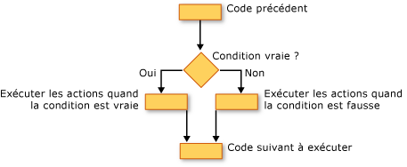

# Structures de décision (Visual Basic)
[!INCLUDE[vbprvb](../../../../csharp/programming-guide/concepts/linq/includes/vbprvb_md.md)]vous permet de tester des conditions et d’effectuer diverses opérations selon les résultats de ce test. Vous pouvez tester une condition vraie ou fausse, plusieurs valeurs d’une expression ou plusieurs exceptions générées lorsque vous exécutez une série d’instructions.  
  
 L’illustration suivante montre une structure de décision qui teste une condition est true et exécute différentes actions selon qu’il est true ou false.  
  
   
Prendre des mesures différentes lorsqu’une condition est true et false  
  
## If... Puis... Construction Else  
 `If...Then...Else`constructions vous permettent de tester une ou plusieurs conditions et d’exécuter une ou plusieurs instructions selon chaque condition. Vous pouvez tester des conditions et prendre des mesures de plusieurs façons :  
  
-   Exécuter une ou plusieurs instructions si une condition est`True`  
  
-   Exécuter une ou plusieurs instructions si une condition est`False`  
  
-   Exécutez des instructions si une condition est `True` et d’autres s’il s’agit`False`  
  
-   Tester une condition supplémentaire si une condition préalable`False`  
  
 La structure de contrôle qui offre toutes ces possibilités est le [si... Puis... Else, instruction](../../../../visual-basic/language-reference/statements/if-then-else-statement.md). Vous pouvez utiliser une version de ligne si vous avez qu’un test et une instruction à exécuter. Si vous avez un ensemble de conditions et actions plus complexe, vous pouvez utiliser la version multiligne.  
  
## Sélectionnez... Construction de cas  
 Le `Select...Case` construction vous permet d’évaluer une expression une fois et d’exécuter différents jeux d’instructions selon différentes valeurs possibles. Pour plus d’informations, consultez [sélectionner... Instruction case](../../../../visual-basic/language-reference/statements/select-case-statement.md).  
  
## Try... Catch... Pour finir de Construction  
 `Try...Catch...Finally`constructions vous permettent d’exécuter un ensemble d’instructions sous un environnement qui conserve le contrôle si l’une de vos instructions entraîne une exception. Vous pouvez prendre des mesures différentes pour des exceptions différentes. Vous pouvez éventuellement spécifier un bloc de code qui s’exécute avant de quitter l’ensemble `Try...Catch...Finally` construction, quel que soit ce qui se produit. Pour plus d’informations, consultez [essayez... Catch... Instruction finally](../../../../visual-basic/language-reference/statements/try-catch-finally-statement.md).  
  
> [!NOTE]
>  Pour de nombreuses structures de contrôle, lorsque vous cliquez sur un mot clé, tous les mots clés de la structure sont mis en surbrillance. Par exemple, lorsque vous cliquez sur `If` dans un `If...Then...Else` construction, toutes les instances de `If`, `Then`, `ElseIf`, `Else`, et `End If` dans la construction sont mises en surbrillance. Pour passer au mot clé en surbrillance suivant ou précédent, appuyez sur CTRL + MAJ + BAS ou CTRL + MAJ + flèche haut.  
  
## Voir aussi  
 [Flux de contrôle](../../../../visual-basic/programming-guide/language-features/control-flow/index.md)   
 [Structures de boucle](../../../../visual-basic/programming-guide/language-features/control-flow/loop-structures.md)   
 [Autres Structures de contrôle](../../../../visual-basic/programming-guide/language-features/control-flow/other-control-structures.md)   
 [Structures de contrôle imbriquées](../../../../visual-basic/programming-guide/language-features/control-flow/nested-control-structures.md)   
 [If (opérateur)](../../../../visual-basic/language-reference/operators/if-operator.md)
