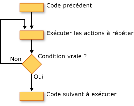

# Loop Structures (Visual Basic)
[!INCLUDE[vs2017banner](../../../../csharp/includes/vs2017banner.md)]

Les structures de boucle [!INCLUDE[vbprvb](../../../../csharp/programming-guide/concepts/linq/includes/vbprvb_md.md)] vous permettent d'exécuter de façon répétitive une ou plusieurs lignes de code.  Vous pouvez répéter les instructions d'une structure de boucle jusqu'à ce qu'une condition soit `True`, jusqu'à ce qu'une condition soit `False`, un certain nombre de fois ou une seule fois pour chaque élément d'une collection.  
  
 L'illustration suivante représente une structure de boucle qui exécute un jeu d'instructions jusqu'à ce qu'une condition prenne la valeur true.  
  
   
Exécution d'un jeu d'instructions jusqu'à ce qu'une condition prenne la valeur true  
  
## Boucles While  
 La construction `While`...`End While` exécute un jeu d'instructions tant que la condition spécifiée dans l'instruction `While` est `True`.  Pour plus d'informations, consultez [While...End While Statement](../../../../visual-basic/language-reference/statements/while-end-while-statement.md).  
  
## Boucles Do  
 La construction `Do`...`Loop` vous permet de tester une condition au début ou à la fin d'une structure de boucle.  Vous pouvez également faire en sorte de répéter la boucle tant que la condition reste `True` ou jusqu'à ce qu'elle devienne `True`.  Pour plus d'informations, consultez [Do...Loop Statement](../../../../visual-basic/language-reference/statements/do-loop-statement.md).  
  
## Boucles For  
 La construction `For`...`Next` exécute la boucle un certain nombre de fois.  Elle utilise une variable de contrôle de boucle, également nommée *compteur*, pour assurer le suivi des répétitions.  Vous spécifiez les valeurs de début et de fin de ce compteur et éventuellement la valeur d'incrémentation d'une répétition à la suivante.  Pour plus d'informations, consultez [For...Next, instruction](../../../../visual-basic/language-reference/statements/for-next-statement.md).  
  
## Boucles For Each  
 La construction `For Each`...`Next` exécute un jeu d'instructions une fois pour chaque élément d'une collection.  Vous spécifiez la variable de contrôle de boucle, mais il n'est pas nécessaire de déterminer la valeur de début ou de fin.  Pour plus d'informations, consultez [For Each...Next, instruction](../../../../visual-basic/language-reference/statements/for-each-next-statement.md).  
  
## Voir aussi  
 [Control Flow](../../../../visual-basic/programming-guide/language-features/control-flow/index.md)   
 [Decision Structures](../../../../visual-basic/programming-guide/language-features/control-flow/decision-structures.md)   
 [Other Control Structures](../../../../visual-basic/programming-guide/language-features/control-flow/other-control-structures.md)   
 [Nested Control Structures](../../../../visual-basic/programming-guide/language-features/control-flow/nested-control-structures.md)