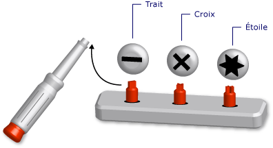

# Types génériques Visual Basic (Visual Basic)
Un *type générique* est un élément de programmation unique qui s’adapte pour exécuter la même fonction sur différents types de données. Quand vous définissez une classe ou procédure générique, vous n’avez pas besoin de définir une version distincte pour chaque type de données pour lequel vous voulez exécuter la fonction.  
  
 On pourrait comparer cet élément de programmation à un tournevis à têtes interchangeables. Vous examinez quel type de vis vous devez serrer et vous choisissez la tête de vis adaptée (fendue, cruciforme, en étoile). Quelle que soit la tête insérée dans le manche du tournevis, vous exécutez toujours la même fonction : vous serrez une vis.  
  
   
Tournevis configuré comme un outil générique  
  
 Quand vous définissez un type générique, vous devez le paramétrer avec un ou plusieurs types de données. Cela permet au code utilisé d’adapter les types de données à ses besoins. Votre code peut déclarer plusieurs éléments de programmation différents à partir de l’élément générique, chacun d’eux agissant sur un ensemble différent de types de données. Ces éléments déclarés exécutent tous la même logique, quel que soit le type de données qu’ils utilisent.  
  
 Par exemple, vous pouvez créer et utiliser une classe « queue » qui agit sur un type de données spécifique, tel que `String`. Vous pouvez déclarer cette classe à partir de <xref:System.Collections.Generic.Queue%601?displayProperty=fullName>, comme illustré dans l’exemple suivant.</xref:System.Collections.Generic.Queue%601?displayProperty=fullName>  
  
 [!code-vb[VbVbalrDataTypes n °&1;](../../../../visual-basic/language-reference/data-types/codesnippet/VisualBasic/generic-types_1.vb)]  
  
 Vous pouvez maintenant utiliser `stringQ` pour agir uniquement sur des valeurs `String` . Étant donné que `stringQ` est spécifique aux valeurs `String` au lieu d’être généralisé pour les valeurs `Object` , aucune liaison tardive ou conversion de type n’est nécessaire. Cela permet de réduire le délai d’exécution et les erreurs d’exécution.  
  
 Pour plus d’informations sur l’utilisation d’un type générique, consultez la page [Comment : utiliser une classe générique](../../../../visual-basic/programming-guide/language-features/data-types/how-to-use-a-generic-class.md).  
  
## Exemple d’une classe générique  
 L’exemple suivant présente une définition squelette d’une classe générique.  
  
 [!code-vb[VbVbalrDataTypes n °&2;](../../../../visual-basic/language-reference/data-types/codesnippet/VisualBasic/generic-types_2.vb)]  
  
 Dans le squelette ci-dessus, `t` est un *paramètre de type*, c’est-à-dire un espace réservé pour un type de données que vous fournissez quand vous déclarez la classe. Ailleurs dans votre code, vous pouvez déclarer des versions différentes de `classHolder` en fournissant différents types de données pour `t`. L’exemple suivant illustre deux déclarations.  
  
 [!code-vb[VbVbalrDataTypes n °&3;](../../../../visual-basic/language-reference/data-types/codesnippet/VisualBasic/generic-types_3.vb)]  
  
 Les instructions ci-dessus déclarent des *classes construites*, dans lesquelles un type spécifique remplace le paramètre de type. Ce remplacement est propagé partout dans le code de la classe construite. L’exemple suivant montre à quoi ressemble la procédure `processNewItem` dans `integerClass`.  
  
 [!code-vb[VbVbalrDataTypes n °&4;](../../../../visual-basic/language-reference/data-types/codesnippet/VisualBasic/generic-types_4.vb)]  
  
 Pour obtenir un exemple plus complet, consultez la page [Comment : définir une classe que peut fournir des fonctionnalités identiques pour différents Types de données](../../../../visual-basic/programming-guide/language-features/data-types/how-to-define-a-class-that-can-provide-identical-functionality.md).  
  
## Éléments de programmation disponibles  
 Vous pouvez définir et utiliser des délégués, structures, interfaces, procédures et classes génériques. Notez que le [!INCLUDE[dnprdnshort](../../../../csharp/getting-started/includes/dnprdnshort_md.md)] définit plusieurs classes génériques, des structures et des interfaces qui représentent des éléments génériques couramment utilisés. Le <xref:System.Collections.Generic?displayProperty=fullName>espace de noms fournit des dictionnaires, des listes, des files d’attente et des piles.</xref:System.Collections.Generic?displayProperty=fullName> Avant de définir votre propre élément générique, vérifiez s’il est déjà disponible dans <xref:System.Collections.Generic?displayProperty=fullName>.</xref:System.Collections.Generic?displayProperty=fullName>  
  
 Les procédures ne sont pas des types, mais vous pouvez définir et utiliser des procédures génériques. Consultez la page [procédures génériques dans Visual Basic](../../../../visual-basic/programming-guide/language-features/data-types/generic-procedures.md).  
  
## Avantages des types génériques  
 Un type générique sert de base de déclaration de plusieurs éléments de programmation différents, chacun agissant sur un type de données spécifique. À la place d’un type générique, vous pouvez utiliser :  
  
1.  un type unique pour le type de données `Object` ;  
  
2.  un ensemble de versions *spécifiques au type* du type de données, chaque version étant individuellement codée pour agir sur un type de données spécifique tel que `String`, `Integer`ou un type défini par l’utilisateur ( `customer`, par exemple).  
  
 Un type générique présente les avantages suivants par rapport à ces alternatives :  
  
-   **Sécurité de type.** . Avec les types génériques, une vérification des types est effectuée au moment de la compilation. Les types basés sur `Object` acceptent tous les types de données. Vous devez écrire le code permettant de vérifier si un type de données d’entrée est pris en charge. Avec les types génériques, le compilateur est capable d’identifier les incompatibilités de type avant l’exécution.  
  
-   **Performances.** . Les types génériques ne nécessitent pas de conversion *boxing* et *unboxinging* des données, car chacun d’eux est utilisé pour un type de données spécifique. Les opérations basées sur `Object` doivent effectuer une conversion boxing des types de données d’entrée pour les convertir en `Object` et effectuer une conversion unboxing des données de sortie. Les conversions boxing et unboxing réduisent les performances.  
  
     Les types basés sur `Object` sont également à liaison tardive, ce qui signifie que l’accès à leurs membres nécessite du code supplémentaire au moment de l’exécution. Cela réduit aussi les performances.  
  
-   **Consolidation du code.** . Le code d’un type générique doit être défini une seule fois. Un ensemble de versions spécifiques au type d’un type de données doit répliquer le même code dans chaque version, la seule différence étant le type de données spécifique à cette version. Avec les types génériques, les versions spécifiques au type sont toutes générées à partir du type générique d’origine.  
  
-   **Réutilisation de code.** . S’il est générique, le code qui ne dépend pas d’un type de données particulier peut être réutilisé avec divers types de données. Vous pouvez généralement le réutiliser même avec un type de données que vous n’avez pas prévu initialement.  
  
-   **Prise en charge de l’IDE.** . Quand vous utilisez un type construit déclaré à partir d’un type générique, l’environnement de développement intégré (IDE) peut vous aider pendant le développement de votre code. Par exemple, IntelliSense vous indique les options spécifiques au type disponibles pour un argument d’une méthode ou d’un constructeur.  
  
-   **Algorithmes génériques.** . Les types génériques sont conseillés pour les algorithmes abstraits qui sont indépendants du type. Par exemple, une procédure générique qui trie les éléments à l’aide de l' <xref:System.IComparable>interface peut être utilisée avec n’importe quel type de données qui implémente <xref:System.IComparable>.</xref:System.IComparable> </xref:System.IComparable>  
  
## Contraintes  
 Dans la mesure du possible, le code d’une définition de type générique doit être indépendant du type. Toutefois, vous pouvez avoir besoin d’une fonction agissant sur tous les types de données fournis à votre type générique. Par exemple, si vous souhaitez comparer deux éléments à des fins de tri ou de classement, leur type de données doit implémenter le <xref:System.IComparable>interface.</xref:System.IComparable> Vous pouvez appliquer cette exigence en ajoutant une *contrainte* au paramètre de type.  
  
### Exemple de contrainte  
 L’exemple suivant montre une définition squelette d’une classe avec une contrainte qui exige que l’argument de type pour implémenter <xref:System.IComparable>.</xref:System.IComparable>  
  
 [!code-vb[VbVbalrDataTypes n °&5;](../../../../visual-basic/language-reference/data-types/codesnippet/VisualBasic/generic-types_5.vb)]  
  
 Si le code suivant tente de construire une classe de `itemManager` en fournissant un type qui n’implémente pas <xref:System.IComparable>, le compilateur signale une erreur.</xref:System.IComparable>  
  
### Types de contraintes  
 Une contrainte peut spécifier les exigences suivantes dans n’importe quelle combinaison :  
  
-   L’argument de type doit implémenter une ou plusieurs interfaces.  
  
-   L’argument de type doit être du type d’une seule classe (ou hériter de cette classe).  
  
-   L’argument de type doit exposer un constructeur sans paramètre, accessible au code qui crée des objets à partir de celui-ci.  
  
-   L’argument de type doit être un *type référence*ou un type *valeur*.  
  
 Si vous devez spécifier plusieurs contraintes, utilisez une *liste de contraintes* séparée par des virgules et mise entre accolades (`{ }`). Pour exiger un constructeur accessible, vous incluez le [nouveau opérateur](../../../../visual-basic/language-reference/operators/new-operator.md) mot-clé dans la liste. Pour exiger un type référence ou un type valeur, ajoutez le mot clé `Class` ou le mot clé `Structure` , respectivement.  
  
 Pour plus d’informations sur les contraintes, consultez [liste de Type](../../../../visual-basic/language-reference/statements/type-list.md).  
  
### Exemple de liste de contraintes  
 L’exemple suivant présente une définition squelette d’une classe générique avec une liste de contraintes sur le paramètre de type. Dans le code qui crée une instance de cette classe, l’argument de type doit implémenter à la fois les <xref:System.IComparable>et <xref:System.IDisposable>interfaces, être un type référence et exposer un constructeur sans paramètre accessible.</xref:System.IDisposable> </xref:System.IComparable>  
  
 [!code-vb[VbVbalrDataTypes n °&6;](../../../../visual-basic/language-reference/data-types/codesnippet/VisualBasic/generic-types_6.vb)]  
  
## Termes importants  
 La terminologie suivante s’applique aux types génériques :  
  
-   *Type générique*. Définition d’une classe, structure, interface, procédure ou délégué pour laquelle vous fournissez au moins un type de données lors de sa déclaration.  
  
-   *Paramètre de type*. Dans une définition de type générique, espace réservé pour un type de données que vous fournissez lors de la déclaration du type.  
  
-   *Argument de type*. Type de données spécifique qui remplace un paramètre de type quand vous déclarez un type construit à partir d’un type générique.  
  
-   *Contrainte*. Condition sur un paramètre de type qui restreint l’argument de type que vous pouvez lui fournir. Une contrainte peut exiger que l’argument de type implémente une interface particulière, soit ou hérite d’une classe particulière, contienne un constructeur sans paramètre accessible, ou soit un type référence ou un type valeur. Vous pouvez combiner ces contraintes, mais vous ne pouvez spécifier qu’une seule classe.  
  
-   *Type construit*. Classe, structure, interface, procédure ou délégué déclaré à partir d’un type générique en fournissant des arguments de type pour ses paramètres de type.  
  
## Voir aussi  
 [Types de données](../../../../visual-basic/programming-guide/language-features/data-types/index.md)   
 [Caractères de type](../../../../visual-basic/programming-guide/language-features/data-types/type-characters.md)   
 [Types valeur et Types référence](../../../../visual-basic/programming-guide/language-features/data-types/value-types-and-reference-types.md)   
 [Conversions de type dans Visual Basic](../../../../visual-basic/programming-guide/language-features/data-types/type-conversions.md)   
 [Dépannage des Types de données](../../../../visual-basic/programming-guide/language-features/data-types/troubleshooting-data-types.md)   
 [Types de données](../../../../visual-basic/language-reference/data-types/data-type-summary.md)   
 [Of](../../../../visual-basic/language-reference/statements/of-clause.md)   
 [En tant que](../../../../visual-basic/language-reference/statements/as-clause.md)   
 [Type de données Object](../../../../visual-basic/language-reference/data-types/object-data-type.md)   
 [Covariance et Contravariance](http://msdn.microsoft.com/library/a58cc086-276f-4f91-a366-85b7f95f38b8)   
 [Itérateurs](http://msdn.microsoft.com/library/f45331db-d595-46ec-9142-551d3d1eb1a7)
