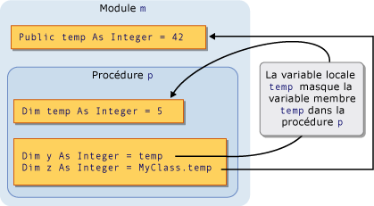
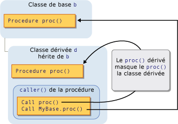

# <a name="shadowing-in-visual-basic"></a><span data-ttu-id="fda7a-102">Occultation dans Visual Basic</span><span class="sxs-lookup"><span data-stu-id="fda7a-102">Shadowing in Visual Basic</span></span>
<span data-ttu-id="fda7a-103">Lorsque deux éléments de programmation partagent le même nom, un d'entre eux peut masquer, ou *ombre*, un autre.</span><span class="sxs-lookup"><span data-stu-id="fda7a-103">When two programming elements share the same name, one of them can hide, or *shadow*, the other one.</span></span> <span data-ttu-id="fda7a-104">Dans ce cas, l’élément occulté n’est pas disponible pour la référence ; en revanche, lorsque votre code utilise le nom de l’élément, le [!INCLUDE[vbprvb](../../../../csharp/programming-guide/concepts/linq/includes/vbprvb_md.md)] compilateur résout vers l’élément d’occultation.</span><span class="sxs-lookup"><span data-stu-id="fda7a-104">In such a situation, the shadowed element is not available for reference; instead, when your code uses the element name, the [!INCLUDE[vbprvb](../../../../csharp/programming-guide/concepts/linq/includes/vbprvb_md.md)] compiler resolves it to the shadowing element.</span></span>  
  
## <a name="purpose"></a><span data-ttu-id="fda7a-105">Objectif</span><span class="sxs-lookup"><span data-stu-id="fda7a-105">Purpose</span></span>  
 <span data-ttu-id="fda7a-106">L’objectif principal de l’occultation est de protéger la définition de vos membres de classe.</span><span class="sxs-lookup"><span data-stu-id="fda7a-106">The main purpose of shadowing is to protect the definition of your class members.</span></span> <span data-ttu-id="fda7a-107">La classe de base peut subir un changement qui crée un élément avec le même nom qu’un que vous avez déjà défini.</span><span class="sxs-lookup"><span data-stu-id="fda7a-107">The base class might undergo a change that creates an element with the same name as one you have already defined.</span></span> <span data-ttu-id="fda7a-108">Dans ce cas, le `Shadows` modificateur force références de votre classe à être résolues vers le membre que vous avez défini, et non vers le nouvel élément de classe de base.</span><span class="sxs-lookup"><span data-stu-id="fda7a-108">If this happens, the `Shadows` modifier forces references through your class to be resolved to the member you defined, instead of to the new base class element.</span></span>  
  
## <a name="types-of-shadowing"></a><span data-ttu-id="fda7a-109">Types d’occultation</span><span class="sxs-lookup"><span data-stu-id="fda7a-109">Types of Shadowing</span></span>  
 <span data-ttu-id="fda7a-110">Un élément peut occulter un autre élément de deux manières différentes.</span><span class="sxs-lookup"><span data-stu-id="fda7a-110">An element can shadow another element in two different ways.</span></span> <span data-ttu-id="fda7a-111">L’élément d’occultation peut être déclaré dans une sous-région de la région contenant l’élément occulté, dans laquelle s’effectue l’occultation de cas *par portée*.</span><span class="sxs-lookup"><span data-stu-id="fda7a-111">The shadowing element can be declared inside a subregion of the region containing the shadowed element, in which case the shadowing is accomplished *through scope*.</span></span> <span data-ttu-id="fda7a-112">Une classe dérivée peut également redéfinir un membre d’une classe de base, dans lequel est effectuée l’occultation de cas *via l’héritage*.</span><span class="sxs-lookup"><span data-stu-id="fda7a-112">Or a deriving class can redefine a member of a base class, in which case the shadowing is done *through inheritance*.</span></span>  
  
### <a name="shadowing-through-scope"></a><span data-ttu-id="fda7a-113">Une occultation par portée</span><span class="sxs-lookup"><span data-stu-id="fda7a-113">Shadowing Through Scope</span></span>  
 <span data-ttu-id="fda7a-114">Il est possible pour les éléments dans le même module, classe ou structure peuvent avoir le même nom mais une portée différente de programmation.</span><span class="sxs-lookup"><span data-stu-id="fda7a-114">It is possible for programming elements in the same module, class, or structure to have the same name but different scope.</span></span> <span data-ttu-id="fda7a-115">Lorsque deux éléments sont déclarés de cette manière, et le code fait référence au nom qu’ils partagent, l’élément avec la portée plus restreinte occulte l’autre élément (la portée de bloc est la plus restreinte).</span><span class="sxs-lookup"><span data-stu-id="fda7a-115">When two elements are declared in this manner and the code refers to the name they share, the element with the narrower scope shadows the other element (block scope is the narrowest).</span></span>  
  
 <span data-ttu-id="fda7a-116">Par exemple, un module peut définir un `Public` variable nommée `temp`, et une procédure du module peut déclarer une variable locale nommée également `temp`.</span><span class="sxs-lookup"><span data-stu-id="fda7a-116">For example, a module can define a `Public` variable named `temp`, and a procedure within the module can declare a local variable also named `temp`.</span></span> <span data-ttu-id="fda7a-117">Des références aux `temp` dans la procédure d’accéder à la variable locale, tandis que les références à `temp` d’en dehors de la procédure accèdent le `Public` variable.</span><span class="sxs-lookup"><span data-stu-id="fda7a-117">References to `temp` from within the procedure access the local variable, while references to `temp` from outside the procedure access the `Public` variable.</span></span> <span data-ttu-id="fda7a-118">Dans ce cas, la variable de procédure `temp` occulte la variable de module `temp`.</span><span class="sxs-lookup"><span data-stu-id="fda7a-118">In this case, the procedure variable `temp` shadows the module variable `temp`.</span></span>  
  
 <span data-ttu-id="fda7a-119">L’illustration suivante montre deux variables, toutes deux nommées `temp`.</span><span class="sxs-lookup"><span data-stu-id="fda7a-119">The following illustration shows two variables, both named `temp`.</span></span> <span data-ttu-id="fda7a-120">La variable locale `temp` occulte la variable membre `temp` lors de l’accès à partir de sa propre procédure `p`.</span><span class="sxs-lookup"><span data-stu-id="fda7a-120">The local variable `temp` shadows the member variable `temp` when accessed from within its own procedure `p`.</span></span> <span data-ttu-id="fda7a-121">Toutefois, le `MyClass` mot-clé outrepasse l’occultation et accède à la variable membre.</span><span class="sxs-lookup"><span data-stu-id="fda7a-121">However, the `MyClass` keyword bypasses the shadowing and accesses the member variable.</span></span>  
  
 <span data-ttu-id="fda7a-122"></span><span class="sxs-lookup"><span data-stu-id="fda7a-122"></span></span>  
<span data-ttu-id="fda7a-123">Une occultation par portée</span><span class="sxs-lookup"><span data-stu-id="fda7a-123">Shadowing through scope</span></span>  
  
 <span data-ttu-id="fda7a-124">Pour obtenir un exemple d’une occultation par portée, consultez [Comment : masquer une Variable portant le même nom que votre Variable](../../../../visual-basic/programming-guide/language-features/declared-elements/how-to-hide-a-variable-with-the-same-name-as-your-variable.md).</span><span class="sxs-lookup"><span data-stu-id="fda7a-124">For an example of shadowing through scope, see [How to: Hide a Variable with the Same Name as Your Variable](../../../../visual-basic/programming-guide/language-features/declared-elements/how-to-hide-a-variable-with-the-same-name-as-your-variable.md).</span></span>  
  
### <a name="shadowing-through-inheritance"></a><span data-ttu-id="fda7a-125">Occultation par héritage</span><span class="sxs-lookup"><span data-stu-id="fda7a-125">Shadowing Through Inheritance</span></span>  
 <span data-ttu-id="fda7a-126">Si une classe dérivée redéfinit un élément de programmation hérité d’une classe de base, l’élément qui redéfinit occulte l’élément d’origine.</span><span class="sxs-lookup"><span data-stu-id="fda7a-126">If a derived class redefines a programming element inherited from a base class, the redefining element shadows the original element.</span></span> <span data-ttu-id="fda7a-127">Vous pouvez occulter tout type d’élément déclaré, ou ensemble d’éléments surchargés, avec un autre type.</span><span class="sxs-lookup"><span data-stu-id="fda7a-127">You can shadow any type of declared element, or set of overloaded elements, with any other type.</span></span> <span data-ttu-id="fda7a-128">Par exemple, un `Integer` variable peut occulter un `Function` procédure.</span><span class="sxs-lookup"><span data-stu-id="fda7a-128">For example, an `Integer` variable can shadow a `Function` procedure.</span></span> <span data-ttu-id="fda7a-129">Si vous masquez une procédure avec une autre procédure, vous pouvez utiliser une liste de paramètres différente et un type de retour différent.</span><span class="sxs-lookup"><span data-stu-id="fda7a-129">If you shadow a procedure with another procedure, you can use a different parameter list and a different return type.</span></span>  
  
 <span data-ttu-id="fda7a-130">L’illustration suivante montre une classe de base `b` et une classe dérivée `d` qui hérite de `b`.</span><span class="sxs-lookup"><span data-stu-id="fda7a-130">The following illustration shows a base class `b` and a derived class `d` that inherits from `b`.</span></span> <span data-ttu-id="fda7a-131">La classe de base définit une procédure nommée `proc`, et la classe dérivée l’occulte avec une autre procédure du même nom.</span><span class="sxs-lookup"><span data-stu-id="fda7a-131">The base class defines a procedure named `proc`, and the derived class shadows it with another procedure of the same name.</span></span> <span data-ttu-id="fda7a-132">La première `Call` instruction accède à l’occultation `proc` dans la classe dérivée.</span><span class="sxs-lookup"><span data-stu-id="fda7a-132">The first `Call` statement accesses the shadowing `proc` in the derived class.</span></span> <span data-ttu-id="fda7a-133">Toutefois, le `MyBase` mot-clé outrepasse l’occultation et accède à la procédure occultée dans la classe de base.</span><span class="sxs-lookup"><span data-stu-id="fda7a-133">However, the `MyBase` keyword bypasses the shadowing and accesses the shadowed procedure in the base class.</span></span>  
  
 <span data-ttu-id="fda7a-134"></span><span class="sxs-lookup"><span data-stu-id="fda7a-134"></span></span>  
<span data-ttu-id="fda7a-135">Occultation par héritage</span><span class="sxs-lookup"><span data-stu-id="fda7a-135">Shadowing through inheritance</span></span>  
  
 <span data-ttu-id="fda7a-136">Pour obtenir un exemple d’une occultation par héritage, consultez [Comment : masquer une Variable portant le même nom que votre Variable](../../../../visual-basic/programming-guide/language-features/declared-elements/how-to-hide-a-variable-with-the-same-name-as-your-variable.md) et [Comment : masquer une Variable héritée](../../../../visual-basic/programming-guide/language-features/declared-elements/how-to-hide-an-inherited-variable.md).</span><span class="sxs-lookup"><span data-stu-id="fda7a-136">For an example of shadowing through inheritance, see [How to: Hide a Variable with the Same Name as Your Variable](../../../../visual-basic/programming-guide/language-features/declared-elements/how-to-hide-a-variable-with-the-same-name-as-your-variable.md) and [How to: Hide an Inherited Variable](../../../../visual-basic/programming-guide/language-features/declared-elements/how-to-hide-an-inherited-variable.md).</span></span>  
  
#### <a name="shadowing-and-access-level"></a><span data-ttu-id="fda7a-137">Occultation et niveau d’accès</span><span class="sxs-lookup"><span data-stu-id="fda7a-137">Shadowing and Access Level</span></span>  
 <span data-ttu-id="fda7a-138">L’élément d’occultation n’est pas toujours accessible à partir du code à l’aide de la classe dérivée.</span><span class="sxs-lookup"><span data-stu-id="fda7a-138">The shadowing element is not always accessible from the code using the derived class.</span></span> <span data-ttu-id="fda7a-139">Par exemple, il peut être déclaré `Private`.</span><span class="sxs-lookup"><span data-stu-id="fda7a-139">For example, it might be declared `Private`.</span></span> <span data-ttu-id="fda7a-140">Dans ce cas, l’occultation échoue et le compilateur résout toute référence au même élément cela aurait si aucun occultation.</span><span class="sxs-lookup"><span data-stu-id="fda7a-140">In such a case, shadowing is defeated and the compiler resolves any reference to the same element it would have if there had been no shadowing.</span></span> <span data-ttu-id="fda7a-141">Cet élément est l’élément accessible la qui moins d’étapes en arrière à partir de la classe d’occultation.</span><span class="sxs-lookup"><span data-stu-id="fda7a-141">This element is the accessible element the fewest derivational steps backward from the shadowing class.</span></span> <span data-ttu-id="fda7a-142">Si l’élément occulté est une procédure, la résolution est de la version la plus proche accessible portant le même nom, la liste des paramètres et type de retour.</span><span class="sxs-lookup"><span data-stu-id="fda7a-142">If the shadowed element is a procedure, the resolution is to the closest accessible version with the same name, parameter list, and return type.</span></span>  
  
 <span data-ttu-id="fda7a-143">L’exemple suivant montre une hiérarchie d’héritage de trois classes.</span><span class="sxs-lookup"><span data-stu-id="fda7a-143">The following example shows an inheritance hierarchy of three classes.</span></span> <span data-ttu-id="fda7a-144">Chaque classe définit un `Sub` procédure `display`, et chaque classe dérivée occulte le `display` procédure dans sa classe de base.</span><span class="sxs-lookup"><span data-stu-id="fda7a-144">Each class defines a `Sub` procedure `display`, and each derived class shadows the `display` procedure in its base class.</span></span>  
  
```  
Public Class firstClass  
    Public Sub display()  
        MsgBox("This is firstClass")  
    End Sub  
End Class  
Public Class secondClass  
    Inherits firstClass  
    Private Shadows Sub display()  
        MsgBox("This is secondClass")  
    End Sub  
End Class  
Public Class thirdClass  
    Inherits secondClass  
    Public Shadows Sub display()  
        MsgBox("This is thirdClass")  
    End Sub  
End Class  
Module callDisplay  
    Dim first As New firstClass  
    Dim second As New secondClass  
    Dim third As New thirdClass  
    Public Sub callDisplayProcedures()  
        ' The following statement displays "This is firstClass".  
        first.display()  
        ' The following statement displays "This is firstClass".  
        second.display()  
        ' The following statement displays "This is thirdClass".  
        third.display()  
    End Sub  
End Module  
```  
  
 <span data-ttu-id="fda7a-145">Dans l’exemple précédent, la classe dérivée `secondClass` ombres `display` avec un `Private` procédure.</span><span class="sxs-lookup"><span data-stu-id="fda7a-145">In the preceding example, the derived class `secondClass` shadows `display` with a `Private` procedure.</span></span> <span data-ttu-id="fda7a-146">Lorsque module `callDisplay` appelle `display` dans `secondClass`, le code appelant est à l’extérieur de `secondClass` et par conséquent ne peut pas accéder privé `display` procédure.</span><span class="sxs-lookup"><span data-stu-id="fda7a-146">When module `callDisplay` calls `display` in `secondClass`, the calling code is outside `secondClass` and therefore cannot access the private `display` procedure.</span></span> <span data-ttu-id="fda7a-147">L’occultation échoue et le compilateur résout la référence à la classe de base `display` procédure.</span><span class="sxs-lookup"><span data-stu-id="fda7a-147">Shadowing is defeated, and the compiler resolves the reference to the base class `display` procedure.</span></span>  
  
 <span data-ttu-id="fda7a-148">Toutefois, la classe dérivée supplémentaire `thirdClass` déclare `display` en tant que `Public`, de sorte que le code dans `callDisplay` peuvent y accéder.</span><span class="sxs-lookup"><span data-stu-id="fda7a-148">However, the further derived class `thirdClass` declares `display` as `Public`, so the code in `callDisplay` can access it.</span></span>  
  
## <a name="shadowing-and-overriding"></a><span data-ttu-id="fda7a-149">Occultation et la substitution</span><span class="sxs-lookup"><span data-stu-id="fda7a-149">Shadowing and Overriding</span></span>  
 <span data-ttu-id="fda7a-150">Ne confondez pas l’occultation et la substitution.</span><span class="sxs-lookup"><span data-stu-id="fda7a-150">Do not confuse shadowing with overriding.</span></span> <span data-ttu-id="fda7a-151">Tous deux sont utilisés lorsqu’une classe dérivée hérite d’une classe de base et redéfinissent un élément déclaré avec une autre.</span><span class="sxs-lookup"><span data-stu-id="fda7a-151">Both are used when a derived class inherits from a base class, and both redefine one declared element with another.</span></span> <span data-ttu-id="fda7a-152">Mais il existe des différences significatives entre les deux.</span><span class="sxs-lookup"><span data-stu-id="fda7a-152">But there are significant differences between the two.</span></span> <span data-ttu-id="fda7a-153">Pour obtenir une comparaison, consultez [différences entre l’occultation et la substitution](../../../../visual-basic/programming-guide/language-features/declared-elements/differences-between-shadowing-and-overriding.md).</span><span class="sxs-lookup"><span data-stu-id="fda7a-153">For a comparison, see [Differences Between Shadowing and Overriding](../../../../visual-basic/programming-guide/language-features/declared-elements/differences-between-shadowing-and-overriding.md).</span></span>  
  
## <a name="shadowing-and-overloading"></a><span data-ttu-id="fda7a-154">Occultation et surcharge</span><span class="sxs-lookup"><span data-stu-id="fda7a-154">Shadowing and Overloading</span></span>  
 <span data-ttu-id="fda7a-155">Si vous masquez le même élément de classe de base avec plusieurs éléments dans votre classe dérivée, les éléments occultants deviennent des versions surchargées de cet élément.</span><span class="sxs-lookup"><span data-stu-id="fda7a-155">If you shadow the same base class element with more than one element in your derived class, the shadowing elements become overloaded versions of that element.</span></span> <span data-ttu-id="fda7a-156">Pour plus d’informations, consultez [surcharge de procédure](../../../../visual-basic/programming-guide/language-features/procedures/procedure-overloading.md).</span><span class="sxs-lookup"><span data-stu-id="fda7a-156">For more information, see [Procedure Overloading](../../../../visual-basic/programming-guide/language-features/procedures/procedure-overloading.md).</span></span>  
  
## <a name="accessing-a-shadowed-element"></a><span data-ttu-id="fda7a-157">Accès à un élément occulté</span><span class="sxs-lookup"><span data-stu-id="fda7a-157">Accessing a Shadowed Element</span></span>  
 <span data-ttu-id="fda7a-158">Lorsque vous accédez à un élément d’une classe dérivée, vous le faites normalement par l’instance actuelle de cette classe dérivée, en qualifiant le nom de l’élément avec la `Me` (mot clé).</span><span class="sxs-lookup"><span data-stu-id="fda7a-158">When you access an element from a derived class, you normally do so through the current instance of that derived class, by qualifying the element name with the `Me` keyword.</span></span> <span data-ttu-id="fda7a-159">Votre classe dérivée occulte l’élément dans la classe de base, vous pouvez accéder à l’élément de classe de base en le qualifiant avec le `MyBase` (mot clé).</span><span class="sxs-lookup"><span data-stu-id="fda7a-159">If your derived class shadows the element in the base class, you can access the base class element by qualifying it with the `MyBase` keyword.</span></span>  
  
 <span data-ttu-id="fda7a-160">Pour obtenir un exemple d’accès à un élément occulté, consultez [Comment : accéder à une Variable masquée par une classe dérivée de](../../../../visual-basic/programming-guide/language-features/declared-elements/how-to-access-a-variable-hidden-by-a-derived-class.md).</span><span class="sxs-lookup"><span data-stu-id="fda7a-160">For an example of accessing a shadowed element, see [How to: Access a Variable Hidden by a Derived Class](../../../../visual-basic/programming-guide/language-features/declared-elements/how-to-access-a-variable-hidden-by-a-derived-class.md).</span></span>  
  
### <a name="declaration-of-the-object-variable"></a><span data-ttu-id="fda7a-161">Déclaration de la Variable objet</span><span class="sxs-lookup"><span data-stu-id="fda7a-161">Declaration of the Object Variable</span></span>  
 <span data-ttu-id="fda7a-162">Création de la variable objet peut également déterminer si la classe dérivée accède à un élément d’occultation ou l’élément occulté.</span><span class="sxs-lookup"><span data-stu-id="fda7a-162">How you create the object variable can also affect whether the derived class accesses a shadowing element or the shadowed element.</span></span> <span data-ttu-id="fda7a-163">L’exemple suivant crée deux objets d’une classe dérivée, mais un seul objet est déclaré comme classe de base et l’autre en tant que la classe dérivée.</span><span class="sxs-lookup"><span data-stu-id="fda7a-163">The following example creates two objects from a derived class, but one object is declared as the base class and the other as the derived class.</span></span>  
  
```  
Public Class baseCls  
    ' The following statement declares the element that is to be shadowed.  
    Public z As Integer = 100  
End Class  
Public Class dervCls  
    Inherits baseCls  
    ' The following statement declares the shadowing element.  
    Public Shadows z As String = "*"  
End Class  
Public Class useClasses  
    ' The following statement creates the object declared as the base class.  
    Dim basObj As baseCls = New dervCls()  
    ' Note that dervCls widens to its base class baseCls.  
    ' The following statement creates the object declared as the derived class.  
    Dim derObj As dervCls = New dervCls()  
    Public Sub showZ()   
    ' The following statement outputs 100 (the shadowed element).  
        MsgBox("Accessed through base class: " & basObj.z)  
    ' The following statement outputs "*" (the shadowing element).  
        MsgBox("Accessed through derived class: " & derObj.z)  
    End Sub  
End Class  
```  
  
 <span data-ttu-id="fda7a-164">Dans l’exemple précédent, la variable `basObj` est déclaré comme classe de base.</span><span class="sxs-lookup"><span data-stu-id="fda7a-164">In the preceding example, the variable `basObj` is declared as the base class.</span></span> <span data-ttu-id="fda7a-165">Affectation d’un `dervCls` objet constitue une conversion étendue et est donc valide.</span><span class="sxs-lookup"><span data-stu-id="fda7a-165">Assigning a `dervCls` object to it constitutes a widening conversion and is therefore valid.</span></span> <span data-ttu-id="fda7a-166">Toutefois, la classe de base ne peut pas accéder à la version de masquage de la variable `z` dans la classe dérivée, le compilateur résout `basObj.z` à la valeur d’origine de la classe de base.</span><span class="sxs-lookup"><span data-stu-id="fda7a-166">However, the base class cannot access the shadowing version of the variable `z` in the derived class, so the compiler resolves `basObj.z` to the original base class value.</span></span>  
  
## <a name="see-also"></a><span data-ttu-id="fda7a-167">Voir aussi</span><span class="sxs-lookup"><span data-stu-id="fda7a-167">See Also</span></span>  
 <span data-ttu-id="fda7a-168">[Références aux éléments déclarés](../../../../visual-basic/programming-guide/language-features/declared-elements/references-to-declared-elements.md) </span><span class="sxs-lookup"><span data-stu-id="fda7a-168">[References to Declared Elements](../../../../visual-basic/programming-guide/language-features/declared-elements/references-to-declared-elements.md) </span></span>  
<span data-ttu-id="fda7a-169"> [Portée dans Visual Basic](../../../../visual-basic/programming-guide/language-features/declared-elements/scope.md) </span><span class="sxs-lookup"><span data-stu-id="fda7a-169"> [Scope in Visual Basic](../../../../visual-basic/programming-guide/language-features/declared-elements/scope.md) </span></span>  
<span data-ttu-id="fda7a-170"> [Conversions étendues et restrictives](../../../../visual-basic/programming-guide/language-features/data-types/widening-and-narrowing-conversions.md) </span><span class="sxs-lookup"><span data-stu-id="fda7a-170"> [Widening and Narrowing Conversions](../../../../visual-basic/programming-guide/language-features/data-types/widening-and-narrowing-conversions.md) </span></span>  
<span data-ttu-id="fda7a-171"> [Ombres](../../../../visual-basic/language-reference/modifiers/shadows.md) </span><span class="sxs-lookup"><span data-stu-id="fda7a-171"> [Shadows](../../../../visual-basic/language-reference/modifiers/shadows.md) </span></span>  
<span data-ttu-id="fda7a-172"> [Les remplacements](../../../../visual-basic/language-reference/modifiers/overrides.md) </span><span class="sxs-lookup"><span data-stu-id="fda7a-172"> [Overrides](../../../../visual-basic/language-reference/modifiers/overrides.md) </span></span>  
<span data-ttu-id="fda7a-173"> [Me, My, MyBase et MyClass](../../../../visual-basic/programming-guide/program-structure/me-my-mybase-and-myclass.md) </span><span class="sxs-lookup"><span data-stu-id="fda7a-173"> [Me, My, MyBase, and MyClass](../../../../visual-basic/programming-guide/program-structure/me-my-mybase-and-myclass.md) </span></span>  
<span data-ttu-id="fda7a-174"> [Éléments fondamentaux de l’héritage](../../../../visual-basic/programming-guide/language-features/objects-and-classes/inheritance-basics.md)</span><span class="sxs-lookup"><span data-stu-id="fda7a-174"> [Inheritance Basics](../../../../visual-basic/programming-guide/language-features/objects-and-classes/inheritance-basics.md)</span></span>
