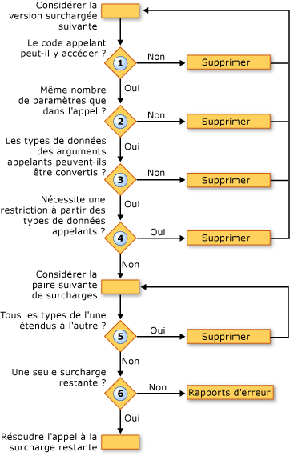

# Résolution de surcharge (Visual Basic)Overload Resolution (Visual Basic)
Lorsque le [!INCLUDE[vbprvb](../../../../csharp/programming-guide/concepts/linq/includes/vbprvb_md.md)] compilateur rencontre un appel à une procédure défini dans plusieurs versions surchargées, le compilateur doit décider de la surcharge à appeler.When the [!INCLUDE[vbprvb](../../../../csharp/programming-guide/concepts/linq/includes/vbprvb_md.md)] compiler encounters a call to a procedure that is defined in several overloaded versions, the compiler must decide which of the overloads to call. Pour cela, procédez comme suit :It does this by performing the following steps:  
  
1.  **Accessibilité.****Accessibility.** Il élimine toute surcharge avec un niveau d’accès qui empêche le code appelant de l’appeler.It eliminates any overload with an access level that prevents the calling code from calling it.  
  
2.  **Nombre de paramètres.****Number of Parameters.** Il élimine les surcharges qui définissent un nombre différent de paramètres que ceux spécifiés dans l’appel.It eliminates any overload that defines a different number of parameters than are supplied in the call.  
  
3.  **Types de données de paramètre.****Parameter Data Types.** Le compilateur donne la préférence de méthodes d’instance sur les méthodes d’extension.The compiler gives instance methods preference over extension methods. Si n’importe quelle méthode d’instance est trouvée qui nécessite uniquement des conversions pour faire correspondre l’appel de procédure étendues, toutes les méthodes d’extension sont supprimées et le compilateur continue avec uniquement les candidats de méthode d’instance.If any instance method is found that requires only widening conversions to match the procedure call, all extension methods are dropped and the compiler continues with only the instance method candidates. Si aucune méthode d’instance de ce type n’est trouvée, il continue avec l’instance et les méthodes d’extension.If no such instance method is found, it continues with both instance and extension methods.  
  
     Dans cette étape, il élimine les surcharges dont les types de données des arguments d’appel ne peut pas être convertis pour les types de paramètres définis dans la surcharge.In this step, it eliminates any overload for which the data types of the calling arguments cannot be converted to the parameter types defined in the overload.  
  
4.  **Conversions restrictives.****Narrowing Conversions.** Il élimine les surcharges qui nécessitent une conversion restrictive parmi les types d’argument appelant pour les types de paramètres définis.It eliminates any overload that requires a narrowing conversion from the calling argument types to the defined parameter types. Cela est vrai que la vérification du type de commutateur ([Option Strict, instruction](../../../../visual-basic/language-reference/statements/option-strict-statement.md)) est `On` ou `Off`.This is true whether the type checking switch ([Option Strict Statement](../../../../visual-basic/language-reference/statements/option-strict-statement.md)) is `On` or `Off`.  
  
5.  **Moindre extension.****Least Widening.** Le compilateur considère les surcharges restantes par paires.The compiler considers the remaining overloads in pairs. Pour chaque paire, il compare les types de données des paramètres définis.For each pair, it compares the data types of the defined parameters. Si les types dans une des surcharges de tous les élargir les types correspondants dans l’autre, le compilateur élimine la seconde.If the types in one of the overloads all widen to the corresponding types in the other, the compiler eliminates the latter. Autrement dit, il conserve la surcharge qui nécessite le moins importante.That is, it retains the overload that requires the least amount of widening.  
  
6.  **Candidat unique.****Single Candidate.** Il continue à rassembler les surcharges par paires jusqu'à ce que la seule surcharge et il résout l’appel à cette surcharge.It continues considering overloads in pairs until only one overload remains, and it resolves the call to that overload. Si le compilateur ne peut pas réduire les surcharges vers un seul candidat, il génère une erreur.If the compiler cannot reduce the overloads to a single candidate, it generates an error.  
  
 L’illustration suivante montre le processus qui détermine un ensemble de versions surchargées à appeler.The following illustration shows the process that determines which of a set of overloaded versions to call.  
  
   
Résolution parmi des versions surchargéesResolving among overloaded versions  
  
 L’exemple suivant illustre ce processus de résolution de surcharge.The following example illustrates this overload resolution process.  
  
 [!code-vb[VbVbcnProcedures&#62;](./codesnippet/VisualBasic/overload-resolution_1.vb)][!code-vb[VbVbcnProcedures#62](./codesnippet/VisualBasic/overload-resolution_1.vb)]  
  
 [!code-vb[VbVbcnProcedures&#63;](./codesnippet/VisualBasic/overload-resolution_2.vb)][!code-vb[VbVbcnProcedures#63](./codesnippet/VisualBasic/overload-resolution_2.vb)]  
  
 Dans le premier appel, le compilateur élimine la première surcharge parce que le type du premier argument (`Short`) restreint au type du paramètre correspondant (`Byte`).In the first call, the compiler eliminates the first overload because the type of the first argument (`Short`) narrows to the type of the corresponding parameter (`Byte`). Il élimine ensuite la troisième surcharge parce que chaque argument de type dans la deuxième surcharge (`Short` et `Single`) s’étend au type correspondant dans la troisième surcharge (`Integer` et `Single`).It then eliminates the third overload because each argument type in the second overload (`Short` and `Single`) widens to the corresponding type in the third overload (`Integer` and `Single`). La deuxième surcharge requérant une extension moins importante, donc le compilateur utilise pour l’appel.The second overload requires less widening, so the compiler uses it for the call.  
  
 Dans le deuxième appel, le compilateur ne peut pas supprimer les surcharges en fonction restrictives.In the second call, the compiler cannot eliminate any of the overloads on the basis of narrowing. Il élimine la troisième surcharge pour la même raison que le premier appel, car il peut appeler la deuxième surcharge moyennant une extension moins importante des types d’arguments.It eliminates the third overload for the same reason as in the first call, because it can call the second overload with less widening of the argument types. Toutefois, le compilateur ne peut pas résoudre entre les premier et deuxième surcharges.However, the compiler cannot resolve between the first and second overloads. Chacune possède un type de paramètre défini qui s’étend au type correspondant dans l’autre (`Byte` à `Short`, mais `Single` à `Double`).Each has one defined parameter type that widens to the corresponding type in the other (`Byte` to `Short`, but `Single` to `Double`). Par conséquent, le compilateur génère une erreur de résolution de surcharge.The compiler therefore generates an overload resolution error.  
  
## Surchargé facultatif et Arguments ParamArrayOverloaded Optional and ParamArray Arguments  
 Si deux surcharges d’une procédure ont des signatures identiques, mais que le dernier paramètre est déclaré [facultatif](../../../../visual-basic/language-reference/modifiers/optional.md) dans un et [ParamArray](../../../../visual-basic/language-reference/modifiers/paramarray.md) dans l’autre, le compilateur résout un appel à cette procédure comme suit :If two overloads of a procedure have identical signatures except that the last parameter is declared [Optional](../../../../visual-basic/language-reference/modifiers/optional.md) in one and [ParamArray](../../../../visual-basic/language-reference/modifiers/paramarray.md) in the other, the compiler resolves a call to that procedure as follows:  
  
|Si l’appel fournit le dernier argument commeIf the call supplies the last argument as|Le compilateur résout l’appel vers la surcharge en déclarant le dernier argument commeThe compiler resolves the call to the overload declaring the last argument as|  
|---|---|  
|Aucune valeur (argument omis)No value (argument omitted)|`Optional`|  
|Une valeur uniqueA single value|`Optional`|  
|Deux ou plusieurs valeurs dans une liste séparée par des virgulesTwo or more values in a comma-separated list|`ParamArray`|  
|Un tableau d’une longueur quelconque (y compris un tableau vide)An array of any length (including an empty array)|`ParamArray`|  
  
## Voir aussiSee Also  
 [Paramètres facultatifs](./optional-parameters.md) [Optional Parameters](./optional-parameters.md)   
 [Tableaux de paramètres](./parameter-arrays.md)  [Parameter Arrays](./parameter-arrays.md)   
 [Surcharge de procédure](./procedure-overloading.md)  [Procedure Overloading](./procedure-overloading.md)   
 [Procédures de dépannage](./troubleshooting-procedures.md)  [Troubleshooting Procedures](./troubleshooting-procedures.md)   
 [Comment : définir plusieurs Versions d’une procédure](./how-to-define-multiple-versions-of-a-procedure.md)  [How to: Define Multiple Versions of a Procedure](./how-to-define-multiple-versions-of-a-procedure.md)   
 [Comment : appeler une procédure surchargée](./how-to-call-an-overloaded-procedure.md)  [How to: Call an Overloaded Procedure](./how-to-call-an-overloaded-procedure.md)   
 [Comment : surcharger une procédure qui accepte des paramètres optionnels](./how-to-overload-a-procedure-that-takes-optional-parameters.md)  [How to: Overload a Procedure that Takes Optional Parameters](./how-to-overload-a-procedure-that-takes-optional-parameters.md)   
 [Comment : surcharger une procédure qui accepte un nombre indéfini de paramètres](./how-to-overload-a-procedure-that-takes-an-indefinite-number-of-parameters.md)  [How to: Overload a Procedure that Takes an Indefinite Number of Parameters](./how-to-overload-a-procedure-that-takes-an-indefinite-number-of-parameters.md)   
 [Considérations sur les surcharges de procédures](./considerations-in-overloading-procedures.md)  [Considerations in Overloading Procedures](./considerations-in-overloading-procedures.md)   
 [Surcharges](../../../../visual-basic/language-reference/modifiers/overloads.md)  [Overloads](../../../../visual-basic/language-reference/modifiers/overloads.md)   
 [Méthodes d’extension](./extension-methods.md) [Extension Methods](./extension-methods.md)
