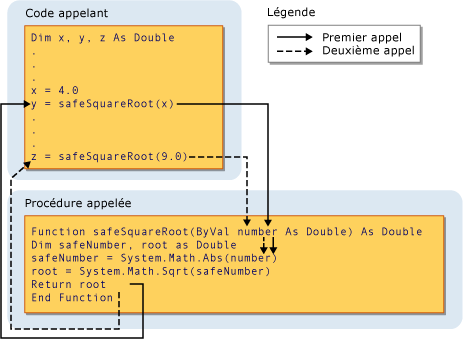

# Procedure Parameters and Arguments (Visual Basic)
[!INCLUDE[vs2017banner](../../../../visual-basic/includes/vs2017banner.md)]

Dans la plupart des cas, une procédure a besoin d'informations sur les circonstances dans lesquelles elle est appelée.  Une procédure qui exécute des tâches répétitives ou partagées utilise des informations différentes pour chaque appel.  Ces informations se composent des variables, constantes et expressions passées à la procédure lorsque celle\-ci est appelée.  
  
 Un *paramètre* représente une valeur que vous êtes censé fournir lorsque vous appelez la procédure.  La déclaration de la procédure définit ses paramètres.  
  
 Vous pouvez définir une procédure sans aucun paramètre, avec un seul paramètre ou avec plusieurs paramètres.  La partie de la définition de procédure qui spécifie les paramètres est appelée *liste de paramètres*.  
  
 Un *argument* représente la valeur que vous fournissez à un paramètre de procédure lorsque vous appelez la procédure.  Le code appelant fournit les arguments lorsqu'il appelle la procédure.  La partie de l'appel de procédure qui spécifie les arguments est appelée *liste d'arguments*.  
  
 L'illustration suivante affiche le code appelant la procédure `safeSquareRoot` depuis deux places différentes.  Le premier appel passe la valeur de la variable `x` \(4.0\) au paramètre `number` et la valeur de retour dans `root` \(2.0\) est assignée à la variable `y`.  Le deuxième appel passe la valeur de littéral 9.0 à `number`, et assigne la valeur de retour \(3.0\) à la variable `z`.  
  
   
Passage d'un argument à un paramètre  
  
 Pour plus d'informations, consultez [Differences Between Parameters and Arguments](../../../../visual-basic/programming-guide/language-features/procedures/differences-between-parameters-and-arguments.md).  
  
## Type de données de paramètre  
 Définissez un type de données pour un paramètre en utilisant la clause `As` dans sa déclaration.  Par exemple, la fonction suivante accepte une chaîne et un entier.  
  
 [!code-vb[VbVbcnProcedures#32](../../../../visual-basic/programming-guide/language-features/procedures/codesnippet/visualbasic/procedure-parameters-and_1.vb)]  
  
 Si le commutateur de vérification de type \([Option Strict Statement](../../../../visual-basic/language-reference/statements/option-strict-statement.md)\) est `Off,` la clause `As` est facultative, sauf si un paramètre l'utilise, dans quel cas tous les paramètres doivent l'utiliser.  Si la vérification de type est `On`, la clause `As` est requise pour tous les paramètres de procédure.  
  
 Si le code appelant est censé fournir un argument avec un type de données différent de celui de son paramètre correspondant, tel que `Byte` à un paramètre `String`, il doit exécuter l'une des opérations suivantes :  
  
-   Fournissez uniquement des arguments avec des types de données qui s'étendent au type de données du paramètre ;  
  
-   Définissez `Option Strict Off` pour autoriser des conversions restrictives implicites ; ou  
  
-   Utilisez un mot clé de conversion pour convertir explicitement le type de données.  
  
### Paramètres de type  
 Une *procédure générique* définit également un ou plusieurs *paramètres de type* en plus de ses paramètres normaux.  Une procédure générique autorise le code appelant à passer différents types de données à chaque appel de la procédure. Il peut ainsi adapter les types de données aux exigences de chaque appel.  Consultez [Generic Procedures in Visual Basic](../../../../visual-basic/programming-guide/language-features/data-types/generic-procedures.md).  
  
## Voir aussi  
 [Procedures](../../../../visual-basic/programming-guide/language-features/procedures/index.md)   
 [Sub Procedures](../../../../visual-basic/programming-guide/language-features/procedures/sub-procedures.md)   
 [Function, procédures](../../../../visual-basic/programming-guide/language-features/procedures/function-procedures.md)   
 [Procédures de propriété](../../../../visual-basic/programming-guide/language-features/procedures/property-procedures.md)   
 [Operator Procedures](../../../../visual-basic/programming-guide/language-features/procedures/operator-procedures.md)   
 [How to: Define a Parameter for a Procedure](../../../../visual-basic/programming-guide/language-features/procedures/how-to-define-a-parameter-for-a-procedure.md)   
 [How to: Pass Arguments to a Procedure](../../../../visual-basic/programming-guide/language-features/procedures/how-to-pass-arguments-to-a-procedure.md)   
 [Passing Arguments by Value and by Reference](../../../../visual-basic/programming-guide/language-features/procedures/passing-arguments-by-value-and-by-reference.md)   
 [Procedure Overloading](../../../../visual-basic/programming-guide/language-features/procedures/procedure-overloading.md)   
 [Type Conversions in Visual Basic](../../../../visual-basic/programming-guide/language-features/data-types/type-conversions.md)